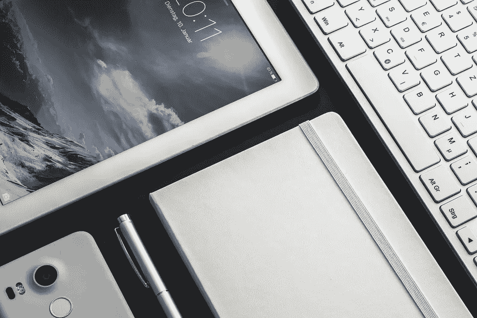
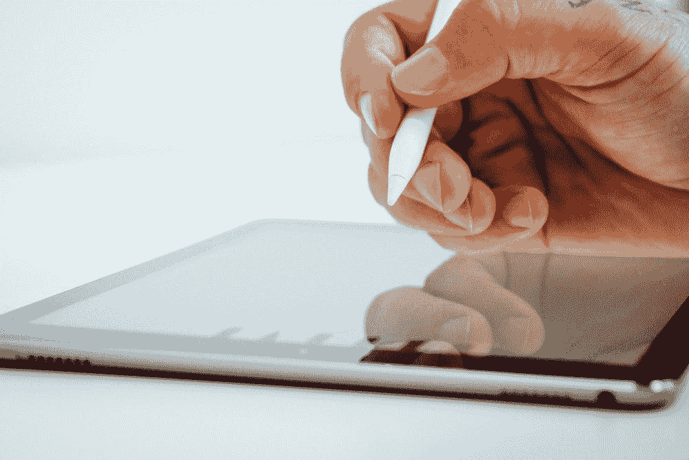
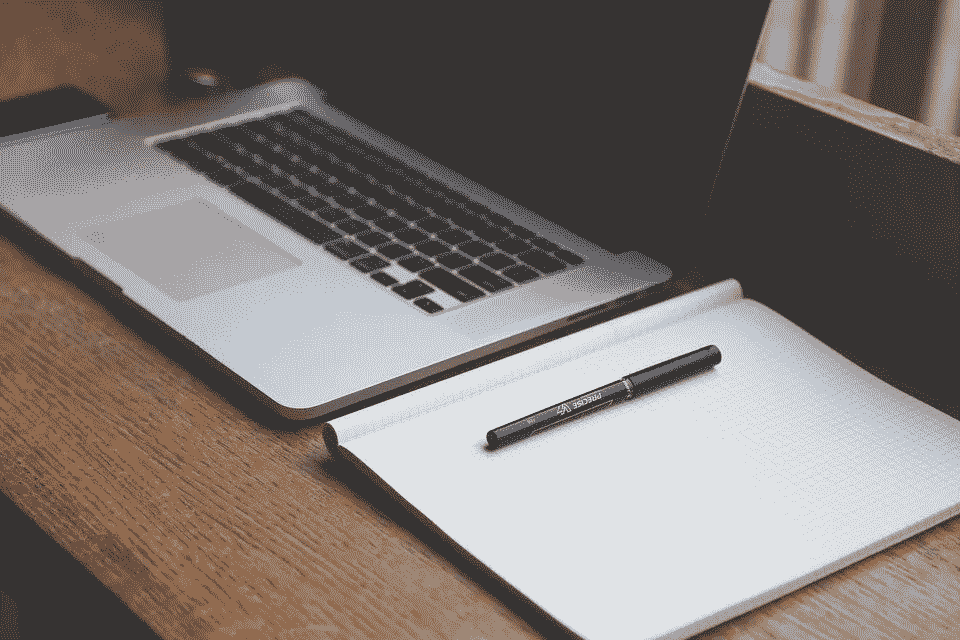
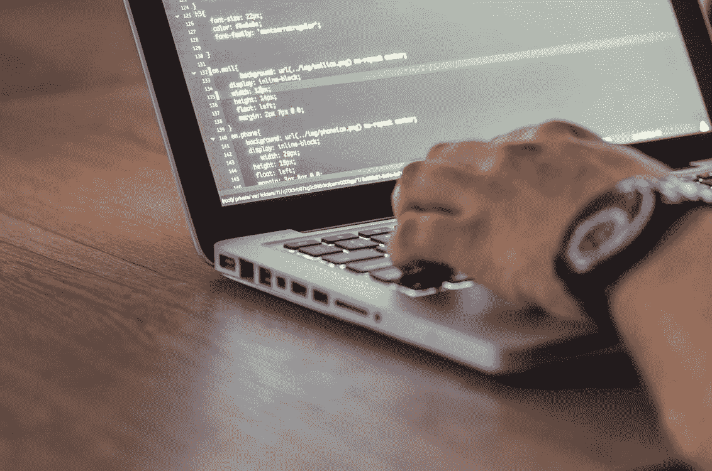

# 2021 年该买笔记本电脑还是 iPad？

> 原文：<https://medium.com/codex/should-you-buy-a-laptop-or-an-ipad-in-2021-89f690f70d28?source=collection_archive---------16----------------------->

虽然仅仅在几年前，上述问题还会被无情地嘲笑，但在 2021 年，它确实让我们许多人挠头。

图片来源: [Pixabay](https://pixabay.com/photos/technology-ipad-mobile-tablet-2746212/)

这就是为什么——iPad 已经变得比以前好了很多，尤其是自从 iPad OS 发布以来。它获得了越来越多的致力于提高生产力的功能，随着许多公司发布了几个 iPad 版本的专业应用程序，完全改变你的工作流程是非常可能的，你为什么不呢？iPads 有一个漂亮的 120 赫兹显示屏(Pro 版本)，触摸支持，*手写笔*支持等等，它们看起来太超前了。

而笔记本电脑只是一台笔记本电脑。

*(对于本文的其余部分，我假设你使用的所有应用程序都可以在笔记本电脑和 iPads 上使用)*

虽然只有一小部分人真正需要 iPad Pro，但倾向于低价 iPad 或 iPad Air 还是很容易的。

所以说，如果你每天在电脑上做的是基本的计算、上网冲浪、偶尔看电影、视频会议和记笔记，或者如果你是一名学生，iPad 将出色地完成你的大部分工作。

照片由[剂量介质](https://unsplash.com/@dose?utm_source=unsplash&utm_medium=referral&utm_content=creditCopyText)在 [Unsplash](https://unsplash.com/s/photos/apple%20pencil?utm_source=unsplash&utm_medium=referral&utm_content=creditCopyText)

与 Apple Pencil 搭配使用，它是学生的梦想，通过获得模拟和数字世界的最佳效果来记笔记。如果你不是一个完全的极客，这个软件很容易，它有基本的文件应用程序，在你很少想要的时候，比如说，重命名文件，或者移动一下东西，这很好。

将它与罗技智能 Folio 键盘(在我看来，这是比 Magic Keyboard 更好的选择)配合使用，可以让写长篇文章变得更加自然和快速，很多人也会喜欢内置的软件键盘及其直观的手势。

但当你想要的不仅仅是基本功能时，问题就来了，在 iPad 上进行多任务处理很好，但不是很好的体验。您最多可以同时打开 3 个应用程序，调整大小选项受到严格限制。虽然这款软件非常适合触摸使用，但它并不是最高效的。

键盘快捷键是有限的，很多时候，在我的电脑上要花 5 分钟才能完成的事情，光是在 iPad 上就要花 15 分钟。从打印文档到适度的文件管理，甚至像 Zoom 或 Teams 这样的视频会议应用程序都不能让你在进行多任务处理时保持相机开机。iPad 甚至不能将其屏幕扩展到显示器上，这对许多人来说是一个严重的问题。

学分: [Pixabay](https://pixabay.com/photos/desk-laptop-notebook-pen-workspace-593327/)

这是“真正的”笔记本电脑将大放异彩的地方。Windows 和 macOS 都内置了强大的多任务功能，理论上你可以同时运行无限的应用程序。如果你是一个“专业”用户，你将不会点击那么多来到达你想要的地方。像 Windows 搜索命令、聚光灯、 [Everything](https://www.voidtools.com/) 和 [Alfred](https://www.alfredapp.com/) 这样的功能是超级用户的梦想，因为它们显著地[缩短了你的想法和行动之间的时间差](https://veer258.medium.com/increasing-efficiency-on-your-machine-5faa438717a8)。虽然很多人读到这里会觉得买 iPad 没什么意义，但实际上，这取决于你想做的工作类型。

学分:[像素](https://www.pexels.com/photo/person-encoding-in-laptop-574071/)

> 你应该问自己的问题是，你到底打算用你的电脑做什么。

如果你想做的事情很“复杂”，比如视频编辑或编写代码，或者如果你真的非常重视效率，甚至使用几个加快工作流程的应用程序，这时你很可能需要一台笔记本电脑。另一方面，如果你不是一个完全的书呆子，也就是说，你偶尔会使用笔记本电脑只是为了上学、浏览网页和玩游戏，那么倾向于 iPad 会更好。

*注意:我再次提醒您，在您购买之前，请确保您要使用的应用程序在您想要购买的机器上具有所需的功能。*

嗨，感谢阅读！💙

查看我的网站
[https://veer258.github.io/](https://vmax258.github.io/)