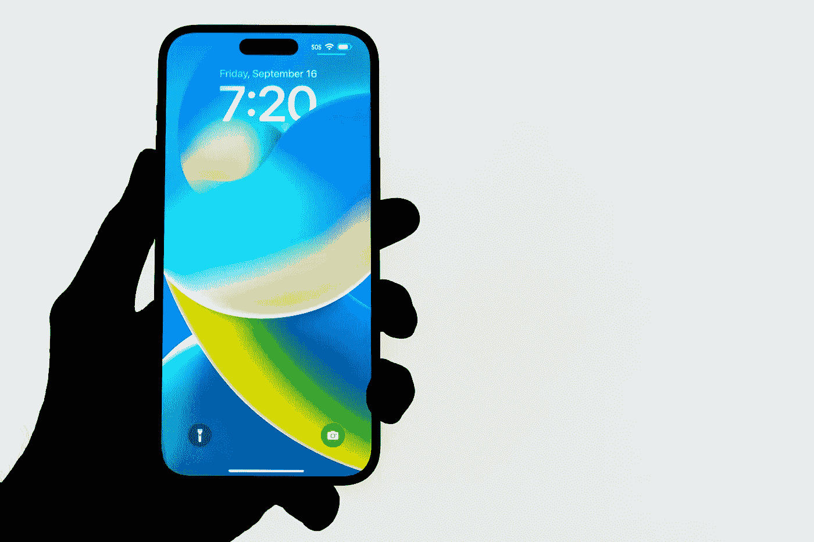

# 该不该买最新的 iPhone 14？

> 原文：<https://medium.com/codex/should-you-buy-the-latest-iphone-14-b0fd48a2d381?source=collection_archive---------12----------------------->

## 当你想要 iPhone 14 又不确定是否需要的时候。

杰里米·贝赞格在 Unsplash 上的照片

我是苹果设备的狂热用户，在本文中，我不会将 iPhones 与其他智能手机品牌及其操作系统进行比较。它们都有各自的优点和缺点。在我成为苹果用户的三年多时间里，我从使用 iPhone 中受益匪浅。这是一个可靠的设备，为我工作，而不是相反。

我的第一部 iPhone 是 iPhone 11，现在仍然是。这是一个很棒的设备，可以拍摄很棒的照片和视频，与所有其他苹果设备同步很容易，三年多来每天使用它是一种乐趣。它的电池现在有 80%，但我仍然正常度过一天，但我不是一个重度 iPhone 用户。Apple Watch 会从它那里获取许多通知，因此我拿起手机的次数大大减少了。我的 Mac 也有帮助。当我在家的时候，我喜欢在 iMac 上工作，因为我更喜欢使用台式机。

> *我走上了每两年换一部手机的道路*

但是，我走上了每 2 年换一部手机的路(iPhone 之前)。我喜欢定制它们，改变各种各样的东西，并总是研究操作系统中的新事物，新应用程序等。大约 2 年后，操作系统和手机本身对我来说不再“足够好”，或者不再有最新的功能更新，只有安全更新。好吧，我们再买一台，最新 OS 的旗舰机型。

不知道是不是因为年纪大了(30 多岁还是 40 出头，哪个听起来更好)，但我对这些东西已经没有那种兴趣了。我想要一台更耐用的电脑，而且不需要每隔几年就购买新的硬件来获得最新的操作系统。此外，我更喜欢把时间花在其他让我感兴趣的有成效的事情上。

 [## 你有没有发现自己对太多东西太感兴趣？

### 你可能会觉得被困在这个循环中，但有办法。

medium.com](/@tom-athos/have-you-ever-found-yourself-too-interested-in-too-many-things-82d22162cf0a) 

我开始研究，对自己说，让我试试 iPhone。它是苹果，一个更封闭和不同的操作系统，设备昂贵。苹果在这一切的背后有着极其智能的营销，所以我尽量不被忽悠。甚至我的一些朋友也试图劝阻我不要购买苹果产品，落入他们的‘陷阱’。

但我还是做了。我买了我的第一部 iPhone。这个决定可能更容易一点，因为在买 iPhone 的一个月前，我已经买了一台 27 英寸的 iMac。Mac 操作系统让我目瞪口呆，现在依然如此。当我意识到我可以通过在同一个生态系统中拥有更多设备来获得更多好处时，这个决定就做出了，我再也没有回头。

照片由 simerpreet singh 在 Unsplash 上拍摄

# 我的 iPhone 11 老了。真的吗？

是的，这是事实。酪苹果 9 月份的重大事件已经过去，我们终于有了新的 iPhone，命名为 iPhone 14，iPhone 14 Plus，iPhone 14 Pro 和 iPhone 14 Pro Max。它们无疑是令人惊叹的科技产品。他们比他们的前辈有更好的相机，更好的屏幕和电池，Pro 型号有一个叫动态岛的东西，以及许多其他东西。

我可以同意其中一些非常耐人寻味(动态岛)，但对我来说，运行在 iPhones 上的操作系统 iOS 更重要。iPhone 11 仍在获得最新功能的更新，这才是最重要的。这也是我热爱 iPhones 的主要原因之一。他们多年来一直在更新操作系统，所以硬件可以等一等。

我决定不买新 iPhone，而是买一个带 Apple Pencil 的 iPad Air。是的，我拥有另一台苹果设备，但只是因为我找到了一种高效使用它的方法。我的日常工作是教授乐理，带铅笔的 iPad Air 是一个很棒的工具。你可以在下面的文章中读到更多关于我如何使用它的信息。

 [## 在教室里使用 iPad 上音乐课

### 我在课堂上使用 iPad 的体验，以及我使用的应用程序和一些有用的技巧。

medium.com](/@tom-athos/using-ipad-in-the-classroom-for-music-lessons-fda68ddf2a5a) 

# 结论

那么，该不该买最新的 iPhone 14 呢？今年我要跳过 iPhone 14。再来一次。我看不出花那么多钱有什么额外的好处(而且今年它们更贵了)。我很高兴我已经有了 iOS 16 和一些有用的新功能。

再者，我想每年都有一部新手机，因为我热爱科技。但是让我们面对它，这并不总是一个我们是否能负担得起的问题，而是我们是否每年都需要所有最新和最棒的东西？更不用说对环境的影响，或者仅仅是对你思维的影响。

明年我可能会选择新的型号，但是我们会看到的。如果出于某种原因，我现在需要一部新手机，我会选择 iPhone 13。它更便宜，仍然是一款很棒的手机，iPhone 12 和 iPhone 13 一样棒，一样便宜。

决定权在你，我希望在评论中听到你的意见。

感谢您的阅读。一直很感激。

汤姆(男子名)

*原载于 2022 年 10 月 5 日*[*【https://www.tomathosblog.com】*](https://www.tomathosblog.com/should-you-buy-the-latest-iphone-14/)*。*