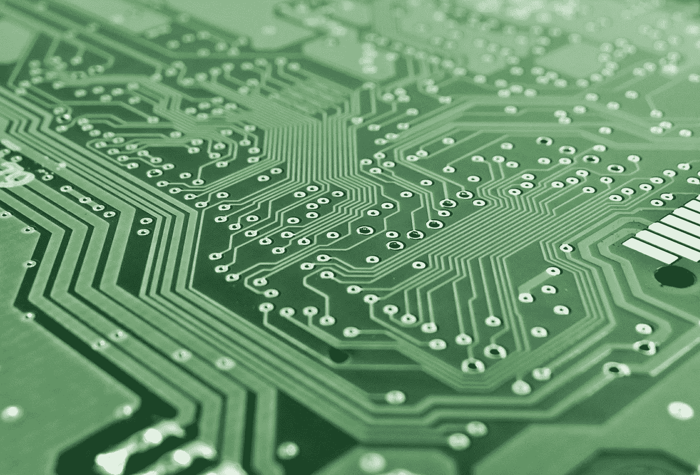

# 你应该学习计算机科学吗？

> 原文：<https://medium.com/codex/should-you-study-computer-science-1f53609e61f?source=collection_archive---------6----------------------->

## 还是应该像埃隆马斯克所说的那样，在网上自学？

[pix abay 上 blickpixel 的图片](https://pixabay.com/de/photos/brett-elektronik-rechner-453758/)

# 计算机科学学位重要吗？

嗯，是也不是。有很多现代公司不在乎你是否有真正的大学学位——即使是在他们的层级中担任更高的职位。他们在追随非常著名的埃隆…