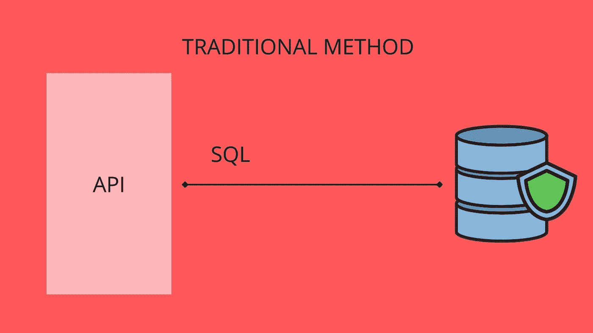
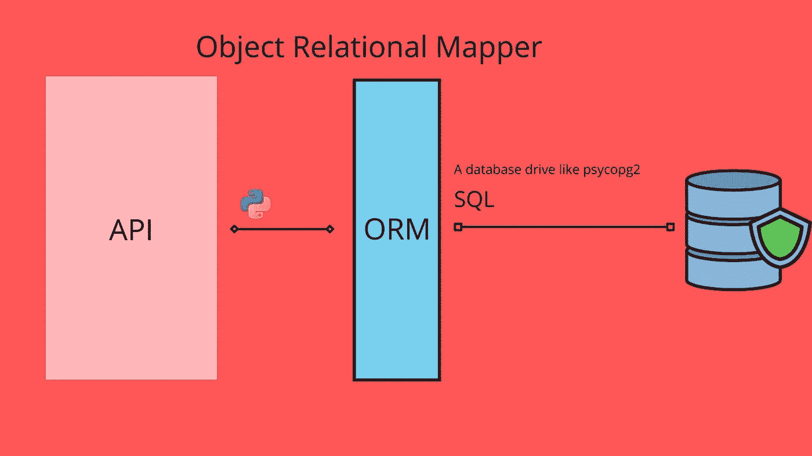

# 应该使用原始 SQL 还是 ORM？

> 原文：<https://medium.com/codex/should-you-use-raw-sql-or-an-orm-18468c11c1a9?source=collection_archive---------0----------------------->

与数据库交互对于成为一名优秀的开发人员非常重要。无论您想成为前端、后端还是全栈开发人员，您都会遇到数据库，因为大多数动态应用程序都高度依赖用户数据。你也不想成为第一天就删除申请表的人。

数据库是结构化信息的有组织的集合，通常以电子方式存储在计算机系统中。如果不能提供、检索、更新或删除数据来增强用户对应用程序的体验，数据库就没有多大用处。那就是 SQL(你发音是 SEQUEL 还是 ESS-CUE-EL；) ?)进来。它是由 Raymond Boyce 和 Donald Chamberlin 在 70 年代创建的一种编程语言(是的，它有那么古老！)来查询、操作、定义和提供直到今天在几乎所有关系数据库中使用的访问控制。在某些情况下，SQL 充当 API 和数据库之间的中间人。API 告诉 SQL 它想要执行的操作，然后它去数据库执行这些操作，并将它们返回给 API。

SQL 如何工作的简单说明

然而，SQL 也有它的缺点。我对学习编程语言犹豫不决的一个主要原因是因为界面太差了，尽管它看起来很简单。由于抽象性太低，它还存在许多安全缺陷。一个没有经验的 SQL 程序员很容易成为 SQL 注入的牺牲品。一个 web 安全漏洞问题使得攻击者能够干扰应用程序对数据库的查询，这通常发生在向数据库传递参数时。所以你需要技术娴熟，高度意识到这些漏洞。

这就是 ORM 的用武之地，它是一种工具，允许您使用面向对象的编程来查询和操作数据库中的数据。这封装了管理数据所需的代码，因此您不必再编写 SQL。ORM(SQLAlchemy)生成 SQL 语句，然后数据库驱动程序(pyscopg2)将 SQL 语句发送到数据库。ORM 严重依赖数据库驱动程序将数据发送到数据库。对于不熟悉 SQL 的人来说，这是一个更方便的选择，因为您现在可以使用 Python 对象(或任何其他语言 OOP)来操作数据和定义表。

关于对象关系映射器如何工作的说明

ORM 已经成为大多数人的一个流行选项，在某种程度上，它被内部集成到一些 web 框架中(Django)。它们是强大的工具，因为它们抽象了与数据库对话的大部分复杂部分，从而减少了安全攻击，并且您不需要编写结构不良的 SQL。但是高层次的抽象也有它的缺点，因为你的控制会更少，而且 ORM 不是轻量级的工具，所以它会大大降低性能，如果你计划扩展你的项目，这是一个缺点。

选择使用 ORM 还是原始 SQL 并不像你想的那么简单，它取决于许多因素，包括你对什么感到舒服，你正在构建的应用程序的规模，你希望对你的应用程序进行什么程度的控制等等。我希望你觉得这篇文章有用，并快乐编码；).