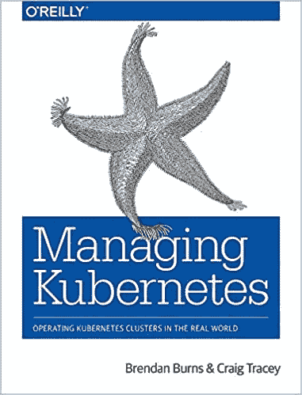
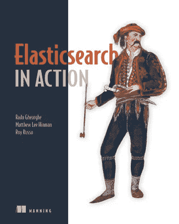

# 初学者成为开发者应该阅读的书籍

> 原文：<https://medium.com/codex/side-story-books-you-should-read-to-become-devops-for-beginner-b75384ef6774?source=collection_archive---------2----------------------->

大家好，在这篇文章中，我将介绍一些在我从全栈开发人员成为云开发工程师的道路上对我有很大帮助的书籍。希望对大家有用，推荐的书从基础到进阶。

# 基础

首先，你必须知道的最基本的东西是 Linux。不要试图成为一个 Linux 高手(因为没有人能自称是 Linux 高手)，我们只需要了解像什么是 Linux 这样的关于 Linux 的基础知识就可以了。Linux 和 Ubuntu 或者 Centos 有什么区别？基本 Linux 命令和 Linux 主机文件系统。

对于初学者，我向你推荐这本书。

[*Linux 初学者*](https://www.amazon.com/Linux-Beginners-Introduction-Operating-Command-ebook/dp/B00HNC1AXY)

这本书会教你 Linux 的基础知识，Linux 和 Ubuntu 的区别，基本的 Linux 命令行(CLI)，需要什么 CLI？以及如何在 Linux 上创建和管理用户。

如果你想深入了解 Linux，我推荐这本书。

[*Ubuntu Linux Unleashed 2021 版*](https://www.amazon.com/Ubuntu-Linux-Unleashed-2021-14th/dp/0136778852)

# 第一步

在你学习了 Linux 的基础知识之后，下一步你需要学习的是如何在不同的操作系统(尤其是 Linux)上运行程序。

如果你学习了 NodeJS、JAVA 或. NET 的基础知识，那是最好的。但是请注意，我们不需要学习如何编程语言，我们只需要学习如何运行它，如何安装语言包和库，以及如何在运行时构建或编译代码。

例如使用 NodeJS，你只需要学习如何安装 NodeJS，如何使用`pm2`运行 NodeJS，如何使用 NPM 安装 NodeJS 包。

以 JAVA 为例，你需要学习如何安装和运行 JAVA，以及如何将 JAVA 编译成 jar 文件。

接下来，为了尽可能容易地运行不同的程序，我们必须学习容器和 Docker。关于 Docker 的基础，我推荐这本书。

[*Docker 在行动，第二版*](https://www.manning.com/books/docker-in-action-second-edition)

在这本书里，你将学习到关于容器和 Docker 的最基本的知识，如何运行容器，如何将源代码构建到容器映像中，以及如何使用 docker-compose 和自宿主容器注册表。完成后，您将对如何使用 Docker 在不同的操作系统上运行我们的程序有一个更好的了解。

# 踏上成为 DevOps 的道路

在做了 Linux 和 Docker 的基础之后，现在你可以自信地踏上成为 DevOps 工程师的道路了。

你需要学习的下一件事是如何尽可能容易地将我们的产品或程序自动交付给客户。这种方法叫做 CI/CD，对于 CI/CD 的基础知识，我推荐这本书。

[*与 Docker 和 Jenkins* 一起连续交货](https://www.amazon.com/Continuous-Delivery-Docker-Jenkins-Delivering/dp/1787125238)

这本书将告诉你你需要什么来建立你的程序的 CI/CD 流程。您将学习 Jenkins 和 Jenkins 架构的基础知识，如何安装和设置 Jenkins，以及如何通过 Docker 使用 Jenkins。

除了学习 CI/CD，我们还需要学习容器编排。容器编排是在我们的客户使用的实际生产环境中操作和管理成千上万个容器的方法。对于初学者来说，学习 Kubernetes 的基础知识，那么《Kubernetes In Action》这本书是一个很好的选择。

[T5【Kubernetes in Action】第二版 ](https://www.manning.com/books/kubernetes-in-action-second-edition)

我喜欢这本书，Marko luk sa 是一位写 Kubernetes 的伟大作家。在这本书里，Marko luk sa 将教你什么是 Kubernetes，如何从基础到高级使用它，以及如何使用 Kubernetes 部署应用程序的最佳实践。

并且尽量多练习 CI/CD 和 Kubernetes。

# 中间

如果你读完了上面的书，并且练习了很多，那么欢迎你，你可以自信地说你是一个更新鲜的 DevOps。接下来你要学习的是如何将理论应用到实际工作中？

虽然这是一个很难的工作，但是我也有以下两本书推荐给大家。

第一本是**管理 Kubernetes** 。

[*管理 Kubernetes*](https://www.oreilly.com/library/view/managing-kubernetes/9781492033905)

这本书将向您展示如何在生产中运行 Kubernetes，如何在生产中安装 Kubernetes，如何管理您的 Kubernetes 集群，以及如何备份和恢复它。

第二本书是 Kubernetes 最佳实践——在 Kubernetes 上构建成功应用的蓝图。

[*Kubernetes 最佳实践*](https://www.oreilly.com/library/view/kubernetes-best-practices/9781492056461)

这本书会给你很多实际的例子，关于如何在 Kubernetes 环境下安装很多应用程序，以及如何监控应用程序。

# 成为一个好的 DevOps

有什么办法让自己的价值比其他 DevOps 考生更好？在我看来，为了让我们的价值优于其他 DevOps 候选人，我们需要了解云。未来将是云的游乐场。

学习云，要选择规模最大，使用最多的提供商，在我写这篇文章的当下，最流行的云是 AWS，我也很喜欢 AWS。

从云开始，我推荐你两本书和一门关于 Udemy 的课程。第一本是《亚马逊网络服务在行动》第二版。

[T3【亚马逊网络服务在行动】第二版 ](https://www.manning.com/books/amazon-web-services-in-action-second-edition)

通过这本书，你将了解什么是 AWS，AWS 的基本服务，如何使用它，如何设计一个高负载的系统，以及如何在 AWS 上设计一个易于扩展的系统。

接下来是教我们如何获得 AWS 认证的课程。

[*终极 AWS 认证解决方案架构师助理 2022*](https://www.udemy.com/course/aws-certified-solutions-architect-associate-saa-c02/)

这门课是由一位非常著名的讲师夏羽·马雷克教授的。他会教你所有你需要知道的关于 AWS 的知识来参加认证考试。虽然它是一门认证考试课程，但在完成课程后，我们将对 AWS 有一个最好的概述。

接下来是关于作为代码的基础设施的书。

[*地形在行动*](https://www.manning.com/books/terraform-in-action)

通常，当使用 AWS 时，我们会使用 AWS 上的另一个工具供应基础设施，在我写作时最流行的工具是 Terraform。上面的书将向我们展示我们需要的关于 Terraform 的所有东西，以及如何将 Terraform 与 AWS 一起使用。

# 不断学习

如果你能完成以上所有，恭喜你，你已经成为 DevOps 工程师😁。但是学习的道路永无止境，要有更多的知识，我们必须学习和学习。这些是我正在读的提高知识的书。

第一本是关于监控的书，当然在我们的操作中监控是不可或缺的。

[*监控用普罗米修斯*](https://www.amazon.com/Monitoring-Prometheus-James-Turnbull-ebook/dp/B07DPH8MN9)

这本书将教我们如何使用 Prometheus 来监控系统和 Grafana 来查询，可视化，并提醒您的度量系统。

接下来是搜索引擎。

[*弹力搜索在行动*](https://www.manning.com/books/elasticsearch-in-action)

这是一本将教我们关于 Elasticsearch 的书，虽然这本书教的是 Elasticsearch 5.x，但从那里我们可以谷歌更多地了解 Elasticsearch 7.x 是如何工作的，这将让我们更详细地了解它。

最后是关于事件流。

[*卡夫卡:权威指南*](https://www.oreilly.com/library/view/kafka-the-definitive/9781491936153/)

当我们使用大型系统时，事件流是必不可少的，Kafka 是最强大的工具之一。

# 结论

这些书对我帮助很大，希望对大家有用。DevOps 和 Cloud 非常有趣，虽然我们永远无法了解它们的全部，但请继续学习吧😁。

如果你喜欢我的文章，你可以给我买杯咖啡来支持我。☕️，谢谢你。