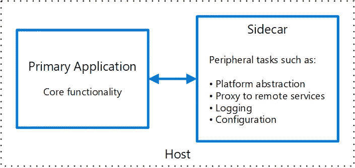

# 边车模式

> 原文：<https://medium.com/codex/sidecar-pattern-4db37273398b?source=collection_archive---------5----------------------->

应用程序和服务通常需要相关的功能，例如监控、日志记录、配置和网络服务。这些任务独立于正在运行的应用程序，可以在并行组件或服务中实现。

如果将它们紧密集成到应用程序中，它们可以在与应用程序相同的进程中运行，从而有效地利用共享资源。但是，这也意味着它们并不是孤立的，由此导致的任何问题或中断都会影响整个应用程序。

此外，这些功能需要用应用程序使用的相同语言或技术来编写，这可能不适合这些功能。

# 边车模式

单节点模式中的边车模式由两个容器组成。第一个是应用程序容器，它包含运行应用程序的所有逻辑，没有它，应用程序就毫无用处；第二个是边箱容器。

sidecar 容器的作用是在大多数情况下添加一些功能，而应用程序容器并不知道它们在上面定义的场景中经常使用或不使用。

Sidecar 容器与主容器并行运行，可以使用 Kubernetes 中的 pod 对象来实现。因为它们运行在同一台机器上，所以它们可以共享资源、空间、文件系统、主机名、网络等。

来源:微软文档

在微服务领域，可能需要将相同类型的边车添加到多个 pod。在一辆摩托车上，边车与一辆摩托车相连，每辆摩托车可以有自己的边车。以同样的方式，sidecar 服务共享其父应用程序的命运。对于应用程序的每个实例，sidecar 的一个实例被部署并托管在它旁边。

# 实现边车模式

Sidecar 和其他容器一样是一个应用程序容器，有特定的事情要处理。利用 Kubernetes 中一个 pod 可以有多个容器的事实，添加它变得更加容易。

在示例中，我们可以看到容器是一个列表，可以将多个容器作为参数，在创建 pod 时，Kubernetes 将为我们处理事情。

首先你可以有你的应用程序容器，其次可以是你的边车容器。

当我不得不处理多个容器的网络流量时，我使用过它。使用 sidecar 模式做这件事变得更容易，因为我不必接触运行的应用程序。

## 现有示例

市场上已经有一些著名的例子，使用 sidecar 模式作为内部实现来解决一些问题，如服务网格、网络流量和监控。

一个著名的例子就是 [Istio](https://istio.io/) :一个开源[服务网格](https://www.redhat.com/en/topics/microservices/what-is-a-service-mesh)平台，它提供了一种方法来控制[微服务](https://www.redhat.com/en/topics/microservices/what-are-microservices)如何彼此共享数据。如果我们阅读问题陈述或服务网格的概念，首先想到的解决方案是 sidecar-pattern，可能不是直接的，但是以某种方式。Linkerd 可能是另一个类似于 Istio 的例子。

*想了解更多关于服务网格的信息—* [*什么是服务网格*](redhat.com/en/topics/microservices/what-is-a-service-mesh)

另一个著名的例子是 [Envoy](https://www.envoyproxy.io/docs) :为云原生应用设计的开源服务代理。

# 优势

*   就运行时环境和编程语言而言，sidecar 独立于其主要应用程序，因此您不需要为每种语言开发一个 sidecar。
*   sidecar 可以访问与主应用程序相同的资源。例如，sidecar 可以监控 sidecar 和主应用程序使用的系统资源。
*   因为它靠近主应用程序，所以在它们之间通信时没有明显的延迟。
*   即使对于不提供可扩展性机制的应用程序，您也可以使用 sidecar 来扩展功能，方法是将它作为自己的进程附加到与主应用程序相同的主机或子容器中。
*   即使 sidecar 关闭，应用程序容器也将照常工作。
*   应用程序容器不需要担心边车容器。

# 使用前的考虑

*   边车集装箱足够小，不会影响运行的集装箱。
*   尝试看看您正在使用的部署技术是否真的支持这一点。
*   尽量避免 sidecar 中的复杂逻辑，这可能会降低运行容器的速度。
*   考虑使用 sidecar 的最小资源来保持应用程序容器像以前一样运行。
*   还要考虑该功能是否可以实现为库或使用传统的扩展机制。特定于语言的库可能具有更深层次的集成和更少的网络开销。

# 何时使用边车模式

*   语言或技术不支持您想要的边车功能。
*   类似的功能必须添加到多个 pod 中
*   sidecar 中的新功能在特性方面与应用程序容器无关，sidecar 只对来自网络或共享资源的一些日志或输出感兴趣。
*   您需要一个共享您的主应用程序的整个生命周期，但可以独立更新的服务。
*   组件或功能必须与应用程序位于同一主机上。
*   一个真实的例子是记录所有网络流量或类似的内容。

这就是本文的结尾，如果您感兴趣，我强烈建议您亲自尝试一下，看看 sidecar 模式的其他可能的使用案例，或者提到您已经使用过的任何案例。