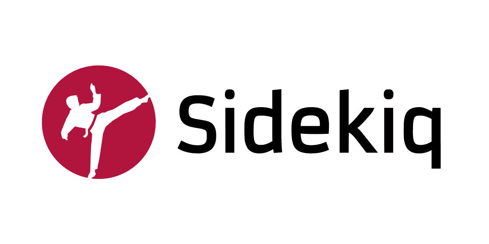
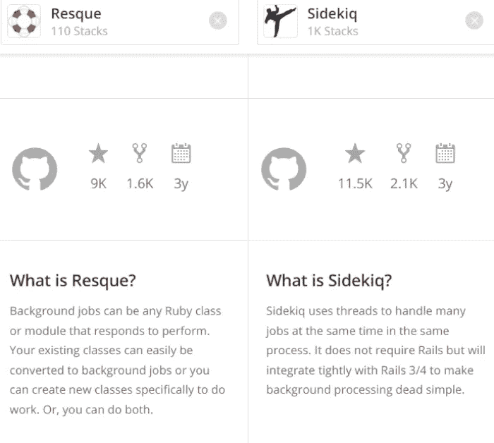
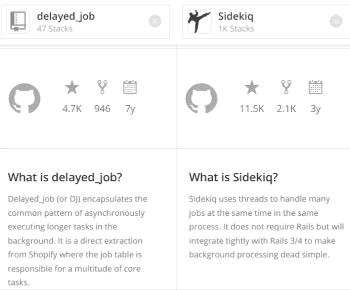

# Sidekiq 教程&概述:10 年后，Sidekiq For Ruby 还值得合作吗？

> 原文：<https://medium.com/codex/sidekiq-tutorial-overview-is-sidekiq-for-ruby-still-worth-working-with-after-10-years-8b3daf524962?source=collection_archive---------2----------------------->

## 夏洛克·福尔摩斯需要华生医生。Ruby 编程需要 Sidekiq。还是 Delayed_job，还是 Resque？



有时我们的客户对我们使用什么技术来构建他们的 web 应用程序项目感兴趣。我们很乐意分享，尽管向人们讲授技术并不容易，也不容易成为一个令人厌烦的人。所以，做好准备，一年的时间又到了。

都是因为 Sidekiq，可能是 Ruby 最常见的后台作业系统，刚满 [10 岁](https://www.mikeperham.com/2022/01/17/happy-10th-birthday-sidekiq/)！这个概述对于那些刚开始使用 Ruby on Rails 编程的人，以及那些对他们的技术堆栈很挑剔的人来说是很有用的。我们提供了关于如何启动 Sidekiq、调度和测试 Sidekiq 工作人员、发送电子邮件等等的教程。

# 什么是 Sidekiq？


李小龙对查克·诺里斯

Sidekiq 是一个免费的开源 Ruby 任务调度程序，由[迈克·佩汉姆](https://github.com/mperham)创建。Ruby 编程语言是我们尊敬和喜爱的使用最多和掌握最好的工具之一。如果你对我们为什么向客户的项目推荐它感兴趣，请查看我们关于 Ruby 的另一篇文章[。如果你没有多余的 10 分钟来了解我们的内在发展过程(我们完全理解)，那么让我们用 4 句话总结一下，并向你介绍这篇文章的主题:](https://shakuro.com/blog/why-use-ruby-on-rails-and-when-its-better-for-your-project)

1.Ruby 是一种编程语言。

2.在开发 Ruby on Rails 应用程序时，您可能会发现自己被大量必须同时执行的任务淹没了。

3.例如，发送电子邮件、为信用卡充电、与外部 API 交互以及其他数据处理。

4.开发人员使用 Sidekiq 之类的工具来运行后台作业，即请求-响应周期之外的自动化流程，这样用户就不必排队等候。

因此， **Sidekiq 是 Ruby 应用程序的默认工具，可以提高其性能和响应等待时间**。

# 企业版

虽然 Sidekiq 在默认情况下是免费的，但它不调度作业，只执行作业。该工具的付费版本——企业版——带有计划功能。它的创造者马克·佩勒姆并没有打算把这个工具分成付费和免费两个版本。确切地说，这个想法是他偶然想到的。

# 雷迪斯

Sidekiq 与 Redis 4.0+紧密合作来组织作业队列和存储统计数据。Redis(代表远程字典服务器)是一个快速的开源内存键值数据存储。它提供了亚毫秒级的响应时间，并允许实时应用程序每秒运行数百万个请求。

# 工人和队列

调度程序作为应用程序的副本在单独的进程中运行，并且可以配置为使用多个工作线程。每个工作者被分配到一个或多个队列。队列按照任务添加的顺序表示任务列表，可以根据目的(默认、邮件、报告)或优先级(低、正常、高)来命名，这完全由开发人员决定。

[Sidekick 6.3](https://www.mikeperham.com/2021/11/07/whats-new-in-sidekiq-6.3/) ，该工具的最新版本，于 2021 年 11 月问世。在介绍新版本时，Mark Perham 详细阐述了如何正确使用术语“工人”。工人到底是什么？

> *“你是在说一个过程吗？一根线？一种工作？我鼓励开发人员停止使用术语* worker *而使用*include Sidekiq::Job*in your Job class”——m . p .*

```
class SomeJob
  include Sidekiq::Job
  sidekiq_options ... def perform(*args)
  end
end
```

# 插件

Sidekiq 有无数突出的特性:可配置的重试周期、灵活的错误处理、web UI 和大量进一步扩展其功能的插件。

例如，其中一个[插件](https://github.com/moove-it/sidekiq-scheduler)引入了日程上的重复任务，这些任务在历史上是由基于 cron 的工具解决的。Cron 更难配置，并且需要时间来启动整个应用程序以执行单个任务。

另一个[插件](https://github.com/sensu-plugins/sensu-plugins-sidekiq)监控各种指标并检查 Sidekiq 以避免错误。你可以在 GitHub 上找到更多！

# Sidekiq 是怎么这么火的？


单身，已婚，多线程？图片由@dwfries 在介质上制作

2012 年，Mike Perham 率先推出了**多线程**后台作业系统。Resque 是多进程单线程的。Delayed_job 只能进行‌for 单线程处理。Sidekiq 是 Ruby 社区中第一个多线程工具。随着时间的推移，它成为 Rails 生态系统中避免线程安全缺陷的主要驱动力。因为 Sidekiq 无处不在，它稳定了 Rails 的线程安全。

# 谁用 Sidekiq？

如今，Sidekiq 已经成为 web 应用程序事实上的标准。根据 [Stackshare](https://stackshare.io/sidekiq) 的说法，Sidekiq 被以下知名公司使用:

*   阿迪达斯，
*   GitLab，
*   产品搜索，
*   发送网格，
*   新遗迹，
*   500 像素，
*   还有很多。


通过 Stackshare 了解使用 Sidekiq 的公司

# Sidekiq 与其他类似工具相比如何？

有一些替代项目具有或多或少相同的特性。在本文中，我们将 Sidekiq 与其最受欢迎的竞争对手 Resque 和 Delayed_job 进行了比较。

# [雷斯克](http://resque.github.io/)

Resque 是一个用于创建后台作业的 Ruby 库。您可以将它们放在多个队列中，稍后再进行处理。后台作业可以是任何 Ruby 类或模块。现有类别可以转换为后台作业。Resque 还提供了创建新类的选项。

Resque 的并发模型与 Sidekiq 略有不同，这可能是您想要的，也可能不是。虽然 Sidekiq 为其工作人员使用线程(并且不能扩展到许多 CPU 核心上)，但 Resque 使用进程，这使得它在一方面稍微更重，但允许它使用 CPU 核心。当单 CPU 线程模型不太适用时，这对于计算量大的任务非常重要。



Stackshare 上的 Sidekiq 与 Resque 统计数据

与 Sidekiq 不同，Resque 不需要线程安全，可以与任何 gem (Ruby 程序和库)一起工作。据[开发者](https://stackoverflow.com/questions/11580954/resque-vs-sidekiq)称，Sidekiq 运行速度更快，使用的内存更少。

# [延迟 _ 作业](https://github.com/collectiveidea/delayed_job)

DJ 是一个优先级队列、面向数据库的工具，允许异步执行后台任务。它最初是从 Shopify 中提取的，这些年来变得非常流行。

根据 Doug Breaker 对 DJ 和 Sidekiq 的比较研究，有几个特性是后者所没有的:

*   与不依赖于关系数据库/非关系数据库的 Rails 轻松集成。
*   自定义数据存储。您可以使用主数据存储脱机处理任务，并自定义数据存储以满足您的需求。
*   不需要一次运行多个依赖项，例如，不需要多个服务和依赖项来运行程序，您可以限制您需要的依赖项。

Delayed::job，可悲的是不支持多线程，不像 Sidekiq。后者也运行得更快，可伸缩，并且具有自动运行 Redis 的能力。



Stackshare 上的 Sidekiq 与 Delayed_job 统计数据

# 在普通 Ruby 中使用 Sidekiq

现在您已经知道了替代方案，让我们学习如何在实践中使用 Sidekiq。

Sidekiq 是框架无关的，可以在任何 Ruby 应用程序中使用。官方的[入门](https://github.com/mperham/sidekiq/wiki/Getting-Started)指南提供了如何启动和运行的详细步骤。

要点是你:

1.将 Sidekiq 添加到您的 gem 文件中:

```
# Gemfile

gem 'sidekiq'
```

2.定义工作类:

```
# app/workers/generate_report_worker.rb

class GenerateReportWorker
  include Sidekiq::Worker

  def perform(user_id)
    # do your reporting here
  end
end
```

3.将 Sidekiq 作为单独的进程启动:

```
$ bundle exec sidekiq
```

4.开始安排您的员工:

```
# Task is to be executed as soon as possible
GenerateReportWorker.perform_async(user.id)

# Task is to be executed in 5 minutes
GenerateReportWorker.perform_in(5 * 60, user.id)

# Task is to be executed at a certain moment (3 hours from now)
GenerateReportWorker.perform_at(Time.now + 10800, user.id
```

5.要立即执行员工，请执行以下操作:

```
MySimpleWorker.new.perform("I was performed!")
```

# 在 Ruby on Rails 中使用 Sidekiq

在普通的老式 Ruby 中使用 Sidekiq 和在 Ruby on Rails 编程中使用 Sidekiq 没有太大区别。您仍然可以很好地与 Rails 活动作业框架集成，并且可以在安排未来任务时使用日期/时间助手:

# 日期/时间助手示例

```
# Generate report next Monday
GenerateReportWorker.perform_at(Time.current.next_week, user.id)
```

**例如，在 5 分钟内生成一份报告:**

```
GenerateReportWorker.perform_in(5.minutes, user.id)
```

# [主动工作整合](http://guides.rubyonrails.org/v5.2.5/active_job_basics.html)

活动职务是与职务运行者交互的标准界面。根据官方指南，它是一个具有多种排队后端的框架。这些工作可能是:

*   定期的大扫除，
*   计费费用，
*   电子邮件，
*   任何你能想象的并行运行。

如果你不希望你的员工是 Sidekiq 特有的，你需要采取几个步骤:

1.将员工定义为活动职务职务:

```
# app/jobs/generate_report_job.rb

class GenerateReportJob < ActiveJob::Base
  # The name of the queue to put this job into
  queue_as :default def perform(user_id)
    # do your reporting here
  end
end
```

2.配置 Rails 应用程序以使用正确的适配器:

```
# config/application.rb

class Application < Rails::Application
  # ...
  config.active_job.queue_adapter = :sidekiq
end
```

3.使用 ActiveJob 语法进行调度:

```
# Generate report as soon as possible
GenerateReportJob.perform_later(user.id)
```

配置[选项](https://github.com/mperham/sidekiq/wiki/Active-Job)很多。

# 使用 [ActionMailer](https://guides.rubyonrails.org/action_mailer_basics.html) 和 Sidekiq 发送电子邮件

ActionMailer 允许你发送邮件(惊喜！)从你的 Ruby 应用。下面是您使用 Sidekiq 异步发送电子邮件所需的内容:

1.要创建邮件程序:

```
# app/mailers/users_mailer.rbclass UsersMailer < ActionMailer::Base
  def welcome_email(user_id)
    @user = User.find(user_id)

    mail(to: @user.email, subject: "Welcome") do |format|
      format.text
      format.html
    end
  end
end
```

2.查看电子邮件视图:

```
app/views/users_mailer/welcome_email.html.erb - HTML version
app/views/users_mailer/welcome_email.text.erb - TEXT version
```

3.最后，发送电子邮件:

```
user = User.find(1)mail = UsersMailer.welcome_email(user.id)
# mail.deliver_now
mail.deliver_later
```

# 测试 Sidekiq 作业(使用 [RSpec](https://github.com/rspec/rspec-metagem) 框架)

Sidekiq 提供工具，用于在员工生命周期的任何阶段测试他们的各个方面。要直接测试工作线程，请使用:

```
worker = MyWorker.new
worker.perform(:my_arg)
```

或者您可以使用[内嵌模式](https://sloboda-studio.com/blog/testing-sidekiq-jobs/):

```
# implementation
class DeleteFromRemoteApiWorker
  include Sidekiq::Worker def perform(item_ids)
    ApiWrapper.delete_items(item_ids) # dependency
  end
end # test
describe DeleteFromRemoteApiWorker do
  let(:items) do
    # ...
  end it "delegates the work to the API wrapper as expected" do
    allow(ApiWrapper).to receive(:delete_items)
    item_ids = items.map(&:id) described_class.perform_async(item_ids) expect(ApiWrapper).to(
      have_received(:delete_items).with(item_ids)
    )
  end
end
```

# 为什么我们(仍然)在外包项目中使用 Sidekiq？

掌握 Sidekiq 并不需要三位数的智商。尽管如此，‌stable 和可靠的软件是处理成千上万的工人必须的。这个工具专门使用 Redis 作为它的数据库，这可能并不适合所有人。内存泄漏也是一件需要注意的事情…

然而，当处理复杂的 Ruby 应用程序时，Sidekiq 架构是完美的。例如，我们创建了一个[虚拟学习环境](https://shakuro.com/works/cgma/),包括实时聊天、视频流、计费等等，Sidekiq 是我们的技术堆栈。

Sidekiq 非常适合那些需要高速度的人，每秒执行 [7100 个任务](https://github.com/mperham/sidekiq/)。多线程能力意味着多个作业可以在后台排队，而不会影响应用程序的同步工作流，从而提高整体性能。

那么，Sidekiq 还是我们最好的伙伴吗？是啊！生日快乐，Sidekiq！🎂


图片来自 Giphy

[作者阿列克谢·古列耶夫&丽塔·恩威作者 ](https://shakuro.com/blog/sidekiq-tutorial-overview)