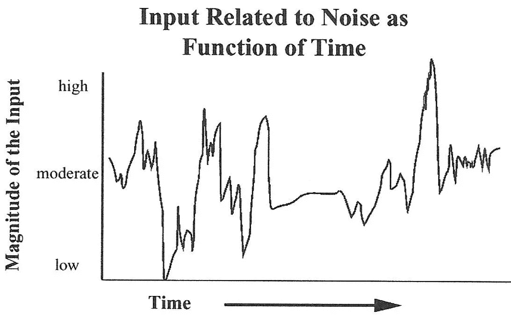
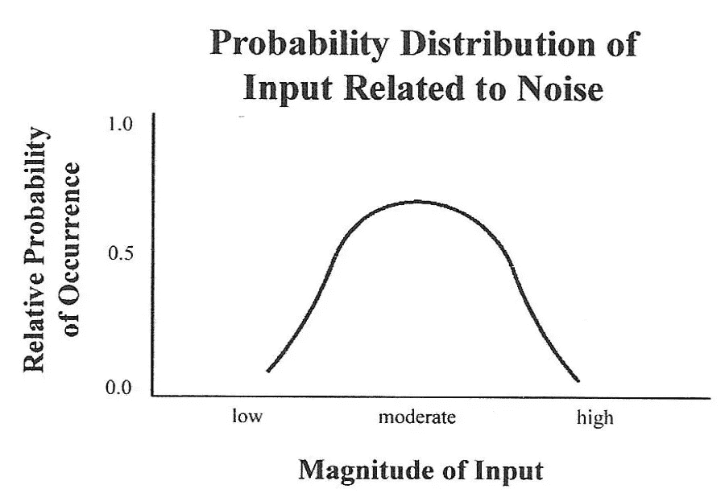
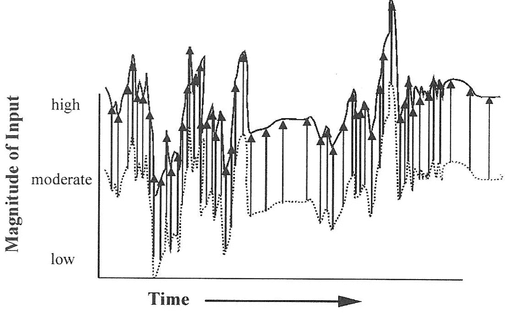
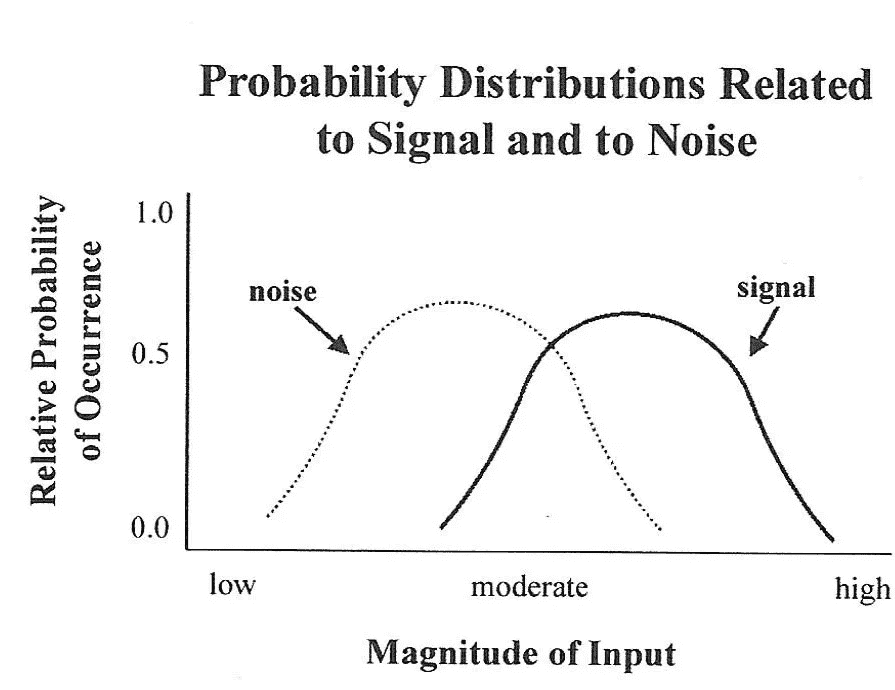
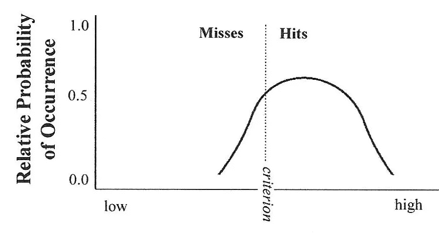
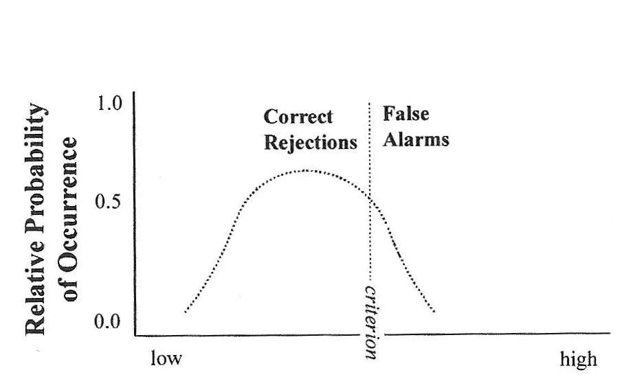
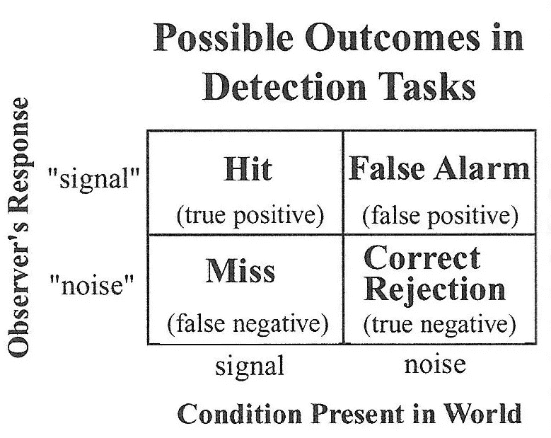

# 信号检测理论，第二部分

> 原文：<https://medium.com/codex/signal-detection-theory-part-2-e5882c985795?source=collection_archive---------14----------------------->

## 基本概念框架

在我之前关于这个话题的文章中，

 [## 信号检测理论，第一部分

### 历史渊源

medium.com](/codex/signal-detection-part-1-f6c19e371716) 

我描述了*信号检测理论* ( **SDT** )产生发展的历史背景。在这里，我将描述这个理论背后的概念框架。

**SDT** 可以推广应用于任何*诊断系统*，这个术语适用于任何使用一套正式的规则和程序来判断环境中是否存在某种特定状态的情况。这个理论最容易解释的方法是描述它在一个简单情况下的应用。考虑人类观察者参与实验的情况，该实验旨在观察她是否能察觉非常微弱的闪光。给出了几个试验，在随机的基础上，在一半的试验中给出了闪光，在另一半的试验中没有给出光刺激。每次试验后，要求受试者报告诊断结果，要么是“闪光存在”(*信号*)，要么是“闪光不存在”(*噪音*)。

**SDT** 试图解释这个观察器(或者更一般地，任何诊断系统)如何决定报告什么。该理论的一个假设是，可用于做出决策的信息隐藏在噪声中。噪声源可能包括外部环境，也可能包括内部处理机制。此外，噪声的幅度随时间波动。图中显示了噪声输入的卡通描述。

如果要测量一段时间内每时每刻存在的噪声量，就有可能根据下图所示的概率分布来确定任何特定时刻可能存在的噪声量。

当环境中存在信号时，关于该信号的信息将与正在进行的噪声混杂在一起。下图对此进行了描述，其中来自信号的恒定幅度的输入(由箭头表示)已经叠加在正在进行的噪声上。

信号的概率分布(技术上来说，*信号加噪声*，但我将简单地称之为信号)将移动到单独噪声分布的右侧，如下图所示。

这些图中的标签*输入*的幅度，是一个有点抽象的理论概念，用来解释诊断系统内部发生的事情。假设在从外部环境到最终诊断的因果链的某处，存在一个做出最终选择的地方。进行这种选择的所有可用信息可以由单个值(*输入*的幅度)来表征，该值类似于输入代表信号的假设可能性。更高的幅度表示信号存在的更高期望。

**SDT** 认为，在响应“信号”之前，诊断系统将要求输入幅度值超过某个值，称为*标准*。每当输入的幅度没有达到这个标准值时，它将响应“噪声”。

在上图中，标准*叠加在信号*的概率分布*上。它说明了使用该标准的诊断系统将能够产生许多检测到信号的试验(标准右侧曲线下的区域)。在最初的 **SDT** 中，这些试验被称为*击中*。在现代术语中，它们通常被称为技术术语*真阳性*。然而，当存在的信号未被检测到时，将有一些比例的试验(标准左侧曲线下的区域)。在 SDT 的最初公式中，这些被称为*未命中*，现在通常被称为*假阴性*。*

因此，有人可能会问，为什么诊断系统不简单地将其标准向左移动足够远，以至于错过的次数可以忽略不计？这个问题的答案是，诊断系统无法知道在任何给定的试验中，信号是否存在。相对于噪声概率分布，这里示出了与上图中所示的信号概率分布相同的标准。

只有当噪声不超过标准(噪声概率分布的区域落在标准的左边)时，在没有信号存在的试验中才会出现正确的诊断。这些被称为*正确拒绝*或*真正拒绝*。噪音超过标准的试验将导致*假警报*(在更现代的用法中*假阳性*)。

因此，套用一句老话，诊断系统被夹在失误和错误警报之间。没有任何策略可以避免犯错。将标准向左移动将减少未命中，但同时会产生额外的错误警报。另一方面，将标准向右移动将减少错误警报，但同时增加未命中。

SDT 明确了一个事实，即诊断系统不能只关心命中和未命中。它必须始终考虑可能结果的完整的 2 乘 2 表。

此外，SDT 允许我们计算调整标准的变化将如何影响表中所有四个单元格的结果。这些计算基于对落在标准左侧和右侧的每条概率分布曲线下的面积的分析。在许多情况下，基于这种类型的分析预测的相互作用与基于传统的*猜测修正*方法的预测大相径庭，正如我在关于这个主题的第一篇文章中所描述的那样，这种方法在过去有时会被使用。

这里描述的 SDT 的主要组成部分(输入的幅度、信号和噪声的概率分布、标准)都是理论上的构造。它们不能被直接看到或测量。在即将发表的第三篇也是最后一篇文章中，我将把这个理论框架与可以在诊断系统上执行的经验测量和评估联系起来，并讨论 SDT 在构建、校准和使用它们时的一些实际用途。

罗恩·布斯

psyrgb@emory.edu

笔记

数字改编自

罗纳德·G·布斯，*视觉环境的感知*，施普林格出版社，2002 年。