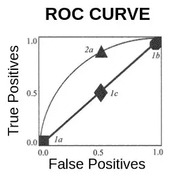
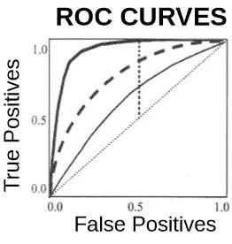
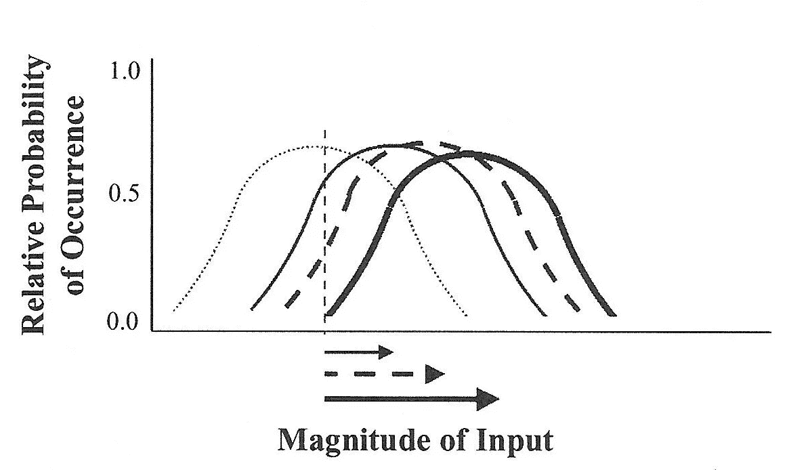

# 信号检测理论，第三部分

> 原文：<https://medium.com/codex/signal-detection-theory-part-3-1b1a1287f320?source=collection_archive---------19----------------------->

## 分析 ROC 曲线

在以前的文章中，我讨论了历史起源，

 [## 信号检测理论，第一部分

### 历史渊源

medium.com](/codex/signal-detection-part-1-f6c19e371716) 

和基本概念框架，

 [## 信号检测理论，第二部分

### 基本概念框架

medium.com](/codex/signal-detection-theory-part-2-e5882c985795) 

*信号检测理论* ( **SDT** )。在这里，我将描述如何使用该理论来评估和微调诊断系统的有效性。

对一个诊断系统的评估包括比较它产生的各种诊断的相对频率。正如我在以前的文章中所讨论的，一个诊断有四种可能的结果(*真阳性、假阳性、真阴性和假阴性*)。但是关于这些结果如何相互作用，只有两个自由度。例如，如果*真阳性*率为 70%，则自动知道*假阴性*率必须为 30%。*假阳性*和*真阴性*比率受到类似的限制。因此， **SDT** 评估只需要检查两个结果的相对比率。典型地，这是通过构建*接收器操作特性**(****ROC****)曲线*来完成的，其中*真阳性*的相对比率被绘制为*假阳性*的函数。一条假想的 ***ROC*** *曲线*如图所示。

标记为 1a、1b、1c 和 2a 的点示出了诊断系统在文中描述的条件下的假设性能。

考虑标记为 *1a* 的数据点。它说明了如果在不确定时选择总是猜测“噪声”,那么没有能力区分信号和噪声的(无价值的)诊断系统的性能会下降到什么程度。该诊断系统从未产生*假阳性*，但也从未产生任何*真阳性*。

数据点 *1b* 说明了如果改变其*标准* ( [我在上一篇文章](/codex/signal-detection-theory-part-2-e5882c985795)中描述了这个技术术语)，并选择在不确定的时候猜测“信号”，那么这个相同(无价值)的诊断系统的性能将会下降到哪里。如果我们只检查*真阳性*，看起来这个诊断系统做得非常好，因为它从未错过任何信号。然而， **ROC** 图表明它也产生 100% *假阳性*响应。

接下来，让我们考虑一下，如果这个同样的(毫无价值的)诊断系统在每次试验中都抛硬币，正面时回应“信号”，反面时回应“噪音”，会发生什么。预计性能会在标记为 *1c 的点下降。*它会产生 50% *的真阳性*，但也会产生*50%*的假阳性。**

请注意，所有这三个数据点都落在 **ROC** 图上向右倾斜的对角线上。一个普遍的规则是，一个产生落在这条对角线上任何地方的点的诊断系统是没有价值的，不管它产生多少*真阳性*。

现在考虑标记为 *2a* 的数据点。这代表一个假设的诊断系统，它产生 85% *的真阳性*和 50% *的假阳性*。这个诊断系统有一定的价值，因为它产生*真阳性*的速率高于 *n 假阳性*。该诊断系统可以调整其*标准*，以增加或减少假阳性的百分比。*标准*中的这些变化将简单地将数据点移动到图中所示平滑曲线的某处，但不会改变*诊断精度*。

*诊断准确率*是指诊断正确的试验的百分比(即在信号试验中响应“信号”，在噪声试验中响应“噪声”)，这可以通过计算 ***ROC*** *曲线*下的面积来评估。通过注意到由于只有两种可能的选择(信号或噪声)，一个无价值的诊断系统将在 50%的试验中是正确的，并且这对应于右倾对角线下的 50%区域，这种关系可以直观地变得明显。诊断系统生成的曲线落在对角线上方越高，其 ***ROC*** *曲线*下的面积就越大，相应地，其*诊断精度*就越好。下图对此进行了说明。

显示了四条假设的 **ROC 曲线**。它们示出了随机运行的诊断系统的性能(向右倾斜的虚线)，并且具有逐渐更好的诊断准确性(细平滑曲线、虚线曲线、粗平滑曲线)。垂直线显示当标准设置为允许 50%的假警报时将达到的真正值。

向右倾斜的细虚线对角线代表随机运行的诊断系统的**曲线*(50%正确)。对角线上方的细实线曲线显示了假设的诊断系统的性能，该诊断系统的性能稍微好一些，虚线曲线甚至更好，粗实线曲线是所有曲线中最好的。垂直线说明了如果诊断系统使用导致 50% *假阳性*的*标准*，则*真阳性*响应的比例。*

****ROC*** *曲线*由诊断系统产生的经验数据生成。然而，这些曲线可以与我在上一篇文章中描述的由 ***SDT*** 提出的基础理论结构相关联，如下图所示。*

**

*虚线表示噪声的假设**潜在概率分布。**信号**与噪声的距离增加的概率分布由细平滑、虚线和粗平滑曲线示出。**基准**已设定在垂直线所示的位置。这些理论结构可以与诊断系统的相应测量输出相关联，如前图中的 **ROC 曲线**所示。***

*假设一个人正在使用具有某种证明的诊断准确度水平的诊断系统，其数据点将沿着其 ***ROC*** *曲线*位于何处将取决于*标准*的设置。*自由标准*是指诊断系统偏向于在不确定时响应“信号”。这将使数据点沿其 ***ROC*** *曲线*向右移动。更保守的标准将向左移动数据点。*标准*的这些变化将改变*假阳性*和*假阴性*的百分比，但不会改变*诊断准确度*。对于任何给定的诊断系统，应该在哪里设置*标准*取决于与*假阴性*相比，以*假阳性*的形式犯错误的相对成本。例如，在法院系统中诊断“有罪”或“无罪”时，一条被称为黑石比率的格言是，“10 个有罪的人逍遥法外，好过给一个无辜的人定罪。”*

*当设计或微调诊断系统时，一个重要的问题是如何设置或调整*标准*。如果诊断系统由算法控制，则可以明确设置。然而，在诊断系统依赖于人的判断的情况下(例如医生诊断是否患有癌症)，已经确定了两个主要因素，它们会影响*标准*的设置。*

*第一个是*收益。*这些是指与四种结果相关的后果(奖励和惩罚)。例如，如果*假阳性*被惩罚，诊断医生将倾向于将*标准*向保守的方向转移，使得更少的*假阳性*发生。类似地，如果有与*真阳性*相关的奖励，诊断医生会倾向于将标准向自由的方向转移。*

*重要的是，不要误以为利用奖励和惩罚来调整*标准*会对*诊断准确性*产生任何影响。出错的总数仅取决于系统的*诊断精度*。*标准*的变化只能影响*假阳性*对*假阴性*的错误的相对比例。*

*第二个因素被称为*先验概率。*这些是指诊断医生关于信号出现的可能性的先前经验和/或期望。如果诊断医生预期极有可能出现信号，则更有可能采用*自由标准*。我们许多人都经历过的一个相反的例子是听到附近的汽车警报声。我们很可能在过去多次听到类似的汽车警报声，它们总是被证明是假警报。因此，我们极不可能诊断出我们现在听到的警报声是一个小偷试图偷车的真实信号。换句话说，*先验概率*影响了我们采用一个非常保守的标准*。当微调诊断医生的表现时，控制这种影响的一种方法是安排系统的频繁的未宣布的测试，并根据这些测试运行期间的表现给予适当的奖励和惩罚。**

*罗恩·布斯*

*psyrgb@emory.edu*

***备注:***

*为了限制篇幅，我在这篇文章中过分简化了许多问题。为了更严格和全面地处理这个问题，我建议:*

*约翰·A·斯威茨和罗纳德·M·皮克特，*诊断系统的评价*，学术出版社，1982 年。*

*本文中的图表改编自:*

*罗纳德·G·布斯，《视觉环境的感知》，施普林格出版社，2002 年。*