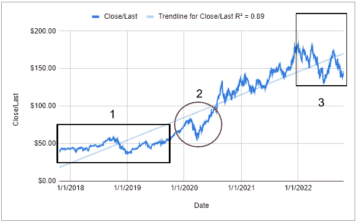
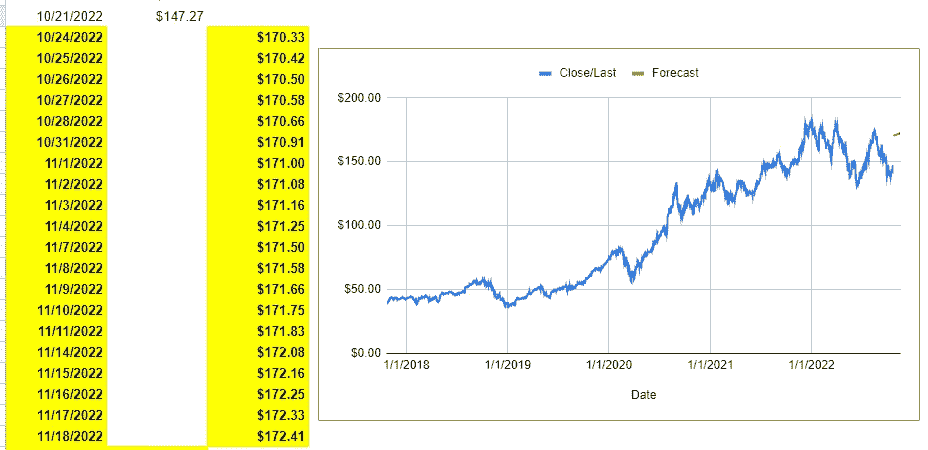
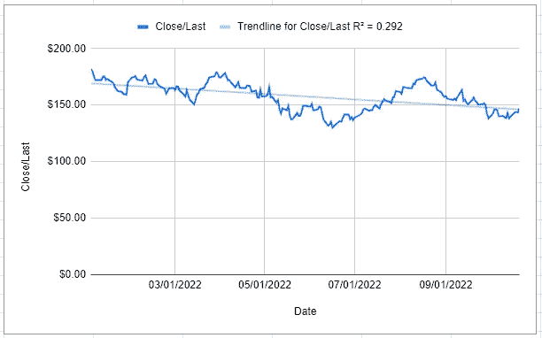
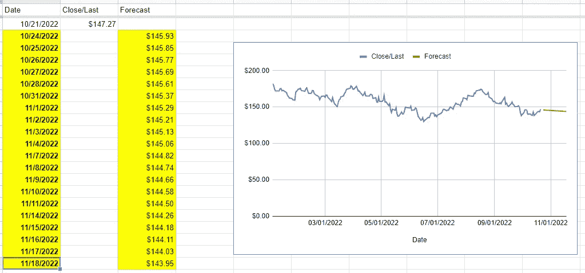
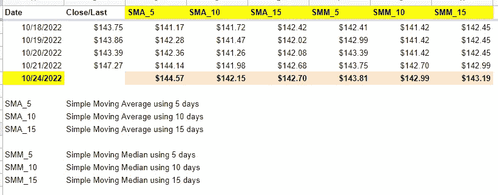
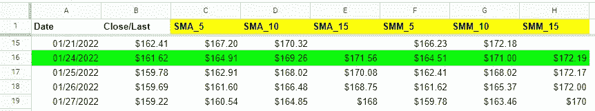
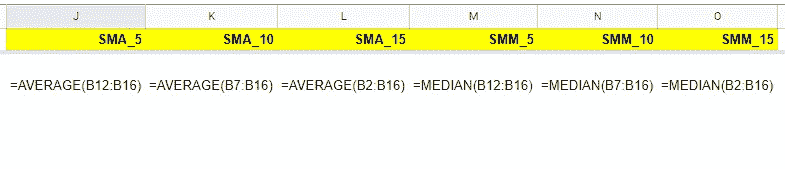
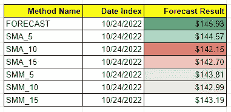

# 使用 Google Sheets 进行简单的数据预测

> 原文：<https://medium.com/codex/simple-data-forecasting-using-google-sheets-58234fdc1281?source=collection_archive---------5----------------------->

嗨，我叫大卫·贝克汉姆，你可以叫我贝克汉姆。我知道你来自人们所说的宇宙，我是一名职业英格兰足球运动员。但是，在我的宇宙中，我是一个新手数据分析师，很高兴认识你！

在我的世界里，我们也有一家叫苹果的公司，是的，就是那家，不同的是我的老板叫史蒂夫·沃克斯，我们在这里卖水果。他让我用这里的数据[预测我们的股票价格。如果你想看它，但不知道如何下载它，请在这里看](https://www.nasdaq.com/market-activity/stocks/aapl/historical)，我已经为我们下载了它。

作为一个新手，我知道一些简单的数据预测方法，我们可以使用 Google Sheets 轻松执行。如果你想知道，我会告诉你我是怎么做的。

# 数据可视化

在我们深入研究如何预测 Google Sheets 中的数据之前，让我们从数据可视化开始，这样我们就可以知道从 5 年前到现在的数据趋势线(我们正在使用的数据是 2017 年 10 月 23 日到 2022 年 10 月 21 日之间的数据)。



图一。AAPL 收盘股价折线图(每日)

我们从上面的可视化中得到了一些信息:

1.  2017 年 10 月到 2019 年 9 月之间价格相当稳定。
2.  从 2017 年 10 月开始到 2022 年 1 月，价格有一条正趋势线，尽管在 2020 年 2 月至 2020 年 4 月期间出现了大幅下跌。
3.  价格再次稳定，但从 2020 年 1 月开始一直呈下降趋势。
4.  添加趋势线，我们可以看到它有一个积极的线性趋势。

好了，事不宜迟，我们开始数据预测吧！

# 预测功能

你知道我们在 Google Sheets 中有预测功能吗？该函数的常见用法如下:

```
=FORECAST (x, *data_y*, *data_x*)
```

1.  `x`应填写我们想要预测的日期。
2.  `data_y`应由我们的历史数据(价格)填写。
3.  `data_x`应由我们的史料(日期)填写。

在这种情况下，假设我们想要预测 2022 年 10 月 24 日的股票价格。如果你问，“为什么不是 2022 年 10 月 22 日或 23 日？”答案是股票市场在周末不活跃，这就是为什么我们跳到周一，也就是 2022 年 10 月 24 日。

> 重要的是拥有进行数据分析的领域知识，而不仅仅是技术技能。



图二。使用预测公式可视化数据预测。

正如我们所看到的，预测公式产生的价值从 170.33 美元开始，并不断增加。从我们最近的数据来看，这是一个突然的增长，只有 147.27 美元的价值。这是因为预测通常使用线性趋势。从常识上讲，我们不能说用这个结果是恰当的。让我们尝试重新创建预测，但现在使用从 2022 年 1 月 1 日开始的更近的数据，因此预测可以获得[当前趋势线](https://docs.google.com/spreadsheets/d/13Gg-5EzFcj2-lTU-V5hEbyZ0yGIRlkZD-JhSLIqnOak/edit#gid=1099853807&range=A1:B204)。



图 3。可视化事实数据从 2022 年 1 月 1 日开始。

股价相当稳定，但总的来说，从 2022 年 1 月 1 日开始到 2022 年 10 月 21 日，它有一条下降的趋势线。



图 4。可视化事实和预测数据从 2022 年 1 月 1 日开始。

好样的。我们上次预测的结果我认为比上次使用的更合理。你可以在我们的图表(预测数据)中看到红线，它是一条直线，因为 Google Sheets 中的预测功能实现了线性预测。我知道这不是一个很好的预测，但是，嘿，最好还是给我们的同事一个信息，通过使用线性预测方法，数据在某种程度上应该是这样的。

> 因为预测并不总是准确的，只是简单地推断我们拥有的数据(只有日期和股票价格)。它没有考虑到由于未知因素导致趋势变化的可能性。我们只能把这个功能作为一个简单的叙述。

# 简单移动平均线(SMA)和简单移动中位数(SMM)

如果我没看错的话，这是我在大学里学到的第一个预测方法。这是一个基本的方法，我们可以在 Google Sheets 中轻松创建。简单来说，移动平均线基于维基百科[这里](https://en.wikipedia.org/wiki/Moving_average)，

> 通过创建完整数据集的不同子集的一系列平均值来分析数据点的计算。

移动平均线有许多类型，如简单移动平均线、累积移动平均线、加权移动平均线、指数移动平均线等等。在这种情况下，我们使用简单的 MA。事不宜迟，让我们继续我们的工作单[这里](https://docs.google.com/spreadsheets/d/13Gg-5EzFcj2-lTU-V5hEbyZ0yGIRlkZD-JhSLIqnOak/edit#gid=1891177247&range=A1:B224)。



图 5。使用 SMA 和 SMM 的预测结果。

正如我们在上表中看到的，我们使用了 5、10 和 15 的索引。我使用这些数字的原因是，股票价格每周只变动 5 个工作日，这就是为什么我使用 5 的倍数。我还添加了一个简单的移动中位数(SMM ),以防我们的数据有异常数据，可能会使我们的平均水平高于应有水平。

至于如何计算上面的 SMA 和 SMM，你可以直接在这里的文件中看到它们来了解更多。



图 6。如何创建 SMA 和 SMM。

# 比较结果

在最后一部分，我们将使用上面的几种方法来比较我们的预测结果。我在这里编译了结果[。](https://docs.google.com/spreadsheets/d/13Gg-5EzFcj2-lTU-V5hEbyZ0yGIRlkZD-JhSLIqnOak/edit#gid=3112502&range=B2:D9)



图 7。每种方法结果的比较。

我们可以看到，最高的预报数是由预报方法预报的，最低的是由 SMA_10 预报的，中间的是由 SMM_15 预报的。如果你知道，我在 2022 年 10 月 23 日晚上 11 点(UTC+7)发布这篇文章。让我们回到 2022 年 10 月 24 日的这张对比表，通常，股市在下午 3 点(UTC+7)收盘。我们可以将上面的结果与 AAPL 股票价格的实际数据进行比较，以了解哪种方法预测的价格最准确！

## 更新(2022 年 10 月 26 日)

正如我们在这里看到的，2022 年 10 月 24 日(收盘)的 AAPL 股票价格是 1.4945 亿美元，这意味着所有的预测值都低于事实。最接近的预测值是使用预测$145.93 的值。

# **结论**

1.  我们可以使用预测功能在 Google Sheets 中做一个简单的数据预测，并创建一个简单的移动平均值或中值。
2.  所有简单的方法都不能单独作为我们最终的决定，只能作为一个基本简单的叙述。
3.  时间越长，数据并不总是代表我们数据的当前状况。有时，我们必须知道可以使用哪些数据来提高预测的准确性。

> 我希望通过阅读这篇文章，你有兴趣尝试在 Google Sheets 中进行简单的数据预测，这不会有什么坏处！如果你有任何意见或批评，不要犹豫给我，我很乐意听到他们，我相信这将使我在未来成为一个更好的作家。