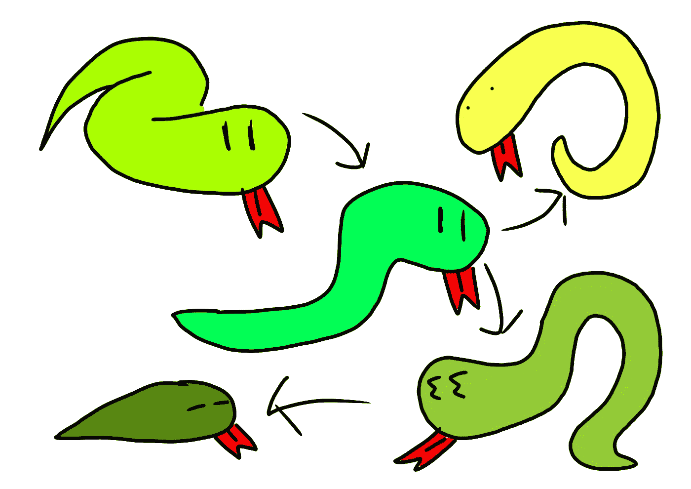

# Python 中的简单图形遍历 COVID 示例的接触追踪

> 原文：<https://medium.com/codex/simple-graph-traversal-in-python-contact-tracing-for-covid-example-15bc0b48498c?source=collection_archive---------2----------------------->



巨蟒图

实际上，我在不久前的一次编码采访中接受了这个任务，因为它需要一些图遍历，所以我决定在本文中分享它。

# 这个问题

您有两个列表— `confirmed`和`history`:

```
confirmed = [1,2,3]
history = [(1,2), (1,4), (4,5), (4,6), (6,10)…
```