# 初学者使用 Goutte 构建 PHP Web Scraper 的简单指南

> 原文：<https://medium.com/codex/simple-guide-to-building-a-php-web-scraper-using-goutte-for-beginners-70f9c908a84f?source=collection_archive---------8----------------------->

最初发表于 [ScraperAPI](https://www.scraperapi.com/blog/simple-guide-to-building-a-php-web-scraper-using-goutte-for-beginners/) 。

PHP 是一种广泛使用的后端语言。被很多人讨厌，被很多应用程序使用，比如 WordPress。然而，当考虑网络抓取时，PHP 并不是第一个想到的选项。

有了像 Python 的[Scrapy](https://www.scraperapi.com/blog/how-to-scrape-amazon-product-data/)或 Node.js 的[Cheerio](https://www.scraperapi.com/blog/web-scraper-with-javascript/)这样的工具，网页抓取变得简单，很难想象为什么要用 PHP 来抓取数据。直到你学会所有不同的选择。

因为它有一个活跃的社区，而且已经存在了很长时间，PHP 有很多工具可以使 web 抓取不仅更简单，而且更强大。

如果你已经知道 PHP 或者你有兴趣学习一门能够快速有效地提取 web 数据的后端语言，那么本教程就是为你准备的。

今天，我们将探索一些您可以随意使用的工具，并做一个真实的代码示例，用 PHP 构建您的第一个 web scraper。

# 选择 PHP 网页抓取库

在 PHP 中有很多方法可以进行网页抓取。但是最有效的方法是使用一个内置了下载和解析 URL 所需的所有工具的库。

否则，我们将不得不花费更多的时间和编写更复杂的代码来完成像发送 HTTP 请求这样的简单任务。

如果我们将网络抓取划分为核心任务，它看起来会是这样的:

*   首先，我们将向服务器发送一个 HTTP 请求来获取页面的源代码。
*   然后，我们必须解析 [DOM](https://www.w3schools.com/whatis/whatis_htmldom.asp) 来识别和过滤信息，以提取我们需要的数据。
*   最后，我们希望对数据进行格式化，使其更容易理解——比如转换成 CSV 或 JSON 文件。

仅仅对于 HTTP 请求，我们可以使用几种不同的方法，比如:

*   fsockopen() —虽然不用于处理 HTTP 请求，但完全可以这样做。当然，这将需要大量我们并不想写的不必要的代码。
*   [cURL](https://curl.se/docs/faq.html#What_is_cURL) —这是一个 URL 客户端，允许您轻松执行 HTTP 请求，但对于导航 HTML 文件和提取我们正在寻找的数据没有太大帮助。
*   使用 HTTP 客户端，如 [Guzzle](https://docs.guzzlephp.org/en/stable/) 或[Goutte](https://github.com/FriendsOfPHP/Goutte)——这也使得解析 HTML DOM 树比以前的选项更容易。

如你所见，最后两个是我们称之为用 PHP 抓取网页的现成工具。

# 为什么使用 Goutte 进行 PHP 网页抓取？

你已经知道我们在这个例子中要用 Goutte 剧透自标题——但是你知道为什么吗？

对于网络抓取来说，Guzzle 绝对是一个很好的选择。它简化了 HTTP 请求，并且能够解析下载的文件以提取数据。

问题是，要实现这一点，我们必须将下载的 HTML 文件转换成 DOMDocument，然后使用 XPath 表达式导航文档以选择我们想要获得的节点。

这些增加了额外的步骤，我们可以使用 Goutte 轻松克服。

Goutte 是一个 HTTP 客户端，由 Symfony 框架的创建者 Fabian Potencier 创建。

这个库结合了四个 Symfony 组件，使得网页抓取非常简单和优雅:

1.  [browser kit](https://symfony.com/doc/current/components/browser_kit.html)——模拟浏览器的行为。
2.  [DOM crawler](https://symfony.com/doc/current/components/dom_crawler.html)—这个组件允许我们使用类似`$crawler = $crawler->filter('body > h2');`的表达式和许多其他方法来导航 DOM 文档。
3.  [CSS selector](https://symfony.com/doc/current/components/css_selector.html)—这个组件允许我们使用 CSS 选择器挑选元素，然后将其转换为相应的 XPath 表达式，从而使选择元素变得非常简单。例如，这个代码片段`$crawler->filter('.fire');`将查找所有带有`class=”fire”`的元素。
4.  [Symfony HTTP 客户端](https://symfony.com/doc/current/http_client.html) —这是最新的组件，自 2019 年实现以来获得了很大的人气。

由于这些原因，我们将在本教程的剩余部分使用 Goutte。

**注意:**我们将在未来发布一个暴饮暴食教程，所以请继续关注[我们的博客](https://www.scraperapi.com/blog/)和[社交媒体](https://twitter.com/scraperapi)。

# 用 PHP 和 Goutte 构建 Web 刮刀

在我们真正开始写代码之前，理解我们想要抓取的站点的结构是很重要的。

对于本教程，我们将抓取 [NewChic 的女装 t 恤页面](https://www.newchic.com/women-t-shirts-c-3666/?mg_id=1&from=nav&country=223&NA=1)以提取:

*   t 恤的名称
*   链接到作品
*   价格

像这样的刮刀可以用于希望进行竞争分析的电子商务企业。

让我们从检查页面开始。

# 1.使用浏览器开发工具检查页面

在我们的目标网站上，右击页面并点击“inspect”——或者，你也可以按 ctrl + shift + c。

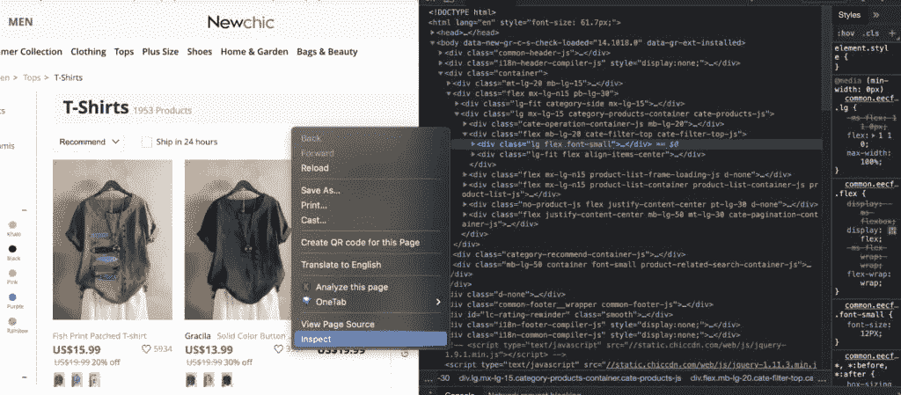

它将在您的浏览器上打开检查工具。

我们在浏览器用来显示页面的 HTML 代码中看到的。每一行都有关于页面上一个元素的信息。

我们真正关心的是每个元素的标签、类和 id，因为这些是我们将用来让我们的 scraper 找到我们需要的信息的细节。

那么，就从布的标题说起吧。为此，右键单击元素并检查它。

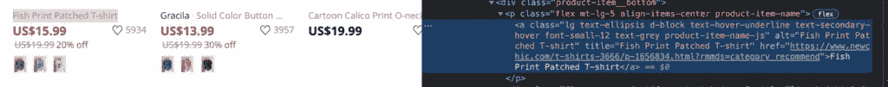

我们可以看到 t 恤的名字被包裹在`
`标签里面的`<a>`标签之间。

也就是说，它肯定不是页面上唯一的链接。如果我们只使用元素的标签，我们将从页面中提取所有链接，包括导航链接、页脚链接和其他所有内容。

这就是职业进入游戏的地方。

对于 t 恤的名字来说，`<a>`标签有一个类“`lg text-ellipsis d-block text-hover-underline text-secondary-hover font-small-12 text-grey product-item-name-js`”。所以我们希望确保所有其他元素都使用同一个类。

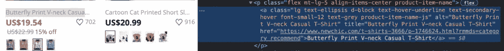

在检查了几个之后，它们都使用了同一个类，这对我们来说是完美的，因为我们可以用它来选择我们的标题和链接。

**注意:**我们稍后将探索如何提取一个< a >标签的 href 属性。

接下来，我们将对每个元素做同样的事情:

*   对于价格:`span class="product-item-final-price-js price product-price-js font-middle font-bold text-black-light-1`

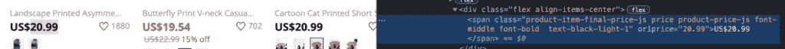

*   对于链接:我们将使用与标题相同的方法，但不是获取文本，而是获取 href 值。

# 2.安装 PHP 和所有必要的依赖项

在我们下载任何文件之前，让我们先检查一下我们是否已经安装了 PHP 的任何版本。在你的终端输入`php -v`。

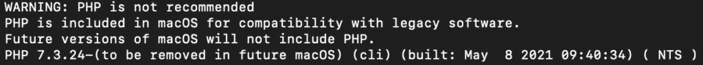

这是我们收到的通知，因为我们用的是 M1 的 Macbook。重要的是我们有 PHP 的 7.3.24 版本。

如果你还没有安装，那么按照下面的步骤[在你的 Mac 上安装 PHP](https://www.php.net/manual/en/install.macosx.packages.php):

*   去 https://brew.sh/[安装自制软件。这是一个缺失的 macOS 软件包管理器](https://brew.sh/)
*   家酿安装后，您可以使用以下命令安装 PHP:brew install PHP—在开始下载之前，它会要求您的机器的密码。

你也可以跟着这个简单的[视频在 macOS Big Sur 中安装 PHP 8](https://www.youtube.com/watch?v=Ry9tYKuXlW0) 。

**注意:**这里有一个资源解释了[如何在 Windows 上安装 PHP](https://www.sitepoint.com/how-to-install-php-on-windows/)。

## 全局安装 Composer

现在 PHP 已经在我们的机器上了，**我们将按照他们的文档下载**[**Composer**](https://getcomposer.org/doc/00-intro.md)(一个我们将用来下载 Goutte 的 PHP 包管理器)。

*   在桌面(cd 桌面)打开你的终端，写`php -r "copy('https://getcomposer.org/installer', 'composer-setup.php');"`。一个名为 composer-setup.php 的文件将会出现在你的桌面上。

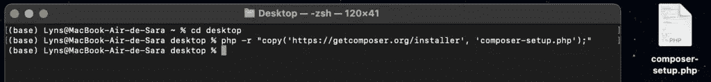

*   接下来，复制并粘贴以下命令:

`php -r "if (hash_file('sha384', 'composer-setup.php') === '756890a4488ce9024fc62c56153228907f1545c228516cbf63f885e036d37e9a59d27d63f46af1d4d07ee0f76181c7d3') { echo 'Installer verified'; } else { echo 'Installer corrupt'; unlink('composer-setup.php'); } echo PHP_EOL;"`

这将验证安装文件是否已正确下载。

*   验证文件后，我们将使用 PHP composer-setup.php 运行脚本。该命令将下载并安装实际的编写器。
*   如果我们停止在这一点上，我们将只能从桌面调用作曲家，这不是我们想要的。为了将它移动到我们的路径中，我们将使用命令`mv composer.phar /usr/local/bin/composer`。

哎呀！我们的指挥出了点小问题。但是不要担心，我们需要做的就是在命令中使用 sudo，所以它看起来像这样:

`sudo mv composer.phar /usr/local/bin/composer`

它会询问我们的密码，然后将文件移动到指定的目录。

*   为了完成这个过程，让我们调用 composer，通过在终端中键入 Composer 来验证它是否正常工作。它应该调用可执行文件，并向您显示以下消息。

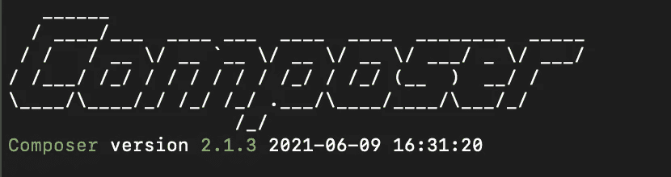

如果它不工作，去你的 finder，点击`shift+command+G`，在弹出窗口中输入`usr/local/bin/ path`。

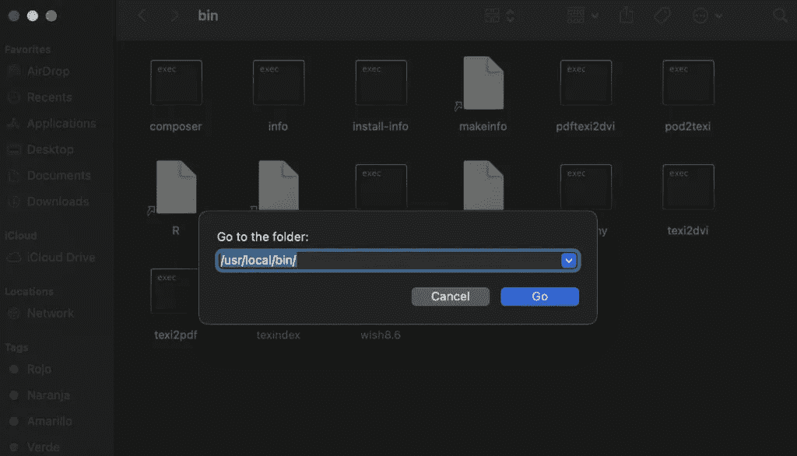

注意，我们的“composer.phar”文件现在被称为“composer ”,它是一个可执行文件。如果您看到它仍然是一个. phar 文件，只需更改它的名称，您就可以使用 composer 命令。

**注意:**完成后，您可以使用下面的命令 p `hp -r "unlink('composer-setup.php');"`删除安装程序。

## 安装 Guzzle 和 Goutte

我们安装 Guzzle 的原因是因为 Goutte 需要它正常运行。

分别在你的终端运行`composer require guzzlehttp/guzzle`安装 Guzzle 和`composer require fabpot/goutte`安装 goutte。

这需要几秒钟的时间，然后我们就可以开始编写我们的 scraper 了。

# 3.刮掉页面上的所有标题

我们将使用 [Visual Studio 代码](https://code.visualstudio.com/),但是您可以使用您喜欢的文本编辑器。

让我们创建一个名为“php_scraper_tutorial”的文件夹，并在 visual studio 中找到它。然后，打开一个新的端子，使用`composer require fabpot/goutte`将 Goutte 安装在里面。

它将添加一个名为“vendor”的新文件夹和两个文件(“composer.json”和“composer.lock”)。准备好之后，创建一个名为“php_scraper.php”的新文件。您的文件夹应该如下所示:

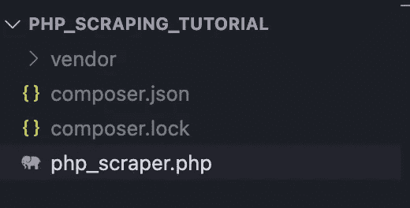

我们将以 PHP 标签(

【
`require 'vendor/autoload.php';`
`use Goutte\Client;`
`$client = new Client();`)开始我们的文件

PHP 自动加载会自动加载我们需要的每一个库，节省我们很多时间和麻烦。然后我们打开一个新的 Goutte 客户端，通过它我们将发送请求。

为此，我们将创建一个名为' $crawler '的新实例，并让它将请求发送到 Newchic 的页面，在 URL 之前指定方法——在我们的例子中是`GET`。

`$crawler = $client->request('GET', 'https://www.newchic.com/women-t-shirts-c-3666/?mg_id=1&from=nav&country=223&NA=1')`

但是我们不仅仅想要 HTML，不是吗？

得到响应后，我们希望使用之前确定的 CSS 类只提取每件 t 恤的名称。这就是`filter()`来拯救世界的时候。

`$crawler->filter('.lg text-ellipsis d-block text-hover-underline text-s;econdary-hover font-small-12 text-grey product-item-name-js')->each(function($node){`T8 `var_dump($node->text());`

我们的脚本将过滤所有与我们指定的类匹配的元素，并遍历每个节点(因为当提取所有元素时，我们将有多个节点)。

然而，在运行脚本之后，我们实际上得到一个致命的错误，并且没有返回任何东西。

这在 web 抓取中很常见(在任何开发环境中也是如此)，重要的是不要气馁。

经过多次尝试，我们使用 chrome 扩展 SelectorGadget 来获得正确的 CSS 选择器。

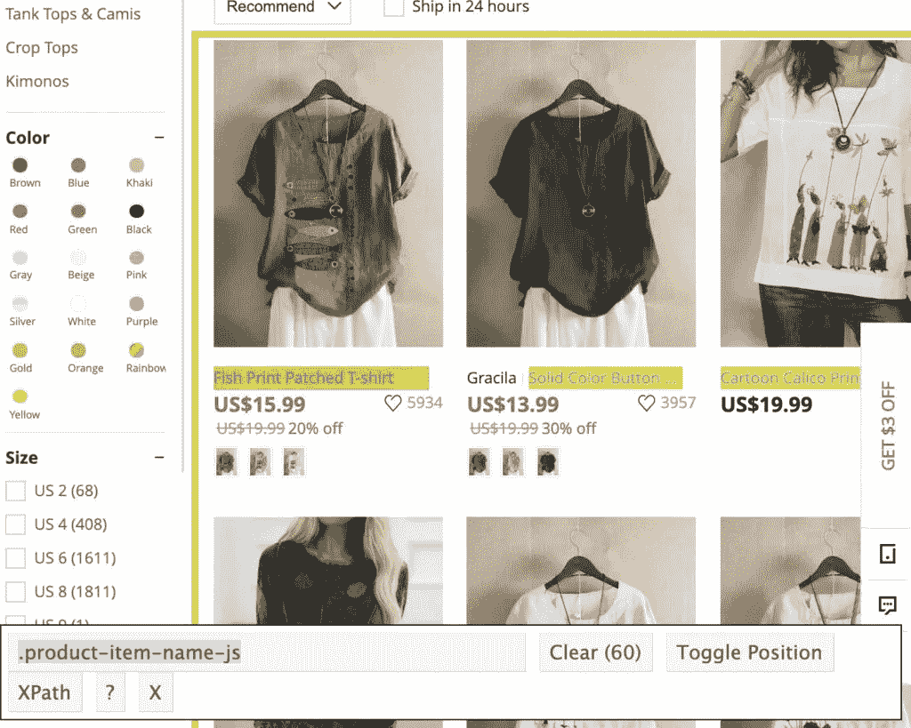

显然，问题是我们的脚本无法找到我们告诉它要寻找的类。所以它是在操作过程中坠毁的。

更新代码后:

【T4
`var_dump($node->text());`
`});`

我们能够运行代码并在页面上获得 60 个产品名称:

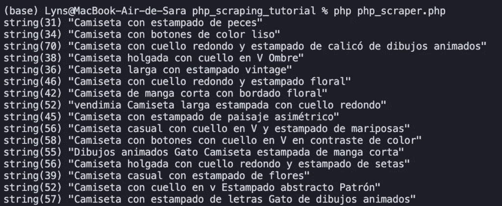

等等…西班牙语？刚刚发生了什么？

Newchic 的网站根据位置显示不同的内容(就像亚马逊一样),因为我们发送请求的 IP 地址来自一个拉丁国家，所以该网站以西班牙语版本的页面进行响应。

为了克服这一点，我们需要改变我们的 IP 地址。

# 4.将 Scraper API 与 PHP 集成用于地理定位

Scraper API 是一个结合了第三方代理、人工智能和多年统计数据的解决方案，以防止我们的抓取工具被验证码、禁令和其他反抓取技术阻止。

此外，我们可以使用 API 来执行 JavaScript(为此我们必须使用一个无头浏览器)和访问特定于地理的数据。

首先，让我们[创建一个免费的 Scraper API 帐户](https://dashboard.scraperapi.com/signup)来获得 5000 个免费 API 调用(每月)和我们的 API 密钥。

一旦我们进入仪表板，我们将使用 cURL 示例来构建用于脚本的 URL。

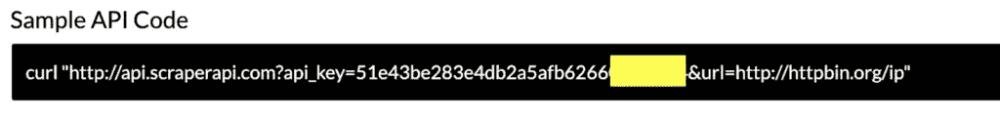

我们现在做的是在 url 参数后添加 Newchic 的 URL，并在字符串末尾添加一个额外的参数。

`$crawler = $client->request('GET', 'http://api.scraperapi.com?api_key=51e43be283e4db2a5afb6266xxxxxxxx&url=https://www.newchic.com/women-t-shirts-c-3666/?mg_id=1&from=nav&country=223&NA=1&country_code=us');`

`country_code`参数将告诉 Scraper API 从美国代理发送请求。

如果我们现在运行我们的脚本，我们将看到返回的内容现在是英文的，这是美国用户将在他们的浏览器中看到的。

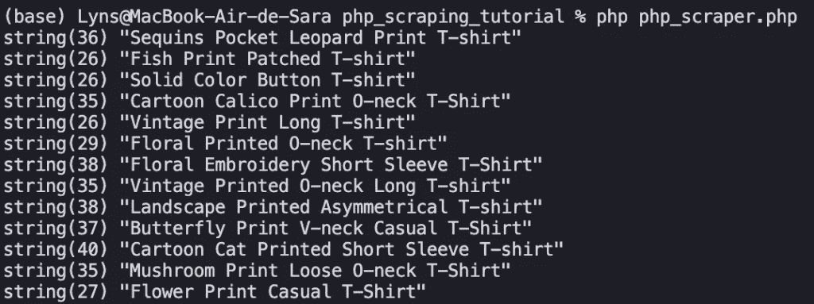

有关可用国家代码的完整列表及更多信息，请查看我们的[详细文档](https://www.scraperapi.com/documentation/)。

**注意:**如果你想从一个需要你执行 JavaScript 的站点获取 access 数据，只需设置`render=true`，记住每个参数都用一个&隔开。

# 5.从网页中抓取多个元素

对于这一部分，我们将混合一些东西。我们希望为每个想要获取的元素创建一个不同的变量。

首先，让我们更改第一个过滤器，让我们的 PHP scraper 查找包装了名称、价格和链接的元素。

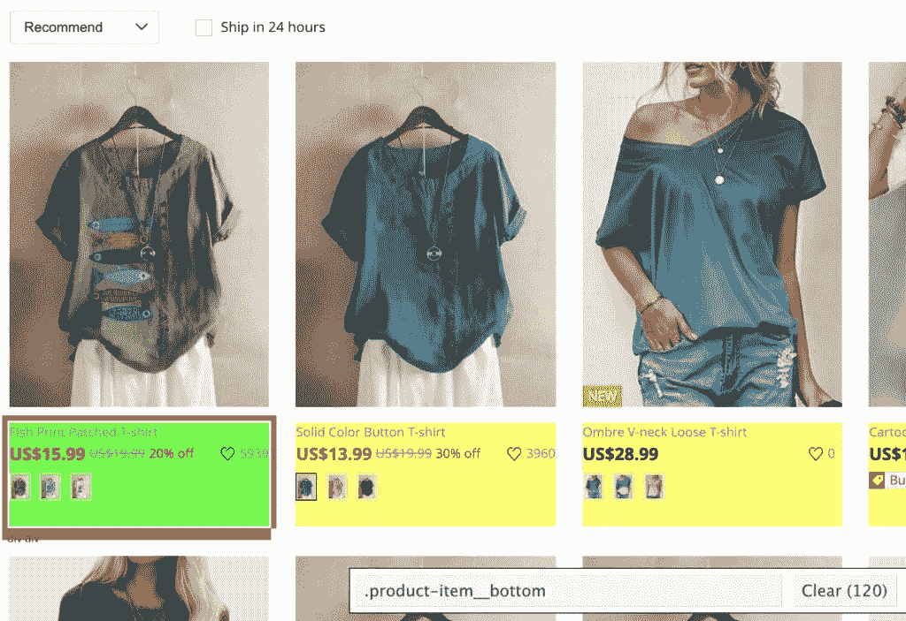

我们将为每个元素创建新的变量，并使用 filter()函数来查找$节点中的元素。

`crawler->filter('.product-item__bottom')->each(function($node){`T20 `$name = $node->filter('.product-item-name-js')->text();`

对于价格和名称，我们希望获取文本，但对于链接却不是这样。为了获取 href 属性中的值，我们将使用 attr('href ')方法。为了确保它找到正确的行，我们在 CSS 选择器中添加了 a 标记。

`$link = $node->filter('a.product-item-name-js')->attr('href');`

更新我们的文件后，它应该看起来像这样:

`<?php`
`include 'vendor/autoload.php';`
`use Goutte\Client;`
`$client = new Client();`
`$crawler = $client->request('GET', 'http://api.scraperapi.com?api_key=51e43be283e4db2a5afb62660fc6ee44&url=https://www.newchic.com/women-t-shirts-c-3666/?mg_id=1&from=nav&country=223&NA=1&country_code=us');`
`$crawler->filter('.product-item__bottom')->each(function($node){`
`$name = $node->filter('.product-item-name-js')->text();`
`$price = $node->filter('.product-price-js')->text();`
`$link = $node->filter('a.product-item-name-js')->attr('href');`
`});`

# 包扎

恭喜你！您刚刚使用 Goutte 创建了第一个 PHP web scraper。当然，还有很多要学的。

现在，我们将停止本教程在这一点上，因为它是一个关于 PHP 的网页抓取的介绍。

在未来的教程中，我们将扩展我们的 scraper 功能，以便它可以通过链接从一个脚本中抓取多个页面，并将我们抓取的数据转换为一个 CSV 文件，供我们进一步分析。

如果你想了解更多关于网络抓取的知识，看看我们关于大规模抓取项目的[提示](https://www.scraperapi.com/blog/5-tips-for-build-large-scale-web-scrapers/)。

有关使用 Scraper API 的更多信息，请查看 [Scraper API 备忘单和抓取最佳实践](https://www.scraperapi.com/blog/web-scraping-best-practices/)页面。您将了解每个 web 抓取器将面临的主要挑战，以及如何通过一个简单的 API 调用来解决它们。

刮的开心！