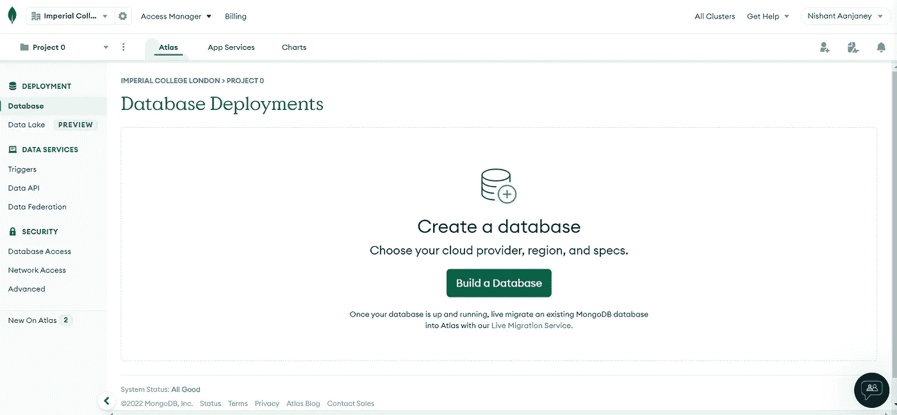

# 简单的 Mongo 快速设置

> 原文：<https://medium.com/codex/simple-mongo-setup-with-express-646583e47ebd?source=collection_archive---------4----------------------->

## NoSQL 数据库。

> 为什么前端 dev 要一个人吃午饭？因为他们不能连接表——一个孤独的程序员。


[鲁拜图·阿扎德](https://unsplash.com/@rubaitulazad?utm_source=medium&utm_medium=referral)在 [Unsplash](https://unsplash.com?utm_source=medium&utm_medium=referral) 上的照片

MongoDB 是一个非关系数据库，它使用类似 JSON 的结构以集合和文档的形式存储数据。它们易于查询，易于连接，并消除了复杂的 SQL 连接命令的麻烦。

# 创建您的 MongoDB 帐户。

去 MongoDB 网站创建一个账户，如果你还没有的话，点击登陆页面左上角的“登录”或“免费试用”按钮。

## 创建数据库

完成登录手续后，您应该会看到仪表板页面



点击“建立数据库”。


对于初学者来说，选择免费共享访问计划是一个好主意。点击最右边卡片上的“创建”按钮。


您可以自由浏览不同的选项，并选择离您最近的位置。以我的情况，我会选择爱尔兰的 AWS。


向下滚动以将集群名称更改为项目名称。我的项目名为 *Ponfi。*

现在点击**“创建集群”**结束。


## 得到蒙哥多布 URI

URI 代表统一资源标识符。我们用这个来定位 MongoDB 中的数据库。要获取 URI，在您的控制面板上的集群中，您应该能够看到一个“Connect”按钮。


添加您当前的 IP 地址，并设置用户名和密码。**请记住您在此设置的密码！你以后会需要它的。**

创建您的数据库用户，然后选择一种连接方法。


点击“连接您的应用程序”。


确保驱动程序和版本与屏幕截图上的一致。复制 URI 并将密码替换为您在创建用户时输入的密码(不带尖括号)

## 将 MongoDB 连接到 Express 应用程序

**注意:** *如果你是在 GDSC 会议上看到这篇文章的，这一部分不适合你，因为它已经完成了。*

Mongoose 是一个很好的框架，可以很好地集成 Express 和 MongoDB。首先，您需要安装依赖项:

```
npm install mongoose dotenv
```

在您的`server.js`文件中，将您的大部分代码迁移到一个函数中，并编写以下代码:

```
const mongoose = require("mongoose")
require("dotenv").config()

function bootServer() {
  const express = require("express")
  // ...
}

mongoose
  .connect(process.env.MONGO_URI, {
    useNewUrlParser: true,
    useUnifiedTopology: true,
  })
  .catch(err => console.error(err))
  .then(() => console.log("Connected to mongoose server"))
  .then(bootServer)
mongoose.Promise = global.Promise
```

我们使用`mongoose`包连接到您的 MongoDB，如果成功，我们启动服务器。但是它怎么知道要连接到哪个 MongoDB 呢？我们使用 URI。

在根目录下创建一个新文件，并将其命名为`.env`。该文件用于定义服务器中的所有环境变量。我在这里将我的`MONGO_URI`指定为键值对。

```
MONGO_URI=mongodb+srv://<username>:<password>@<cluster-host-domain>/?retryWrites=true&w=majority
```

使用`dotenv`包和变量`process.env.MONGO_URI`，我能够从环境中检索 URI。

喜欢我的文章？在我的页面查看更多信息:

[](https://www.medium.com/@cybercoder.naj) [## Nishant Aanjaney Jalan - Medium

### 阅读 Nishant Aanjaney Jalan 在媒体上的文章。本科生| CS 和数学老师| Android 开发者|…

www.medium.com](https://www.medium.com/@cybercoder.naj) 

```
**Want to connect?**

My [GitHub](https://github.com/cybercoder-naj) profile.
My [Portfolio](https://cybercoder-naj.github.io) website.
```