# 简单移动平均和指数加权移动平均

> 原文：<https://medium.com/codex/simple-moving-average-and-exponentially-weighted-moving-average-with-pandas-57d4a457d363?source=collection_archive---------0----------------------->

照片由来自 [Pexels](https://www.pexels.com/photo/graphs-display-on-an-ipad-187041/?utm_content=attributionCopyText&utm_medium=referral&utm_source=pexels) 的 [Burak Kebapci](https://www.pexels.com/@weekendplayer?utm_content=attributionCopyText&utm_medium=referral&utm_source=pexels) 拍摄

趋势是一种模式，显示数据随时间的移动。可以用手绘图解法、选点法、半平均法、移动平均法、最小二乘法进行测量。

**移动平均**的方法是基于不同时间点周期性变化的总效应完全中和的原理。它使用多个相邻数据点或周期的平均值，该平均值通过重叠观察计算得出，并且它**突出时间序列中的长期趋势**，同时捕捉短期波动。ARIMA 等时间序列预测模型使用移动平均进行预测。

## 简单移动平均线

SMA 是之前 k 个数据点的未加权平均值。如果 p1，p2…，pn 是时间序列数据点，并且最后 k 个数据点的平均值表示为 SMAk，则它可以计算为:

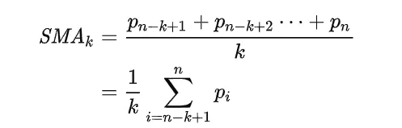

这里，k 的相同采样宽度是从(n-k+1)到 n 的范围。当计算接下来 k 个数据点的 SMA 时，k 的宽度将是从(n-k+2)到(n+1)的范围，并且新的值 p(n+1)进入图像，并且 p(n-k+1)消失。下一个 k 值的 SMA 可以用之前的值进行总结

SMA 可以用熊猫来实现。DataFrame.rolling()函数用于计算固定窗口内的移动平均值。

滚动函数的一般语法是

**data frame . rolling(*window*， *min_periods=None* ， *center=False* ， *win_type=None* ， *on=None* ， *axis=0* ， *closed=None* ， *method='single'* )**

其中 ***窗口*** 的大小是固定的，它是用于计算统计量的观察值的数量。如果未提供其他值，将采用默认值。

滚动平均从具有窗口值大小的完整序列中创建一个子集，它将是第一个移动平均。然后通过**向前移动**到具有窗口大小的下一个子集来改变子集。

为了解释 rolling()，我使用了一个数据集来描述 1959 年(从 1 月 1 日到 12 月 31 日)加州每天的女性出生人数。数据集的前 5 行如下

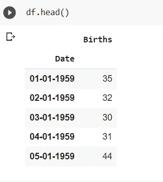

绘制数据框后，它将如下所示:

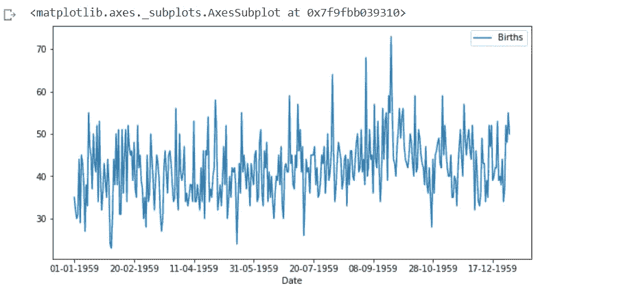

rolling()函数用于 5 天的窗口大小，详细信息如下:

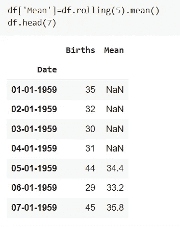

前 4 天的值，即(窗口-1)值将为 NaN，因为我们已经提供了从 5 天开始的滚动平均值。我们可以用线图来描绘它。

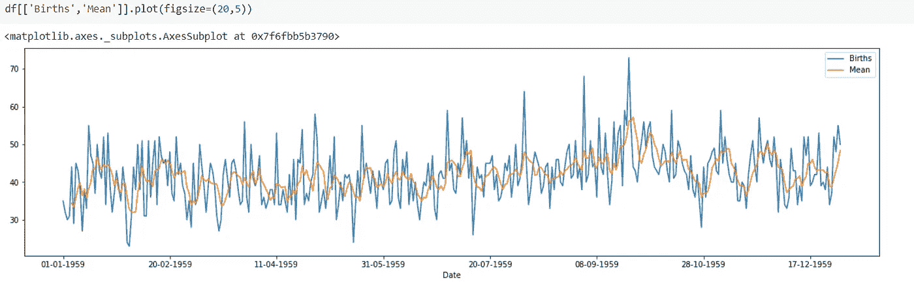

橙色线表示滚动平均值，不同于日线图，它具有平滑的趋势，因为它平滑了时间序列。

## **指数加权移动平均(EWMA)**

EWMA 也被称为**指数移动平均线(EMA)。**

**EMA 是通过使用 pandas 函数实现的。DataFrame.ewm()。**

**一般语法是**

****data frame . ewm(*com = None*， *span=None* ，*半衰期=None* ， *alpha=None* ， *min_periods=0* ， *adjust=True* ， *ignore_na=False* ， *axis=0* ， *times=None* )****

**在 EWMA，应用的权重取决于“调整参数”和使用的周期数。默认情况下，调整为真。**

**使用以下公式计算重量**

**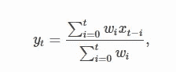****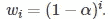**

****其中，alpha 是一个平滑因子，取值范围为 0 到 1，包括 1。****

**当调整参数为真时，yt 计算如下**

**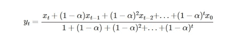**

**当调整参数为假时，yt 计算如下**

**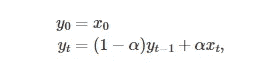**

**跨度对应于通常所说的“N 日 EW 移动平均线”**

**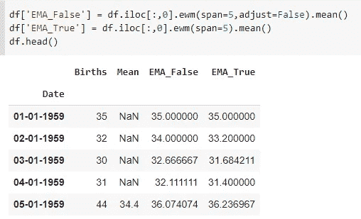****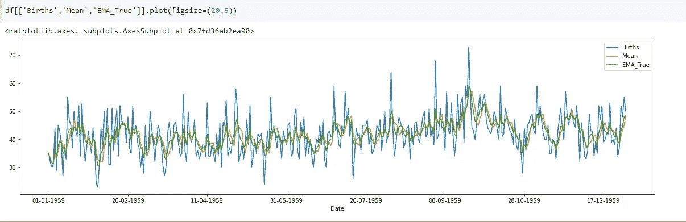**

**如果绘制最后几行，绘图将如下。**

**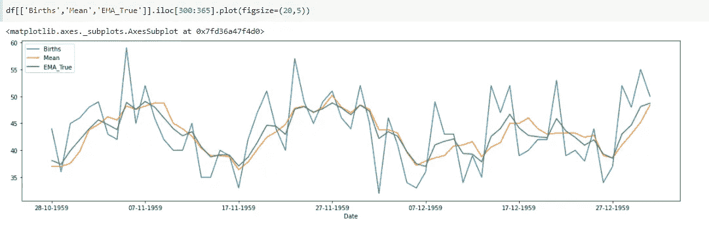**

**EWMA 用于计算会计/财务流程中可能看起来非常大的日常波动，它可以用于计算电子商务网站或其他网站的波动，等等。,**

**对于 ewm()函数，comass、span、halflife 和 alpha 是互斥的，因此要绘制 ewm()。mean()对于不同的 alpha 值，不能提供 span。当提供跨度时，alpha 计算为 2/(跨度+1)，其中跨度> = 1。**

**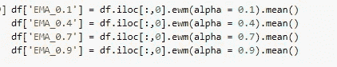****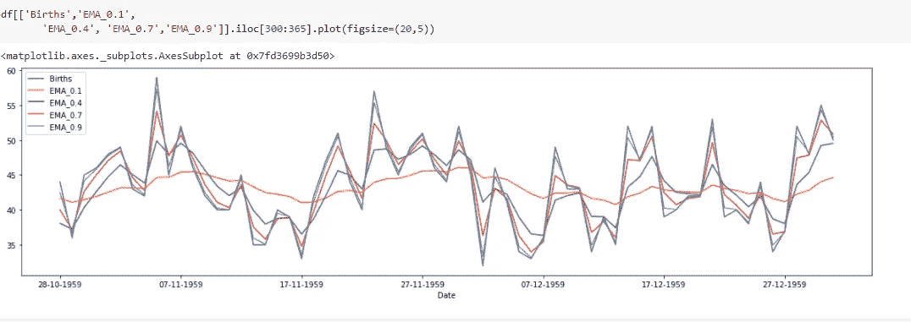**

**随着 alpha 值的增加，它变得越来越类似于原始特征。
我们来绘制原始特征，alpha 值=0.98999。**

**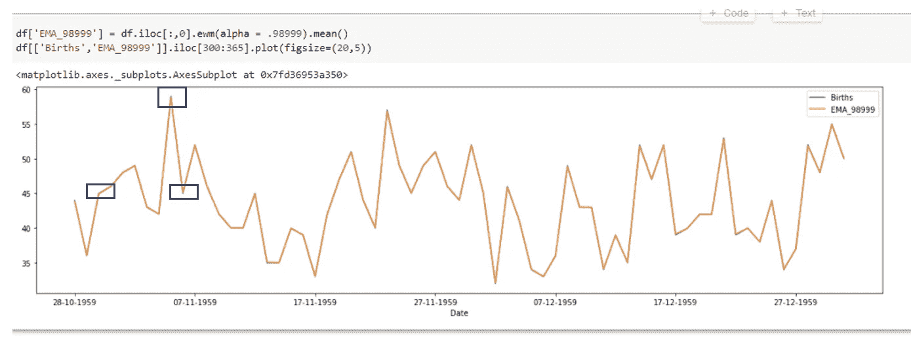**

**在这里，ewma 图几乎与原始特征重叠，我标记了几个点，在这些点上蓝线是可见的。如果 alpha 值取为 1，它将与原始值重叠。因此α值应根据要求取值。**

**你可以从[这里](https://github.com/SandKrish/TimeSeries/blob/main/SMA_EWMA.ipynb)获得完整的代码。**

****感谢阅读！！！！如果这篇文章对你有帮助，欢迎鼓掌，分享和回复。****

# **参考**

 **[## 熊猫。DataFrame.rolling - pandas 1.3.4 文档

### 提供滚动窗口计算。参数 windowint、offset 或 BaseIndexer 移动窗口的子类大小…

pandas.pydata.org](https://pandas.pydata.org/docs/reference/api/pandas.DataFrame.rolling.html)** ** [## 移动平均线-维基百科

### 在统计学中，移动平均线(滚动平均线或移动平均线)是一种通过…分析数据点的计算方法

en.wikipedia.org](https://en.wikipedia.org/wiki/Moving_average)**