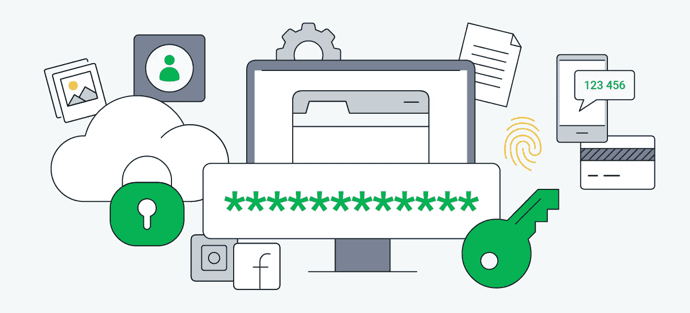

# 简单的密码技巧

> 原文：<https://medium.com/codex/simple-password-trick-ce60abe0f748?source=collection_archive---------15----------------------->

*你再也不用点击“重置密码”了。*

来源: [Pexels](https://medium.com/u/3ff316f89935?source=post_page-----ce60abe0f748--------------------------------)

随着对有效密码技术(使用复杂密码、保持密码私密性等)的大量了解，你会同意记住所有服务中使用的各种密码是最具挑战性的部分。

你喜欢做的最后一件事是记住你注册的所有服务(应用程序和网站)的密码，所以你在任何地方都使用同一个密码。

有些人实际上做了一些改变，比如在每个平台的同一个密码后面加上数字(0，1，2，…)。

这个技巧的问题是，每个人都喜欢简单的东西；你知道，我也知道。**但** [**黑客**](/@abdulazeezhaleemah/hackers-are-not-evil-fb808818b16c) **也知道这一点。**

想象一下，有人在黑了你的脸书账户后获得了你的电子银行账户，只是因为你在所有网站上都使用了相同的密码。

存储密码最安全的方法是使用**密码管理器。**

密码管理器是安全的在线保管库，用于存储应用程序和网站的登录信息、个人身份信息和敏感数据。

其中一些还具有密码自动生成功能，这有助于为新的注册活动创建唯一的密码。

> **事实上，您不必记住所有密码，只需记住一个(1):保险库密钥。**

来源:谷歌

保管库密钥是在密码管理器上开户时设置的主密码。

由于所有密码都存储在密码管理器中，因此在获得访问权限之前需要一个安全的整体密码。

这个密码应该非常安全和复杂，因为它是你所有密码*(和存储数据)的唯一入口。*

使用密码管理器，你不必担心你的密码被破解，因为所有的密码都以加密格式*(不可读形式)*存储，而不是纯文本。

只有当某人拥有您的主保险库密钥时，他才能访问您的密码。

## 可信密码管理器的一些示例如下:

1.  [**Bitwarden:**](https://bitwarden.com/) 最好的免费密码管理器。
2.  [**1 密码:**](https://1password.com/) 多个平台的最佳付费密码管理器，提供 14 天免费试用。
3.  [**KeePassXC:**](https://keepassxc.org/) 也是免费的，可以跨所有操作系统和设备型号工作。

所有这些密码管理器只有一个共同点:使用一把**主保险库钥匙**，这就是为什么在任何时候都要让它变得复杂和保密是极其重要的。

在下一篇文章中，我将分享如何创建完全安全的保管库密钥密码的分步指南。

如果你学到了新的东西，请给这个帖子 50 个掌声，不要忘记关注更多的内容。

此外，请随意在“回复部分”提出任何问题或顾虑，我会立即处理。

***下次见，Ciao。***