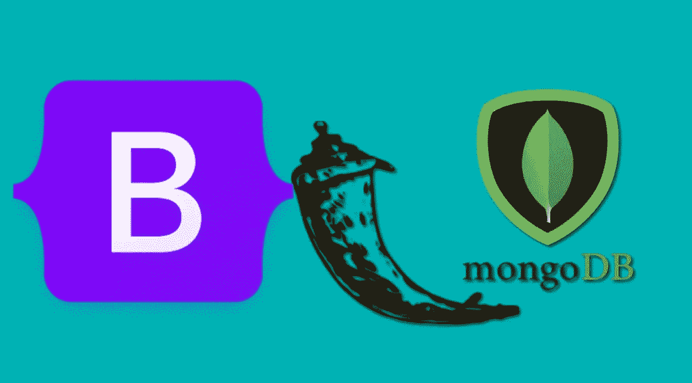

# 带有 Flask、MongoDB 和 BootStrap 的简单注册/登录系统

> 原文：<https://medium.com/codex/simple-registration-login-system-with-flask-mongodb-and-bootstrap-8872b16ef915?source=collection_archive---------0----------------------->

# **简介**

**Bootstrap** 是一个免费的开源 CSS 框架，致力于快速响应、移动优先的前端 web 开发。它包含基于 CSS 和 JavaScript 的设计模板，用于排版、表单、按钮、导航和其他界面组件。