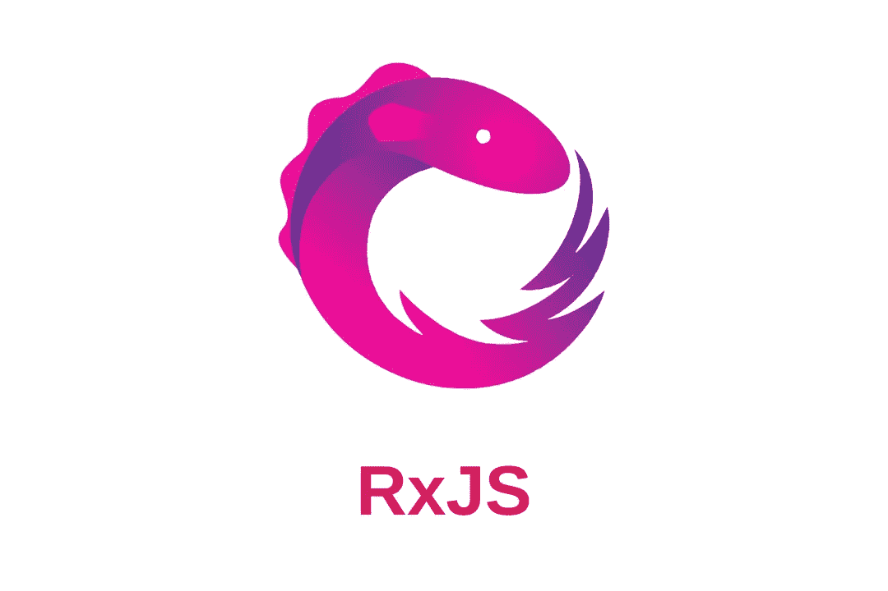
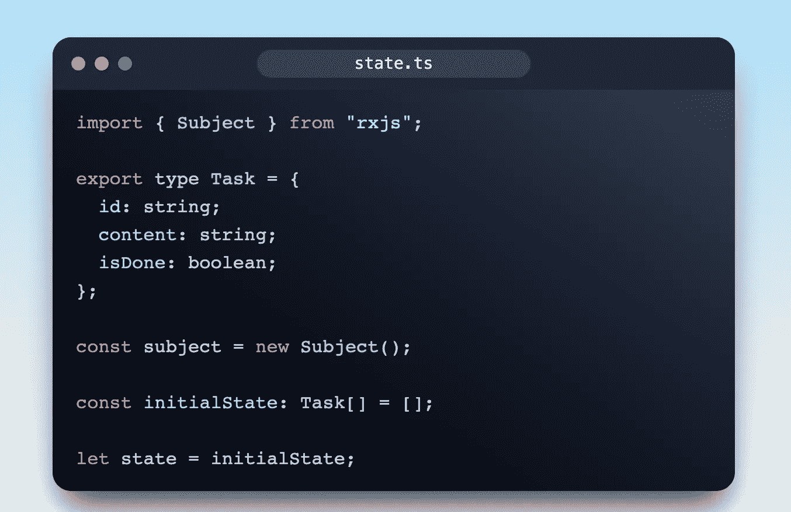
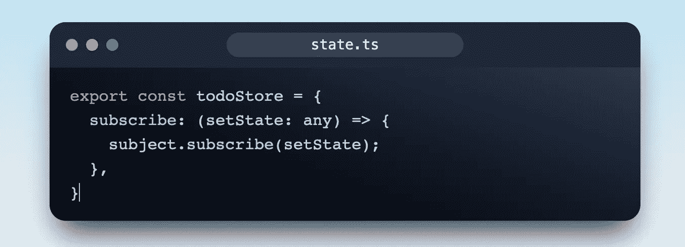
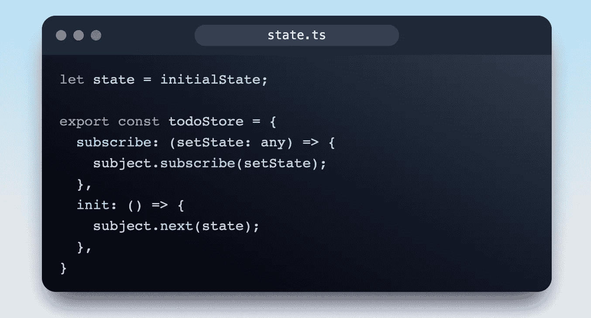
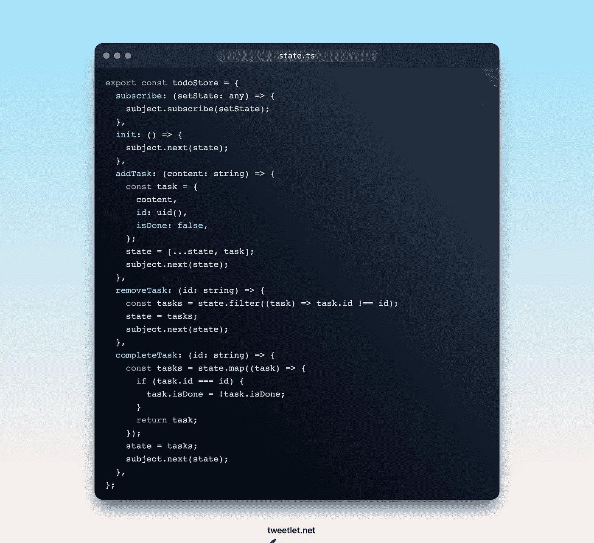
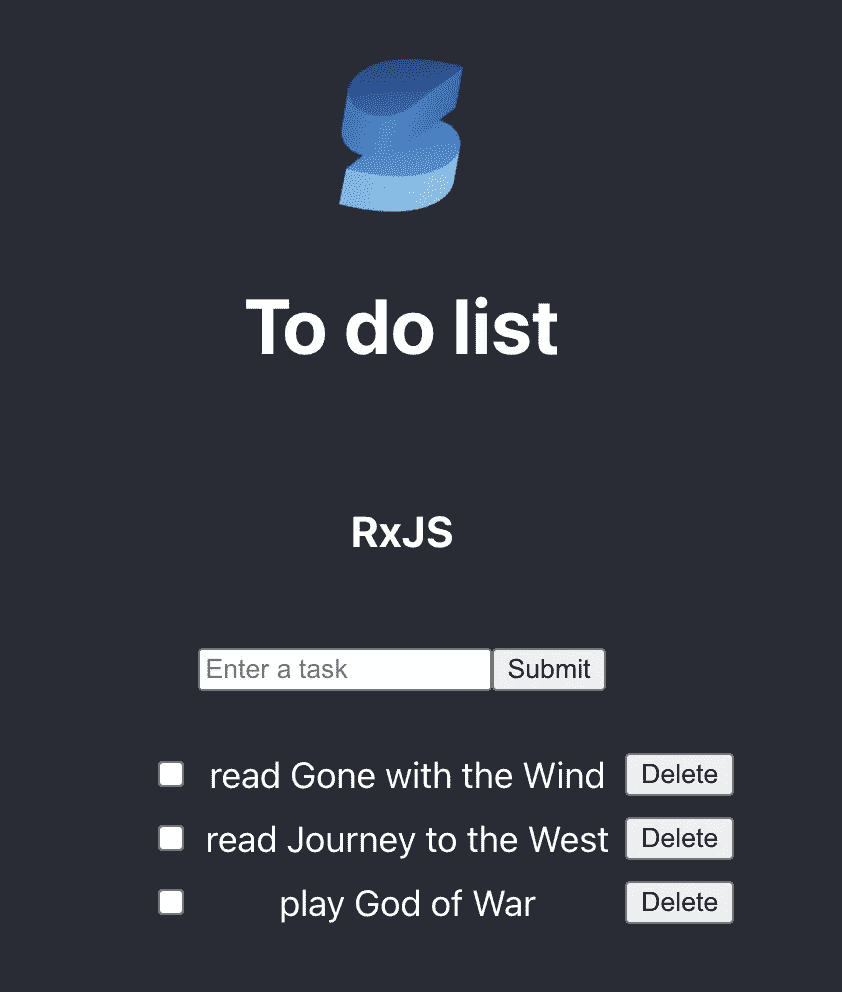

# 使用 RxJS 进行简单的状态管理——待办事项列表示例

> 原文：<https://medium.com/codex/simple-state-management-with-rxjs-a-to-do-list-example-ebd8da247e02?source=collection_archive---------8----------------------->



# RxJS 是什么？

RxJS 是一个非常流行的 JavaScript 反应式扩展库。

根据维基百科，反应式编程是一种声明式编程范式，涉及数据流和变化的传播。

在继续之前，我将介绍一些基础知识:

*   **可观察的**:表示未来值或事件的可调用集合的概念。
*   **Observer** :是一个回调集合，它知道如何监听被观察对象传递的值。
*   **订阅**:表示一个可观察的执行，主要用于取消执行。

# 设置项目

你基本上可以使用任何 UI 框架或库，甚至是普通的 JS。在本文中，我将使用 SolidJS(您可以发现它与 React 非常相似)

```
npx degit solidjs/templates/ts my-app
```

这将生成一个新的带有 TypeScript 的 Solid 应用程序，接下来，只需添加 RxJS 库

```
yarn add rxjs
yarn dev
```

# 安装存储

在`src`文件夹中，让我们创建`state.ts`文件(你可以把它命名为 store 或者别的什么),然后创建`initialState`和`subject`



# 捐款

RxJS 主题是向多个观察者多播值或事件的唯一方式。在这个例子中，我们将为我们的 RxJS Subject 订阅不同的`setter`函数，这样当它接收到任何数据时，它会将数据转发给与我们的`setter`函数相关联的每个状态(如果您熟悉 React，那么只需向它传递一个`setState`)

然后，我们将`subscribe`交给它



接下来，我们将创建一个`init`方法来初始化状态



`next`方法用于将一个值推送给主题，当我们调用`next`方法并将一个值作为其参数时，该值将被强制转换给订阅该主题的所有观察者。

# 添加、删除和修改状态

关于这一点没什么可说的，就像其他待办事项列表的例子一样，我们需要多种方法来修改保存任务的状态



这是我们的应用程序的完整版本，如果你想实现你的愿望，你可以添加更多的方法。最终产品可能看起来像这样，这取决于您的风格:



希望这篇教程能帮助你理解 RxJS 的基本知识和用法。你可以在这里找到源代码

参考资料:

*   [https://rxjs.dev/](https://rxjs.dev/)
*   【https://tweetlet.net/code】
*   [https://en.wikipedia.org/wiki/Reactive_programming](https://en.wikipedia.org/wiki/Reactive_programming)
*   [https://blog . log rocket . com/rxjs-react-hooks-for-state-management/](https://blog.logrocket.com/rxjs-react-hooks-for-state-management/)

# 遗言

虽然我的内容对每个人都是免费的，但是如果你觉得这篇文章有帮助，[你可以在这里给我买杯咖啡](https://www.buymeacoffee.com/kylele19)