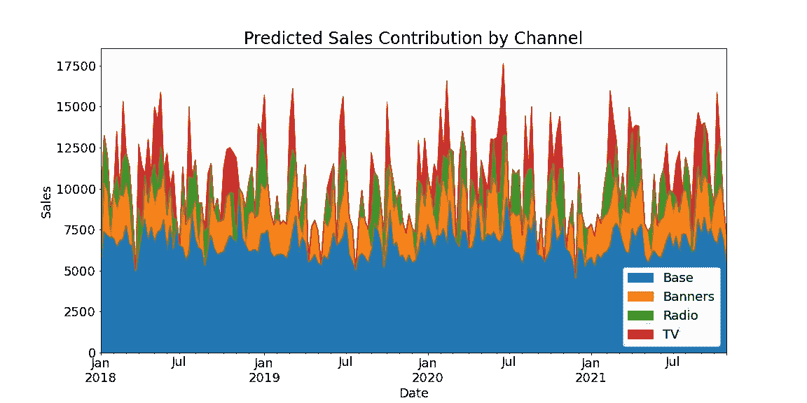
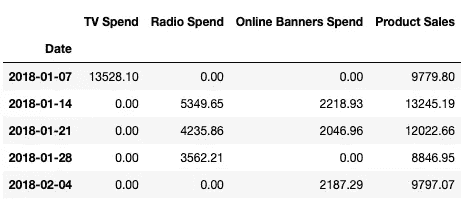
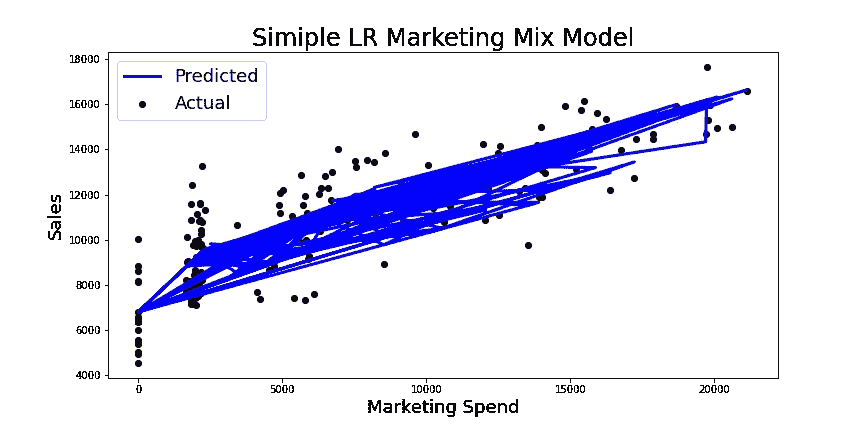
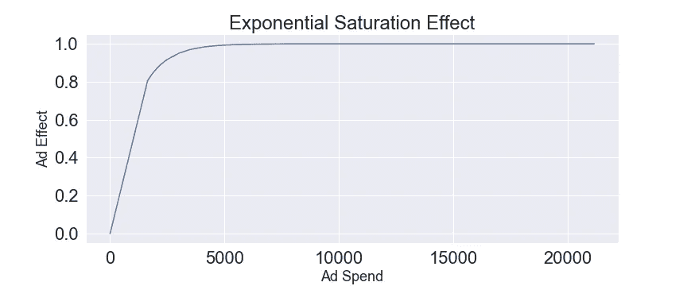
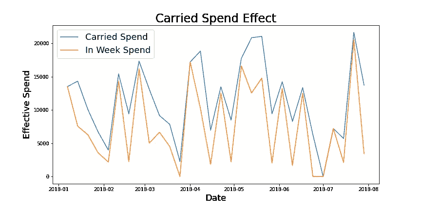
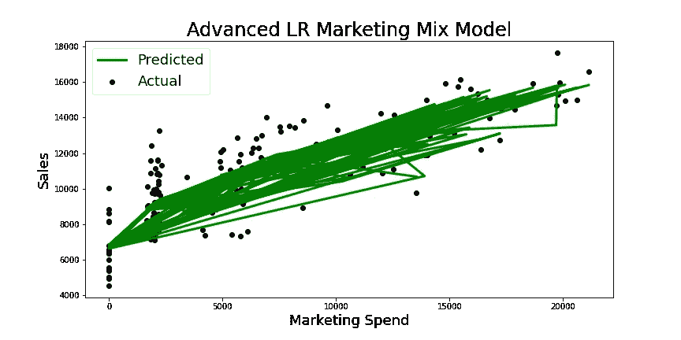

# 使用 Scikit-Learn 进行媒体混合建模

> 原文：<https://medium.com/codex/simple-to-advanced-media-mix-modeling-d86764e2afdb?source=collection_archive---------5----------------------->

媒体组合建模是一种分析技术，用于理解和量化广告对其预期目标(通常是促销产品的销售)的影响。

本文将介绍媒体混合建模的原则，并用 scikit-learn 演示各种建模技术，从一个非常简单的方法开始，逐步提高模型的复杂性。


约书亚·厄尔在 [Unsplash](https://unsplash.com?utm_source=medium&utm_medium=referral) 上的照片

> “我一半的广告支出都浪费了；麻烦的是，我不知道是哪一半。” *1900 -* ***约翰·沃纳梅克*** *，零售业巨头&广告业先驱*

约翰·沃纳梅克在数字营销时代为广告商提供了对广告影响的新见解之前写下了这些文字。他在印刷品和黑白电视上做广告。虽然从脸书到你的网站跟踪点击远比衡量一个全国性电视广告的影响更直接，但最后点击的衡量并没有结束我们的对话，也没有结束我们对什么才是真正影响广告的困惑。

问 10 个营销人员他们喜欢的归因技巧，你会得到 10 个不同的答案。这种分歧源自一些基本问题，这些问题在今天的市场营销人员的头脑中扮演着重要角色，就像他们在约翰·沃纳梅克的头脑中扮演的角色一样。

1.  我如何将广告销售与即使没有广告也会发生的销售分开？
2.  同时在两个渠道投放广告的综合效果是什么，我如何将两者分开？
3.  今天的广告如何影响明天或六个月后的销售？
4.  如果我继续在这一渠道投资，回报会减少吗？

# 为什么媒体混合建模？

广告商需要了解如何分配他们的营销预算，以最大限度地提高投资回报率(广告支出)。在一个预算有限、渠道众多的世界里，浪费 50%的投资是不够的。智能媒体规划始于对广告渠道的投资回报率的预测。



媒体组合建模使用来自广告商的历史数据来绘制花费(X)和销售(y)之间的联系。这些联系不仅有助于阐明过去投资的投资回报率，还能释放优化未来媒体计划的能力。

把你自己放在一家手机配件公司的 CMO 椅子上。在过去几年中，贵公司在三个渠道投放了广告；电视、广播和网络。您有一款新产品在年底发布，您想知道过去哪些广告渠道发挥了作用，这样您就可以为产品发布活动创建最佳的媒体组合。

你会使用什么技巧？如果谈论 X 和 y 之间的联系使你想到线性回归，那么直觉上你是正确的。我们稍后会看到，广告支出和销售之间的关系不是一条简单的直线，但一般来说，随着广告支出的增加，销售也会增加，所以线性回归是一个很好的起点。

使用线性回归，媒体组合模型寻找两件事…

这个模型的系数告诉我们在给定渠道上调整支出对销售的影响程度。*

**将一个渠道对销售的影响从销售和其他营销的基线中分离出来，可以让我们找到该渠道的投资回报率。**

**一切平等*

# 简单媒体混合模型

## 使用 scikit-learn 中的线性回归

线性回归是揭示广告支出和销售之间隐藏联系的最简单的技术。我们从罗伯特·库伯勒博士提供的一个样本数据集开始，他对我理解这个话题做出了重大贡献。



数据:[https://raw . githubusercontent . com/Garve/datasets/4576d 323 bf2 b 66 c 906d 5130d 686245 ad 205505 cf/mmm . CSV](https://raw.githubusercontent.com/Garve/datasets/4576d323bf2b66c906d5130d686245ad205505cf/mmm.csv)

在数据集([此处可用](https://github.com/Garve/datasets/blob/4576d323bf2b66c906d5130d686245ad205505cf/mmm.csv))中，我们可以看到在 200 周的过程中，每周对三个广告渠道的历史投资。这些将是我们在线性回归模型中的特征。

1.  **电视**
2.  **收音机**
3.  **在线横幅**

我们还有一个列代表我们的目标变量，**产品销售额。**

## 创建我们的功能和目标

将你的数据分成 X(消费特征)和 y(产品销售)

```
from sklearn.linear_model import LinearRegression
from sklearn.model_selection import cross_val_score, TimeSeriesSplit
import pandas as pddata = pd.read_csv(
    '[https://raw.githubusercontent.com/Garve/datasets/4576d323bf2b66c906d5130d686245ad205505cf/mmm.csv'](https://raw.githubusercontent.com/Garve/datasets/4576d323bf2b66c906d5130d686245ad205505cf/mmm.csv'),
    parse_dates=['Date'],
    index_col='Date'
)
X = data.drop(columns=['Sales'])
y = data['Sales']
```

## 建立和评估线性回归

```
lr = LinearRegression()
print(f'cross val scores {cross_val_score(lr, X, y, cv=TimeSeriesSplit())}')
print(f'mean cross val score {np.mean(cross_val_score(lr, X, y, cv=TimeSeriesSplit()))}')**# Output: 
cross val scores [0.69594303 0.69302285 0.66850729 0.78807363 0.73512387]
mean cross val score 0.716134134746767**
```

我们的简单线性回归在预测销售额方面做得不错(R2 = 0.7)。让我们解开模型的属性以获得系数和基线，知道我们的模型使用以下公式进行预测。

**Sales = coef_tv(电视)+ coef_radio(广播)+ coef_radio(横幅)+ Base**

首先是系数。这些数据告诉我们，给定渠道中增加的支出会对销售额产生多大影响。你可以看到，在同等条件下，条幅对销售的影响最大。

```
#Return coeficients for each type of marketing spend
lr_coef_table = pd.DataFrame(lr.coef_.flatten())
lr_coef_table.index = list(X.columns)
lr_coef_table = lr_coef_table.rename(columns={0:"Coef"})
lr_coef_table**# Output:** 
**TV 0.348643
Radio 0.459996
Banners 1.206171**
```

接下来，y 截距，我们营销组合模型中的基线。这就是我们不打广告也能期待的持续销售。你可以看到我们的模型在 6678 美元处与 y 轴相交。这是我们产品的销售底线。

```
#Return the y interceptbaseline = lr.intercept_
baseline**# Output:** 6678.396933606161#Save a total spend df
total_spend = X.copy()
total_spend["Spend Total"] = total_spend["TV"] + total_spend["Radio"] +total_spend["Banners"]
total_spend = total_spend[["Spend Total"]]#Plot our model's performance
fig, ax = plt.subplots(figsize=(12, 6))
ax.scatter(total_spend, y,color="black")
ax.plot(total_spend, lr.predict(X), color="blue", linewidth=3)
ax.set_xlabel("Marketing Spend")
ax.set_ylabel("Sales")
ax.legend(["Predicted","Actual"])
ax.set_title("Simiple LR Marketing Mix Model")
```



在我们进入 ROI 分析之前，让我们看看是否可以改进我们模型的性能。

简单媒体混合模型 R2: 0.71

# 调整后的简单媒体组合模型

## 使用 scikit 的线性回归-学习和手动调整

这种手动调整的思想是理解模型的偏差并针对它进行调整。为了理解我们的模型是如何产生偏差的，让我们先来看一周的样本，看看我们的模型表现如何。

```
#Test our lr on a single week of spend data
test_week_spend = data.loc["2021-10-10"][0:3].values#Use sample week spend data to predict sales
spend_test_prediction = lr.predict(([test_week_spend]))[0]#Now use our lr to attempt a prediction using this selected week's spend figure and our lr's coeficients
print(f'lr sales prediction {spend_test_prediction}')
print(f'Actual sales {data.loc["2021-10-10"][3]}')
print(f'Delta {spend_test_prediction-data.loc["2021-10-10"][3]}')#Find a correlation factor using truth and predictions
correl_factor = data.loc["2021-10-10"][3]/spend_test_prediction
print(f'Correlation factor {correl_factor}') **# Output:****lr sales prediction 15992.602810755861
Actual sales 15904.11
Delta 88.49281075586077
Correlation factor 0.9944666411213349**
```

**相关系数=(实际销售额/预测销售额)**

**销售额=相关系数(coef_tv(电视)+ coef_radio(电台)+ coef_radio(横幅)+ Base)**

我们对单周销售的预测相差 88 美元，相关系数为 0.99。为了调整我们的模型的偏差，我们简单地将我们的相关因子应用于我们对数据集的每一周所做的预测。

如果我们对整个数据集执行这种调整，我们将返回一个完美的 R2 分数，这是不现实的，因为在实践中，我们需要将这种模型应用于看不见的数据。

我们首先将我们的数据分成训练组和测试组，然后在看不见的测试组上评估调整后的模型。

```
#Split our data into 2/3 for training and 1/3 for eval
from sklearn.model_selection import train_test_split
X_train, X_test, y_train, y_test = train_test_split(X, y, test_size=0.33, random_state=42)
lr = LinearRegression()
lr.fit(X_train,y_train)
```

接下来，我们将使用训练集中的支出数据和模型的相应系数(权重)构建一组未经调整的预测。

```
#unadjusted_sales_predictions = weights * spend
weights = pd.Series(lr.coef_,index=X_train.columns)
#Now on the x_test
#Create a Dataframe that contains the product of weights and spend numbers, this will need to be adjusted by the correl factor
unadj_contributions = X_test.copy()
unadj_contributions["TV"] = unadj_contributions["TV"]*weights.TV
unadj_contributions["Radio"] = unadj_contributions["Radio"]*weights.Radio
unadj_contributions["Banners"] = unadj_contributions["Banners"]*weights.Banners
unadj_contributions["Base"] = baseline
```

现在，我们根据来自训练数据的原始相关因子调整贡献，并返回调整后模型的 R2。

```
adjusted_contributions = unadj_contributions.mul(correl_factor,axis=0)
adjusted_contributions["Total Predicted Spend"] =  adjusted_contributions.sum(axis=1)print(f'adjusted R2 {r2_score(y_true=y_test,y_pred=adjusted_contributions["Total Predicted Spend"])}')**# Output:****adjusted R2 0.8232431652722243**
```

我们已经显著改进了我们的模型！让我们通过将我们的广告支出投资除以预测的销售回报来获得每个渠道的投资回报率。现在我们可以看到每个渠道的相对表现及其对销售的贡献。这是智能媒体规划的关键信息。

```
roi = {'TV':[],'Radio':[],'Banners':[]}
for channel in roi:
    roi[channel] = adjusted_contributions[channel].sum()/data[channel].sum()
roi**# Output:****{'TV': 0.11238120757362816,
 'Radio': 0.14342429769462278,
 'Banners': 0.42312870897586125}**
```


**调整后的简单媒体混合模型 R2: 0.82**

# 高级媒体组合模型

## 使用 scikit-learn & feature engineering 的线性回归

在这一点上，我们需要认识到，我们简单的线性回归虽然相当准确，但却是不现实的。它没有考虑到广告的两个现实世界的影响。

**饱和效应**

该模型假设广告支出和销售之间存在线性关系，但任何广告商都可以告诉你这不是真的。你花的越多，广告的效果就越差，因为市场已经饱和，它已经部分吸收了信息。



a =控制饱和曲线形状的超参数(a>0)

X =花费

饱和效应= 1-exp(a*X)

**结转效应**

我们的简单模型假设广告对销售的全部影响在支出发生的同一周被吸收。营销人员明白，现实中存在一种光环效应，第一阶段的广告也会影响未来阶段的销售。遗留效应有两个变量，可分别视为垂直和水平移动。

**强度**(以前期间的支出有多少结转到未来期间)是有效支出的垂直变化。您可以在下图中看到，结转支出是周内支出的向上转移。

**长度**(今天的广告支出影响未来多少个时期)是有效支出的水平移动。您可以在下图中看到，结转支出是周内支出的右移。



要进一步了解在你的建模管道中添加饱和度和遗留效果的方法，请参见我的 [Jupyter 笔记本](https://github.com/zander1268/marketing-mix-modeling/blob/main/advanced_linear_regression.ipynb)和 Robert Kübler 博士的文章[。](https://dr-robert-kuebler.medium.com/)

下一步是调整我们工程特征的超参数

**饱和效应超参数**

*   a =控制饱和曲线形状的超参数

**结转效应超参数**

*   力量
*   长度

这可以通过 [scikit-learn 网格搜索](http://scikit-learn.org/stable/modules/generated/sklearn.model_selection.GridSearchCV.html)来完成，或者通过 [Optuna](https://optuna.readthedocs.io/en/stable/reference/generated/optuna.integration.OptunaSearchCV.html) 随机网格搜索来更有效地完成。Optuna 将在一段时间的试验中随机选择超参数，直到它开始学习和测试更有希望的组合。

最终结果是一个改进的模型，更好地反映了广告的现实。

**高级媒体混合模型 R2: 0.82**

# 结论

更高级的模型能够更好地预测销售额，如下图所示。



该模型的特征工程版本改进了先前模型对潜在假设的坚持，并使该模型对于使用看不见的数据更实用。该模型能够相当准确地预测销售额(0.82)，返回不同广告渠道投资的 ROI 计算结果，并将基线销售额与受广告影响的销售额隔离开来。

我需要进一步研究的一个限制是，当谈到线性回归特性对目标的影响时，必须提供“所有其他条件相同”的警告。如果我们只能说一个渠道中的支出以这样一种方式影响销售,“在所有条件相同的情况下”,这削弱了我们的历史 ROI 分析，并限制了我们模型的预测能力。在广告业，事情很少是平等的。如果你的 MMM 模型建议将预算从一个渠道转移到另一个渠道，这将违反你用来指导决策的同一模型的假设，这一点尤其正确。

这个模型的更高级版本将考虑额外的广告因素，如季节性和广告库存的相对成本。

进一步的发展将考虑公司和产品因素，如产品价格和客户情绪。