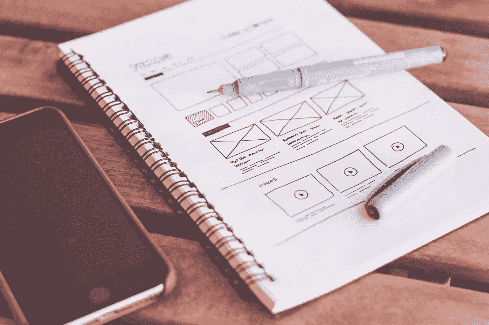

# 提高转化率的简单 UX 实践

> 原文：<https://medium.com/codex/simple-ux-practices-to-increase-conversion-71743fcfa941?source=collection_archive---------8----------------------->

## 这里有一些 UX 的做法，可以帮助你提高网站的转化率。

[Picjumbo.com 的照片](https://www.pexels.com/photo/notebook-beside-the-iphone-on-table-196644/)

一些简单的 UX 实践可以帮助提高转化率，包括使用清晰简洁的标题，将重要元素放在前面和中心，简化用户体验，以及提供有用的提示和指南。正在实施…