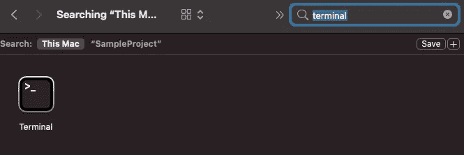
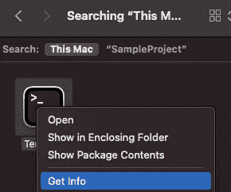
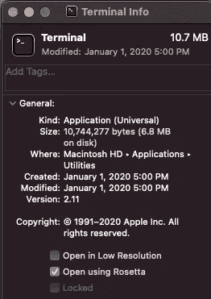
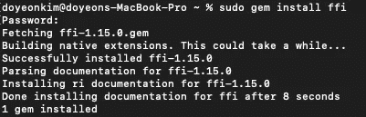
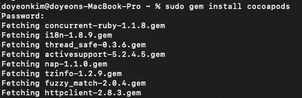
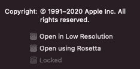
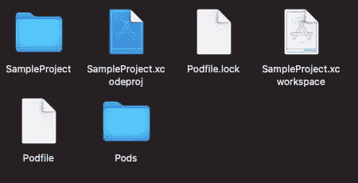

# 在 M1 使用椰子的简单方法

> 原文：<https://medium.com/codex/simple-way-to-use-cocoapods-on-m1-ac9e22cf7e1c?source=collection_archive---------0----------------------->

## [法典](http://medium.com/codex)

我最近买了一台 Macbook Pro M1，仍然没有任何遗憾！耶！🙌🏻我有点担心应用程序与其他软件的兼容性，这些软件还没有为 M1 做好准备，但几乎我正在使用的每个应用程序都非常好。

但是，如果你是一个 iOS 开发人员，并试图在 xcode 上使用 Cocoapods，这可能是一个问题，当出现大量错误时，你会感到恐慌，但不要担心！下面是最简单的方法！

1️⃣在取景器中寻找终端

2️⃣右击终端，点击“获取信息”，然后在常规菜单下勾选“使用 Rosetta 打开”。

好吧，我们必须使用罗塞塔翻译技术才能运行！

> Rosetta 是一款仿真器，旨在为英特尔和苹果处理器之间的过渡搭建桥梁。换句话说，Rosetta 将为英特尔构建的应用程序转化为苹果芯片。

3️⃣打开终端，键入`sudo gem install ffi`

4️⃣接着安装 cocoapods `sudo gem install cocoapods`

5️⃣等等等等..安装 cocoapods 后，取消勾选“获取信息”中的`Open using Rosetta`框。它工作得很好，✌🏻

6️⃣去你的项目目录和往常一样！

1.  `pod init`
2.  `open Podfile`
3.  `edit Podfile`(添加吊舱)
4.  `pod install`
5.  打开。xcworkspace 享受😁

然后你会看到一切都成功安装！感谢你的阅读，这篇文章可能会帮助一些像我一样的 M1 用户🍎