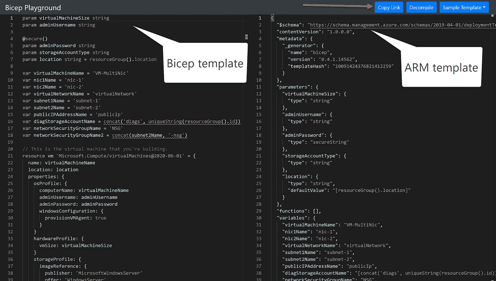

# 使用 Bicep 简化您在 Azure 中的基础设施即代码部署体验

> 原文：<https://medium.com/codex/simplify-your-infrastructure-as-code-deployment-experience-in-azure-with-bicep-f67ad43389ce?source=collection_archive---------5----------------------->

了解有助于实现这一目标的最新 Azure 基础设施功能。

如果你负责使用基础设施即代码在 Azure 中创建和维护环境，毫无疑问 Azure 资源管理器(ARM)模板是有吸引力的；然而，随着我们部署规模的扩大，ARM 模板可能会变得复杂且难以维护。

Bicep 是作为一种开源的、特定于领域的语言(DSL)而诞生的，旨在简化你在 Azure 中的声明式部署体验。

二头肌位于手臂模板的顶部。它提供了一个透明的抽象层，使得在 Azure 中读写基础设施代码变得更加容易。

这意味着今天你在 ARM 模板中做的一切，你都可以在 Bicep 中做，因为所有 Azure 资源类型一经发布就受到支持，并且不需要任何状态文件。

值得强调的是模块化在 Bicep 中得到了极大的改进；您可以轻松地在 Bicep 文件中定义一个资源，并将其作为一个模块作为本地或外部资源使用。你可以在这里找到更多关于使用模块[的信息。](https://blog.azinsider.net/azure-bicep-working-with-modules-2942ec9a43d3)

# 入门—资源

如果你对二头肌感兴趣，我建议你查阅以下资源:

 [## 用于部署 Azure 资源的 Bicep 语言- Azure 资源管理器

### Bicep 是一种特定于领域的语言(DSL ),它使用声明式语法来部署 Azure 资源。它提供了简明的…

docs.microsoft.com](https://docs.microsoft.com/en-us/azure/azure-resource-manager/bicep/overview#get-started?WT.mc_id=AZ-MVP-5000671)  [## 使用 Bicep - Learn 在 Azure 中部署和管理资源

### Bicep 使您能够部署 Azure 资源。Bicep 使用一种声明性语法，您可以像对待应用程序代码一样对待它…

docs.microsoft.com](https://docs.microsoft.com/en-us/learn/paths/bicep-deploy/?WT.mc_id=AZ-MVP-5000671)  [## 通过使用 Bicep - Learn 在团队环境中构建 Azure 基础设施

### Bicep 有一些很棒的特性，可以让你协同工作，提高 Azure 的质量…

docs.microsoft.com](https://docs.microsoft.com/en-us/learn/paths/bicep-collaborate/?WT.mc_id=AZ-MVP-5000671) 

# 是时候从手臂模板转向二头肌了吗？

Bicep 的主要目标之一是让尚未过渡到基础设施即代码的专注于 Azure 的客户更容易开始，并完全支持当今使用 ARM 模板的庞大客户群。

虽然 ARM 模板不会消失，但我建议您开始在 Bicep 上做一些工作，并利用现有的工具:

*   [蔚蓝二头肌游乐场](https://blog.azinsider.net/azure-bicep-playground-transitioning-from-arm-templates-into-bicep-5c10c864c863)
*   [将手臂模板转换成二头肌模板](https://blog.azinsider.net/azure-bicep-how-to-migrate-from-arm-templates-to-bicep-a9639ac316d8)
*   [用 Visual Studio 代码创建二头肌模板](https://docs.microsoft.com/en-us/azure/azure-resource-manager/bicep/quickstart-create-bicep-use-visual-studio-code?WT.mc_id=AZ-MVP-5000671&tabs=CLI)

部署 Azure 资源的其他高级编程语言包括 Terraform、Farmer 或 Pulumi。

## 真的需要学二头肌吗？

您仍然可以选择创作 ARM 模板，但是，如果您不喜欢 JSON，Bicep 已经可以投入生产，并且提供了更易于阅读的语法。你会发现创作二头肌模板比手臂模板容易得多。

在 Bicep 中，您仍然可以定义类似于 ARM 模板的参数、变量、函数、资源和输出，但是您将以更简化的方式来完成。

下图显示了二头肌和手臂模板之间的比较:

天蓝色二头肌(左)和手臂模板(右)

关于[如何使用 Bicep](https://blog.azinsider.net/how-to-create-a-linux-virtual-machine-with-azure-bicep-template-e22f50f2baea) 部署基于 Linux 的虚拟机，可以参考下面的例子。

## 什么二头肌不是用来

Bicep 是一种特定于领域的语言(DSL)，这意味着它是特定于 Azure 的。如果您目前使用的是多云方法，这可能不是 IaC 的最佳选择。

Bicep 不会取代任何通用语言，根据您的环境，您可能仍然需要执行 Bicep 之前或之后的任务。

你可以在 Bicep GitHub [资源库](https://github.com/Azure/bicep/tree/main/docs/examples)中查看一些工作负载的例子。

[*在此加入****azin sider****邮箱列表。*](http://eepurl.com/gKmLdf)

*-戴夫·r*