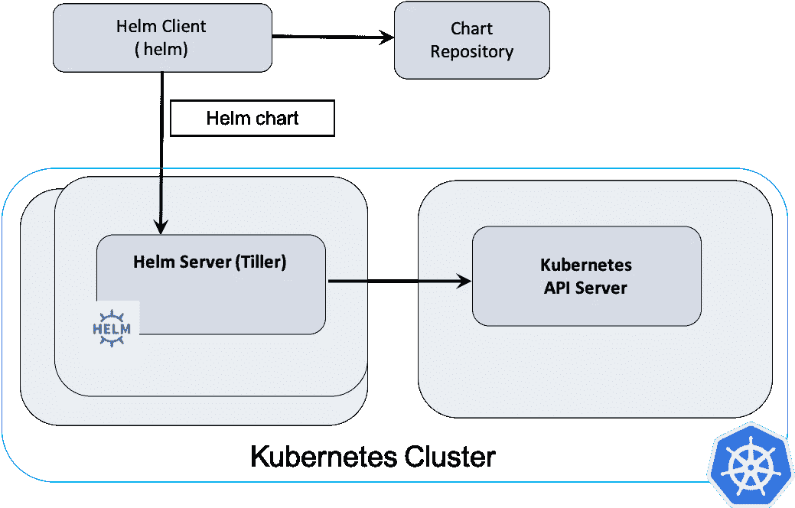
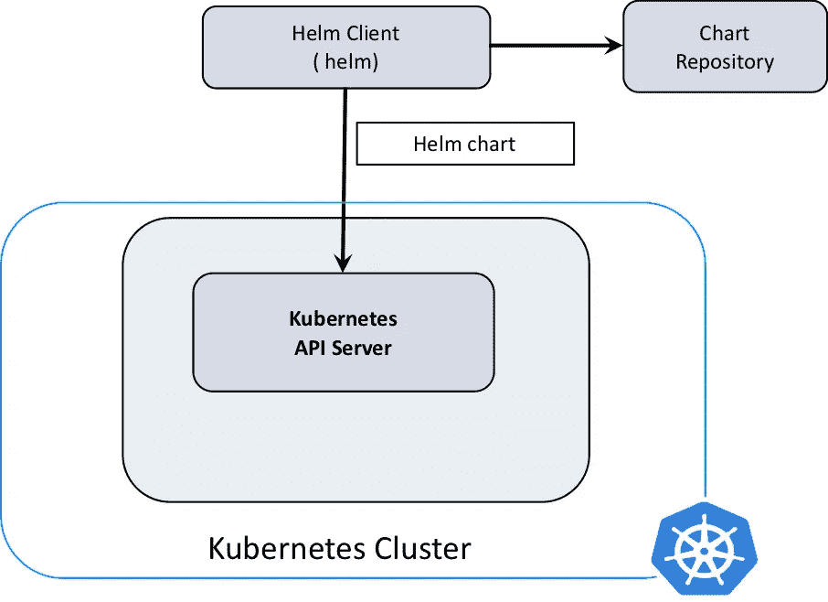
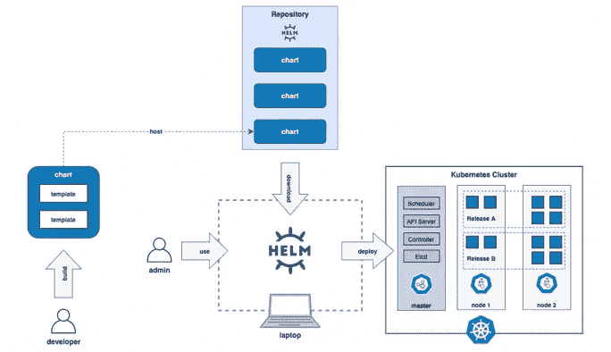
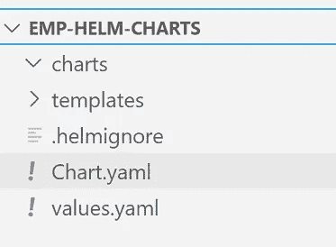
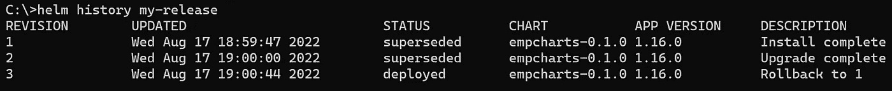
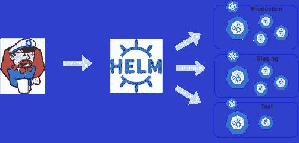

# 使用 Helm Package Manager 简化 Kubernetes 部署

> 原文：<https://medium.com/codex/simplifying-kubernetes-deployments-with-helm-package-manager-bf834c51818d?source=collection_archive---------0----------------------->


图片来源:iStockPhoto.com

Kubernetes 在最近几年获得了很大的发展，它已经成为业界部署容器化应用程序的事实上的标准。Kubernetes 作为一个容器编排器，为您抽象了许多复杂性，但是随着应用程序的增长，Kubernetes 集群上的应用程序部署和发布管理变得更加繁琐。

我们通常使用普通的 Kubernetes 清单——YAML 文件来将我们的应用程序及其资源部署到 Kubernetes 集群。从版本控制的角度来看，我们可以将您的 YAML 文件保存在 Git 存储库中，但是没有可靠的方法来正确地对它们进行版本控制。此外，从可重用性的角度来看，使用动态配置选项生成清单文件可能是至关重要的。

这就是赫尔姆大放异彩的地方。Helm 允许您在终端中简单地执行几个命令，您就可以很好地部署 Kubernetes 了！

在本文中，我们将尝试介绍 Helm 的核心概念，以及 Helm 如何简化 Kubernetes 的部署和发布管理。

# 什么是头盔？

## 掌舵[](http://localhost:3002/pages/csharm33/payer-tech-leadership-academy/blog/helm#helm)

Helm 是一个包管理器，用于 Kubernetes 集群上的应用程序部署和发布管理。它类似于 APT、YUM、NPM 和 YARN package managers。它不仅是 Kubernetes 部署的包管理器，而且还是 Kubernetes 部署/发布管理工具。

> Helm 帮助您管理 Kubernetes 应用程序——Helm 图表帮助您定义、安装和升级最复杂的 Kubernetes 应用程序。Helm 是查找、共享和使用为 Kubernetes 构建的软件的最佳方式。Helm 是 CNCF 的一个毕业项目，由 Helm 社区维护。来源——【https://helm.sh/ 

## Helm2 架构

> Helm 2 是一个客户端-服务器架构，客户端叫做`helm`，服务器叫做`Tiller`。客户端是一个 CLI，用户可以与之交互来执行不同的操作，如安装、升级和删除。如下图所示，客户端与 Tiller 和图表存储库进行交互。Tiller 与 Kubernetes API 服务器交互。它将 Helm 模板文件呈现到 Kubernetes 清单文件中，用于通过 Kubernetes API 对 Kubernetes 集群进行操作。资料来源——developer.ibm.com



图片来源:developer.ibm.com

## Helm3 架构

> Helm 3 有一个客户端专用的架构，客户端仍然叫做`helm`。如下图所示，它的操作类似于 Helm 2 客户端，但是客户端直接与 Kubernetes API 服务器进行交互。集群内服务器`Tiller`现已移除。资料来源——developer.ibm.com



图片来源:developer.ibm.com

# 安装舵

安装舵非常容易。请参考官方发布页面，获取适用于您特定操作系统的最新 Helm 版本。

```
https://helm.sh/docs/intro/install/
https://helm.sh/docs/intro/using_helm/
```

# 掌舵图表创建、存储库和部署工作流

Helm 软件包管理器的主要组件…

## 掌舵图[T3](http://localhost:3002/pages/csharm33/payer-tech-leadership-academy/blog/helm#helm-chart)

创建 Kubernetes 应用程序的一个实例需要一组信息。

## 配置[](http://localhost:3002/pages/csharm33/payer-tech-leadership-academy/blog/helm#config)

它保存了关于配置的信息，您可以将这些信息合并到一个打包的图表中，以创建一个可发布的对象。

## 舵释放[](http://localhost:3002/pages/csharm33/payer-tech-leadership-academy/blog/helm#helm-release)

使用特定配置的海图作业实例。

## 掌舵图库[](http://localhost:3002/pages/csharm33/payer-tech-leadership-academy/blog/helm#helm-chart-repository)

图表存储库是存放索引的 HTTP 服务器。YAML 文件和可选的一些打包图表。当您准备好共享图表时，首选的方法是将它们上传到图表存储库。

此图描述了舵图的高级工作流程…



图片致谢—hand-on . cloud

# 舵图表[](http://localhost:3002/pages/csharm33/payer-tech-leadership-academy/blog/helm#helm-charts)

安装舵后，要创建舵图，请运行以下命令…

```
helm create <Name Of the Chart>
helm create EMP_HELM_CHARTS
```

运行此命令后，您将获得以下文件夹结构…

*   顶层 EMP_HELM_CHARTS ->文件夹是舵图的名称
*   Chart.yml ->图表元数据信息
*   价值观。YAML ->模板文件的值
*   图表->文件夹具有图表相关性
*   模板->文件夹中有实际的模板文件(YAML 文件模板创建 Kubernetes 资源，如 pod、service 等。)

此图描述了舵图表的文件夹结构…



# 舵库[](http://localhost:3002/pages/csharm33/payer-tech-leadership-academy/blog/helm#helm-repository)

我们可以创建您的掌舵图表或使用第三方掌舵图表，并将它们添加到掌舵回购中以供以后使用。以下命令可用于向报告添加图表、搜索图表、列表图表、更新图表和删除图表…

```
helm repo list
helm repo search <repo_name>
helm repo add <repo_name> <repo_url>
helm repo update
helm repo remove <repo_name>
```

# 升级和回滚[](http://localhost:3002/pages/csharm33/payer-tech-leadership-academy/blog/helm#upgrades-and-rollbacks)

Helm release management 使用以下命令帮助部署、升级和回滚部署:

```
Helm install <chartname> -f PATH_TO_values.yaml
Helm upgrade <chartname> -f PATH_TO_values.yaml
Helm rollback <chartname>  [REVISION]
```

Helm `install`命令将使用动态 YAML 模板文件和 1 号 Helm 版本创建 Kubernetes 资源，同时创建 Kubernetes 资源。

而`upgrade`和`rollback`命令将添加/更新/删除 Kubernetes 资源并创建后续的 helm 版本。



更改将应用于现有部署，而不是创建新的部署并处理回滚到以前版本的操作。

通过使用定制的`values.yaml`，相同的掌舵图可以用于跨不同环境的 Kubernetes 应用程序部署。

`values.yaml`会因各自的环境而不同。



# 清理资源[](http://localhost:3002/pages/csharm33/payer-tech-leadership-academy/blog/helm#cleanup-resources)

头盔版本包括其生命周期中的`delete`状态。当你删除一个舵图表，它会删除所有与舵释放相关的资源。

```
helm delete my-helm-release
```

# 结论[](http://localhost:3002/pages/csharm33/payer-tech-leadership-academy/blog/helm#conclusion)

在本文中，我们介绍了 Helm 如何简化 Kubernetes 的部署和发布管理。

Helm 帮助我们从 Kubernetes 清单文件中抽象出配置，并使其更加定制化。使用舵图表，可以毫不费力地建立许多堆栈，如詹金斯，普罗米修斯，格拉夫纳等。与通过 Kubernetes YAML 文件进行的手动部署相比。

总的来说，当谈到让 Kubernetes 部署无缝和快速时，Helm charts 肯定会有所帮助。话虽如此，还有一些其他的 Kubernetes 软件包管理器，如 kustomize、kapitan、skallfold 等..同样好。

## 这里有一个回购样本来试用 Helm… `[GitHub Repo](https://github.com/chanderkant7/employee-apis-helm.git)`

使用本报告的说明…

**感谢您的阅读！**