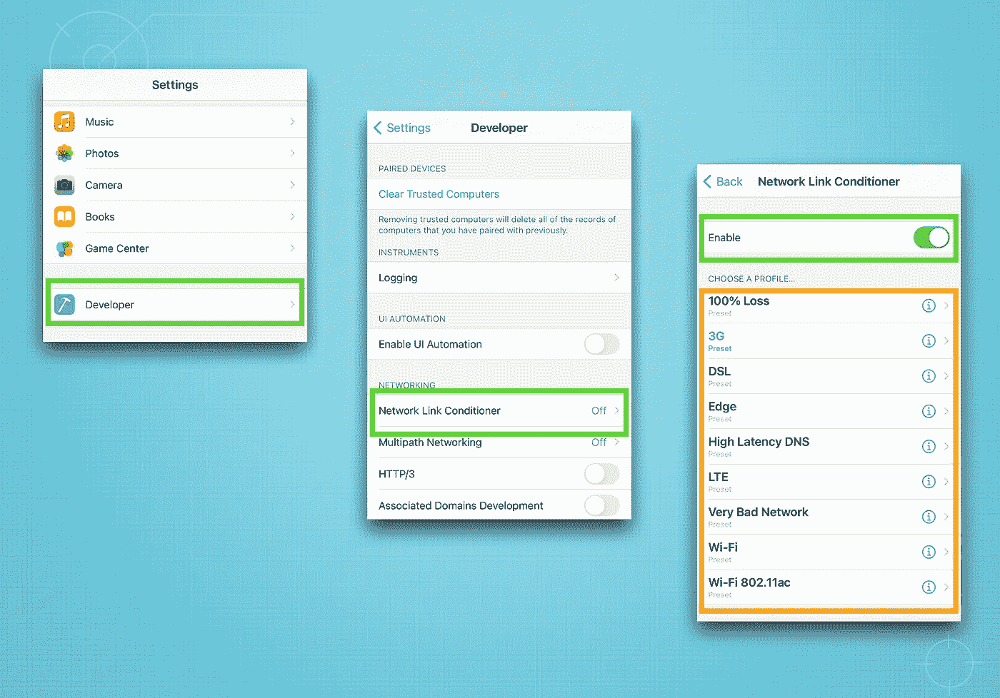
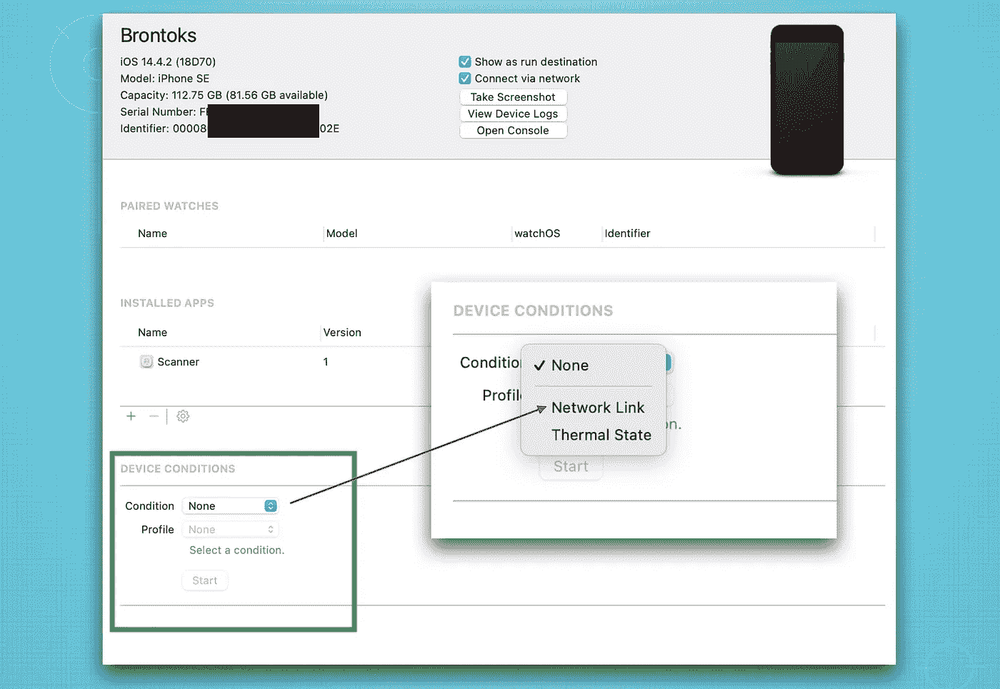
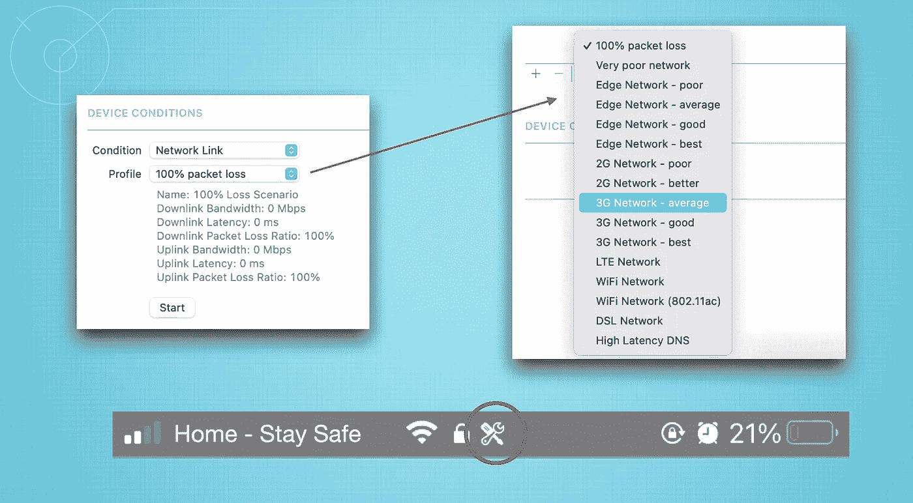
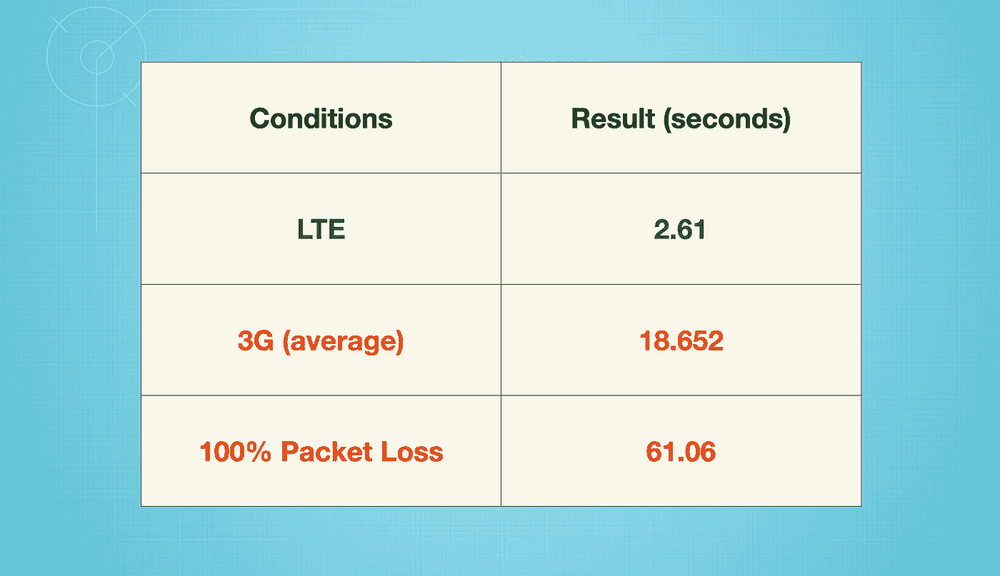

# 在 iOS 开发中模拟恶劣的网络条件

> 原文：<https://medium.com/codex/simulate-poor-network-conditions-in-ios-development-1c1912a33a51?source=collection_archive---------4----------------------->

弗雷德里克·李佛特在 [Unsplash](https://unsplash.com/?utm_source=unsplash&utm_medium=referral&utm_content=creditCopyText) 上的照片

在软件开发中，我们总是专注于实现最终结果，有时会忽略另一个重要的衡量标准，以确保我们向用户提供最好的应用程序。

我知道现在的大多数用户都有很好的互联网连接，有高速 WiFi 和 4G。然而，我们不能否认，在某些情况下，连接有时会变得很差，这肯定会影响应用程序的正常行为。

作为开发人员，我们应该为处理网络故障做好充分的准备，例如添加重试功能、网络连接监听器，当然，还要显示适当的错误消息。

# 我们需要什么工具？

从 [WWDC19](https://developer.apple.com/videos/play/wwdc2019/422/) 开始，Xcode 11 就配备了**网络调节器链接**来模拟多种网络状况。如果我们能准备一个测试计划来测试不同条件下的预期结果，那就更好了。例如，完全丢包(请求失败)和 LTE 连接之间的处理应该不同，我们需要模拟这两种情况。

# 怎么用？

在 iOS 开发中，我们可以使用两种方法。

## 1.在开发者设置中使用设备网络链接调节器

在“设置”中，转到“开发者”部分，并选择“网络链接调节器”。从那里，将其切换到“启用”并选择任何首选条件。哇，这么简单对吧？

## 2.使用 Xcode 设备条件

这个方法非常类似，除了我们从 Xcode 触发它到一个调试设备。

从 Xcode 菜单“窗口”中打开它，然后转到“设备和模拟器”并检查您连接的设备。**确保解锁** **您的设备**，您应该会看到类似如下的视图。在下拉条件中选择“网络链接”。

然后，只需选择任何首选的网络条件进行测试。单击底部的“开始”按钮，您应该会看到“网络状况”图标(红色圆圈中，对于其他设备可能略有不同)

# 我们现在要试试吗？

是的，我们写一个简单的代码，看看如何在开发中实现。我创建了包含对 [GitHub 公共 API](https://docs.github.com/en/rest) 的 json 请求并记录执行时间的项目(您可以使用自己的项目)。

首先，简单地将这段代码粘贴到`ViewController`中。请记住，它只能在真实的 iOS 设备上运行，而不能在模拟器上运行。在这个测试中，我使用了第二种方法来从 Xcode 设置(对我来说，这要容易得多)。

在这段代码中，我使用了由[hackingwithswithswith](https://www.hackingwithswift.com/example-code/system/measuring-execution-speed-using-cfabsolutetimegetcurrent)解释的速度测量。另外，我使用`URLSession`和 [DispatchGroup](https://developer.apple.com/documentation/dispatch/dispatchgroup) 以异步模式执行 5 个 GET 请求。

# 分析

以上是我得到的结果(可能会因设备和您的实际互联网连接而异)。从这个结果，我们可以知道什么将是最好的情况，中等和最坏的情况。因此，我们可以确定如何正确处理延迟。

例如，我们可以将请求超时设置为 25-30 秒，这样当连接很差时，用户不会等到 60 秒。其次，我们还可以测试当请求失败或缓慢时如何显示错误消息。

厉害！

# 有办法在模拟器上测试吗？

答案是肯定的。但是当然，精确度不会像使用真实设备那样好。网络调节器链接实际上在 Mac 上[可用](https://developer.apple.com/download/more/?q=Additional%20Tools)用于测试 Mac 应用。尝试使用 mac 应用程序并设置首选网络条件。

感谢您的阅读，不要忘记与您的朋友分享。非常欢迎反馈。

“学习，这是我们增长技能的方式”

# 参考

[https://developer.apple.com/videos/play/wwdc2019/422/](https://developer.apple.com/videos/play/wwdc2019/422/)

[https://developer . apple . com/documentation/xcode-release-notes/xcode-11-release-notes](https://developer.apple.com/documentation/xcode-release-notes/xcode-11-release-notes)

[https://developer . apple . com/documentation/dispatch/dispatch group](https://developer.apple.com/documentation/dispatch/dispatchgroup)

[https://docs.github.com/en/rest](https://docs.github.com/en/rest)

[https://www . hacking with swift . com/example-code/system/measuring-execution-speed-using-cfabsolutetimegetcurrent](https://www.hackingwithswift.com/example-code/system/measuring-execution-speed-using-cfabsolutetimegetcurrent)