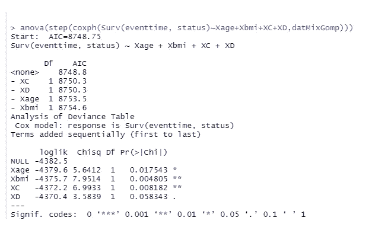

# 模拟常见的，截尾，结果变量作为因变量在 R[第一部分]

> 原文：<https://medium.com/codex/simulating-common-censored-outcome-variables-as-dependent-variables-in-r-part-1-4ff2a2594c34?source=collection_archive---------20----------------------->

*【正在审核】*

按照我们在[这里](https://laure-17161.medium.com/simulating-common-non-censored-outcome-variables-as-dependent-variables-4bdea1efd211)所做的，在这篇短文中构成反应变量 Y 的，是标记感兴趣事件时间的单个时间或持续时间。它们通常被称为*到事件时间(tte)* 。这些时间可以是几天、几周、几个月或几年，也可以是其他形式的时间。事件可能发生在研究者开始按计划进行试验研究之前，事件可能发生在研究期间，也可能发生在研究之后。并非所有患者/参与者都经历过或将经历感兴趣的事件。一个常见的场景是这样呈现的:登记的参与者经历了事件，事件发生的时间被记录下来，他们被停止跟踪，或者他们没有经历事件，他们选择停止被跟踪，或者研究者失去了对他们的跟踪，研究者不知道患者是否经历了事件，因此患者最后一次被看到的时间被记录为*审查时间*， 或者研究的结束时间以及为尚未经历该事件的患者记录的时间对应于研究结束时间，这些时间也被标记为*删截时间*。 所有这些时间都记录在响应变量 y 中。这种情况下的删失时间称为*右删失*。这篇短文中不感兴趣的其他可选场景是左删失和区间删失时间。

为了模拟所述*右删失机制*的时间，我们为时间生成两个变量: *tte 变量 T 和右删失时间变量 C，*假设 T 独立于 C，给定一组协变量 x。*然后我们认为 Y 中的观察值是 T 和 C 值之间的最小值。生存分析中需要的一个重要变量是指标二进制变量，tte 的为 *1，删失次数*为 *0。感兴趣的事件通常是死亡，由此我们得到名称*生存时间*(你生存到死亡的时间)。另一个常见术语是*总存活时间(OS)* ，当事件为*全因死亡*(患者可能死于交通事故，而感兴趣的事件为因观察到的健康状况而死亡)，以及*无进展存活时间(PFS)* ，当感兴趣的事件包括*死亡和疾病进展。***

*我们模拟了适用于右删失数据的一般三类生存模型的生存时间:一类*参数模型(通常为指数、威布尔、瑞利、Gompertz、对数逻辑和对数正态模型)，包括加速失效时间(AFT)模型和 cox 比例(cox-PH)半参数模型。*我们将在[的下一篇文章中介绍 AFT 模型的模拟策略。](https://laure-17161.medium.com/simulating-common-censored-outcome-variables-as-dependent-variables-in-r-part-2-c6c012417801)生存建模有三个基本功能:*

**

**风险函数 h()* ，它测量每个个体 I 在时间 t 经历感兴趣事件的*(瞬时)*风险。它取决于*基线* ( *，即在研究开始时测量的* ) *风险 h0()* ，以及潜在协变量的线性预测值。考虑到存活时间取决于这些变量，我们将使用来自[另一篇关于模拟的文章](https://laure-17161.medium.com/simulating-common-non-censored-outcome-variables-as-dependent-variables-4bdea1efd211)的相同线性预测值。然而，这组系数*β*，不包括参数模型的截距系数 b0(我们在此限制中排除了 AFT 模型)。你可以在这里得到一些澄清。*累积风险函数 Hi()* 对风险函数*Hi()*t 进行积分或求和，当后者分别为连续或离散时。*生存函数* *Si()* 测量个体 I 在*一段时间 t* 后经历感兴趣的事件的可能性，或者到时间 t 为止“*生存”*的概率。*

*参数模型和 cox-PH 模型本质上是基于这些函数(检查 [*这里*](https://laure-17161.medium.com/applying-propensity-score-weighting-psw-technique-to-synthesize-evidence-from-two-individual-4c72ec9dac77) 它们是如何一一对应的)。最值得注意的一点是:*

> *“危险函数可以相对于时间保持不变(对应于指数密度)；可以根据某个幂函数(对应于威布尔密度)作为时间的函数而增加；可以随时间线性增加
> (对应于瑞利密度)；或者可以随时间指数地增加(对应于 Gompertz 密度)。此外，
> 根据时间的幂、线性或指数函数，可能存在危险交替减少
> 或增加的时间间隔— **丁和卡尔·E(2013)第 5 章。***

*针对基线测量的危险 *h0()* 定义了许多函数；可能是一个*常数*一个*多项式*某个*对数*或者 t 指数的某个*函数。与*指数、*冈珀茨*和 [*威布尔*](https://laure-17161.medium.com/applying-propensity-score-weighting-psw-technique-to-synthesize-evidence-from-two-individual-4c72ec9dac77) 分布相关的常见危险有:*

**

*参数模型对基线风险进行了分布假设，由于一对一的关系，这相当于对存活时间进行了分布假设。cox-PH 模型不需要基线危害或生存函数的特定分布，使模型灵活地适应参数模型可以适应的任何数据。根据风险函数的定义，我们得到等式*log[hi(t)/h0(t)]=β* Xi，*，由此*作出随时间恒定的对数风险比(lhr)* 的假设(即线性预测器*β* Xi*被认为不依赖于 t)，也称为比例风险(PH)假设*。*后者是半参数 cox-PH 建模框架下一个特别已知的假设。*

## *从标准参数生存分布模拟生存时间(假设比例风险)*

*R 包 *simsurv (* [web 文档](https://www.jstatsoft.org/article/view/v097i03)， [YouTube](https://www.youtube.com/watch?v=fJTYsncvpvI) *)为这一点提供了便利。**

****set . seed(10082021)******b****<-runif(10，-0.05，...* ***beta s****<-c(Xage = b[2]，Xbmi=b[3]，Xfemale=b[4]，XE“贝塔”是一个命名的向量。**

*我们使用本文生成的相同协变量，存储在 *data2* 中，其中我们添加了一个由 *simsurv()* R 函数所需的单独索引列:*

****data 2****<-data . frame(id = 1:1000，gender=factor(性别)，Xage=age，Xbmi=bmi，smoking . status = factor(smoking . status)，trtgps=factor(trtgps)，Xfemale=contrast.matrix[，2]，Xexsmoker=contrast.matrix[，3]，Xnonsmoker=contrast.matrix[，4]，XB=contrast.matrix[，5]，XC=contrast.matrix[，6]，XD=contrast**

***指数模型***

****exp . surv dat****<-simsurv(dist = " exponential "，lambdas = 1.3，betas = betas，x = data2，seed=77)**

**

**“exp . surv dat”*是一个 3 变量的数据帧。“状态”变量是一个 1 的向量，表示没有对*“事件时间”*进行审查。为了创建审查时间，可以假设任何大于或等于 4 的 *eventtime* 都被认为是(正确的)审查。我们在带有组件 *maxt=4* 的 *simsurv()* 函数中指定这一点，并得到以下结果。记得在 *simsurv* 函数中设置种子，让我和你有相同的模拟存活时间。*

**

*我们在这个数据中没有太多的审查时间。删失率为 28/1000*100 = 2.8%。审查时间是固定值，这并不常见。另一种创建右删截时间的方法，是生成两个指数型的*事件时间* T 和 C，分别用对象 ***exp1.survdat*** 和 ***exp2.survdat*** 表示。最终事件时间将是最小值 *min(Ti，Ci)* ，如果 Ti 小于或等于 Ci，则状态变量将为 1，否则为 0。我们分别改变 ***exp1.survdat*** 和 ***exp2.survdat*** 中的 lambdas 值(比如 1.3 和 1)和种子(比如 77 和 78)。假设我们已经生成了 ***exp1.survdat*** 和 ***exp2.survdat，*** 我们得到新的数据帧 ***exp.survdat*** 为*

****exp . surv dat****<-data . frame(id = exp 1 . surv dat $ id，T=exp1.survdat$eventtime，C=exp2.survdat$eventtime，event time = pmin(exp 1 . surv dat $ event time，exp2.survdat$eventtime)，status = as . numeric(exp 1 . surv dat $ event time<= exp 2 . surv dat $ event**

**

*数据帧的前 5 个值如下所示。这次被审查的价值观有不同的价值观。我们以同样的方式处理剩余的模型。*

## *gompertz 模型*

****gomp 1 . surv dat****<-sim surv(dist = " gompertz "，lambdas = .03，gammas = .5，betas = betas，x = data2，seed = 77)**

****gomp 2 . surv dat****<-sim surv(dist = " gompertz "，lambdas = .01，gammas = .3，betas = betas，x = data2，seed = 78)**

*得出的存活时间在数据帧 *gomp.survdat:* 中*

****gomp . surv dat****<-data . frame(id = gomp 1 . surv dat＄id，T = gomp 1 . surv dat＄event time，C = gomp 2 . surv dat＄event time，event time = pmin(gomp 1 . surv dat＄event time，gomp 2 . surv dat＄event time)，status = as . numeric(gomp 1 . surv dat＄event time<= gomp 2 . surv dat＄event time))【t1**

## *威布尔模型*

****Wei B1 . surv dat****<-simsurv(dist = " Weibull "，lambdas = .3，gammas = 1.5，betas = betas，x = data2，seed = 77)**

****weib 2 . surv dat****<-simsurv(dist = " Weibull "，lambdas = .1，gammas = 1.3，betas = betas，x = data2，seed = 78)**

****weib . surv dat****<-data . frame(id = Wei B1 . surv dat $ id，T=weib1.survdat$eventtime，C=weib2.survdat$eventtime，event time = pmin(Wei B1 . surv dat $ event time，weib2.survdat$eventtime)，status = as . numeric(Wei 1 . surv dat $ event time<= Wei 2 . surv dat $ event time))【T33**

*上述*(正 lambda 和 gamma 低于 gompertz，gamma 为 weibull>1)*的模拟设置意味着 Weibull 和 gompertz *(指数风险不变)*的基线风险都是单调(严格)增加的。然而，在现实中，h0(t)也可能减少。双组分混合模型放宽了基线风险单调性的假设，例如，双组分混合 gompertz 模型下的存活时间可通过以下方式生成:*

****2c gomp . surv dat****<-sim surv(dist = " gompertz "，lambdas = c(0.03，0.01)，gammas = c(.3，. 5)，betas = betas，mixture = TRUE，pmix = 0.5，x = data2，maxt = 9.00，seed=77)**

## *根据标准参数生存分布模拟生存时间(假设非比例风险)*

*这个假设意味着线性预测器*贝塔*Xi* 依赖于 t。*例如，*贝塔*Xi* 可以是*贝塔*Xi =贝塔 1*Xi +贝塔 2*Xi*log(t)的形式。*我们接着定义两组系数*β1*和*β2*，它们具有相同的维数*，β1*是 *log(t)=0 时的 *lhr* ，β2*是 log(t)中每单位变化的 *lhr* 的变化。**

****set . seed(10082021)******b****<-runif(10，-.05，* ***beta 1****<-c(Xage = b[2]，Xbmi=b[3]，Xfemale=b[4]，Xexsmoker=b[5]，XB**

****B2****<-runif(10，-.01，. 05)* ***beta 2****<-c(Xage = B2[2]，Xbmi=b2[3]，Xfemale=b2[4]，xex smoker =b2[6]，x 非吸烟者= B2[6]，XB=b2[7]，XC=b2[8]，XD=b2[9]，XE=b2**

*存活时间最终通过以下代码获得:*

****nonphgomp . surv dat**<-simsurv(dist = " gompertz "，lambdas = 0.03，gammas = .5，betas = beta1，tde = beta2，x = data2，tdefunction = "log "，maxt = 4，seed=77)****

*另一种情况是仅为治疗组定义β2:*

****beta 2****<-c(XB = B2[7]，XC=b2[8]，XD=b2[9]，XE=b2[10])* ，上面的代码还是会生成相应的生存时间。*

## *拟合模拟存活时间*

*我们将 *gompertz-PH* 和 *coxPH* 模型分别拟合到 ***2cgomp.survdat*** 和***nonphgomp . surv dat****并测试 PH 假设，考虑到存活时间和协变量*年龄、bmi、性别、吸烟状况*和*之间的潜在相关性我们需要 *R 包生存*。我们使用包中的 *survreg()* R 函数来拟合 gompertz 参数模型，然后使用同一个包中的 cox.ph() R 函数来拟合一个 coxPH 模型。响应变量在这些函数中被指定为 *Surv(事件时间，状态)。*遗憾的是， *survreg()* 只支持以下分布:*"极值"、" logistic "、"高斯"、"威布尔"、"指数"、"瑞利"、"对数高斯"、"对数正态"、"对数 logistic "、" t "。*可能其他函数有，比如 *flexsurv R 包*中的 *flexsurvreg()* 函数。然而，我们可以依靠 *coxph()* 函数来拟合数据，正如我们前面提到的，我们不需要像在 *coxph()* 中指定*dist = "*gompertz*"*这样的组件，就像在 *survreg()函数中需要的那样。*我们需要将 *data2、*中存储的所有协变量包含在 *2cgomp.survdat* 中，并为生存数据帧保留相同的名称 *2cgomp.survdat* 。***

***拟合双组分混合物数据***

****2c gomp . Surv dat****<-data . frame(2c gomp . Surv dat，data 2)* ***fitcph . mix gomp****<-Cox ph(Surv(event time，status)~ Xage+Xbmi+Xfemale+xex smoker+xn smoker+XB+XC+XD+XE，2c gom**

***拟合非 PH 值数据***

****nonphgomp . Surv dat****<-data . frame(nonphgomp . Surv dat，data 2)* ***fitcph . nonphgomp****<-Cox ph(Surv(event time，status)~ Xage+Xbmi+Xfemale+Xexsmoker+xnosmoker+XB+XC**

***比例风险假设的测试***

*对于由 R 函数 *cox.zph()* 定义的 PH，我们使用*舍恩菲尔德测试*。零假设 H0 陈述*“危险成比例(或危险比随时间恒定)”*，替代 Ha 陈述*“危险不成比例(或危险比随时间不恒定)”。*下面是*Cox . zph(****fitcph . mix gomp****)*和*Cox . zph(****fitcph . nonphgomp****)的 R 输出。**

**

**cox.zph()* 测试每个协变量，并提供模型的整体测试。使用 *cox.zph()[]* 得到测试的每一个组件。我们得到了我们所期望的结果，在非 PH 设置下模拟的存活时间的测试是显著的*(p 值=1.4e-06)* ，在 PH 设置下模拟的存活时间的测试是不显著的*(p 值=0.084)* 。我们可以进一步绘制 *cox.zph()[]* 对于 *Xfemale 和 Xexsmoker* 例如，从显著性检验*、*以及*在每幅图*、*上风险比随时间不变的 0 线*，来查看该线多久运行一次*围绕风险比随时间变化的 95%置信带。**

**par(m flow = c(1，2))
plot(****Cox . zph(fitcph . nonphgomp)【3】****)
abline(h = 0，col = 2)
plot(****Cox . zph(fitcph . nonphgomp)【4】****)
abline(t**

**

*在第一个图中，0 线只是短暂地穿过范围，而在第二个图中，它几乎总是穿过范围，这证实了第一个图中的非恒定风险比*(p 值<. 05】*和第二个图中的恒定比*(p 值>. 05】*。*

## ***额外分析***

***型号选择***

*如果我们希望选择具有更好模型性能的协变量，我们使用 *step()* R 函数进行*逐步模型选择*并结合 *anova()* R 函数选择具有统计显著性的协变量。*

*具体来说，函数 *anova()，ANOVA(step(fitcph . mix gomp))*产生了几个步骤的冗长输出。我们呈现最后一步。*

**

*我们剩下 4 个显著的协变量:*年龄 bmi* *治疗组 C* 和*我们用 *anova(step())* 对模型重复相同的分析，简化为这 4 个变量(其中*datMixGomp = 2c gomp . surv dat*)。**

****

**这一新的分析建议我们去掉 d。因此，最终简化模型的汇总统计数据如下所示。**

****

**同样， ***fitcph.nonPHGomp*** 回归模型简化为*年龄 bmi 女和 D.***

****测试线性假设****

**一些协变量可能最适合其正交三次指数或对数版本。让我们从上面的简化模型中检查整体线性度。我们用下面的行代码来形象化这一点**

*****par(m flow = c(1，2))******plot****(predict(reducedgomp . cphmodel)，Residual(reducedgomp . cphmodel，type="martingale)，xlab = "fitted values "，ylab = "martingale residuals "，main = "Residual plot "，las = 1)* ***abline*****

****

**怀疑存活时间(在 PH 设置下模拟)和第一张图中的协变量之间存在非共线性。第二张图看起来令人满意，这是根据在非 ph 环境下模拟的存活时间拟合的模型。**

# ****推荐:****

**当 PH 假设不满足时:对相关协变量进行分类或分层，或应用一些其他可能的有效转换，或拟合时间相关系数模型，或拟合 AFT 模型框架下的数据[(见我们的下一篇文章)](https://laure-17161.medium.com/simulating-common-censored-outcome-variables-as-dependent-variables-in-r-part-2-c6c012417801)。**

**当不满足线性假设时:识别非线性变量，包括二次三次项(即添加多项式项)，对变量进行分类/分层，应用一些对数变换或指数变换等。**

# **参考**

**1. [*临床试验数据分析采用 R*](https://www.academia.edu/20618730/Clinical_Trial_Data_Analysis_Using_R_by_Ding-Geng_Din_Chen_Karl_E._Peace) 由陈定庚(Din)和卡尔《2013 年国际统计评论》**