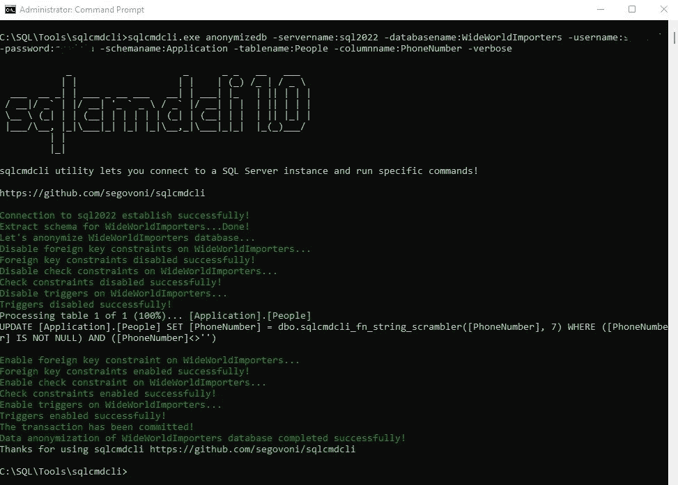
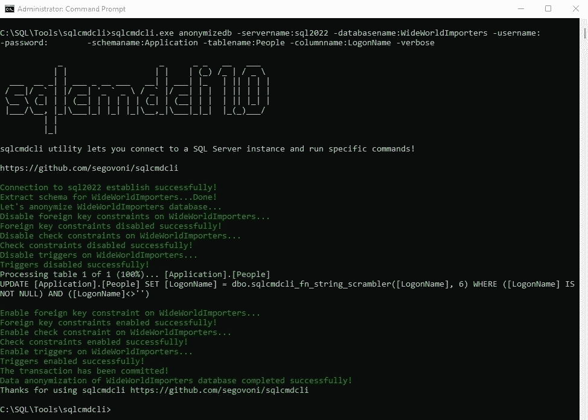

# 使用 sqlcmdcli 匿名化单个数据库列

> 原文：<https://medium.com/codex/single-database-column-anonymization-with-sqlcmdcli-49f2f428578c?source=collection_archive---------10----------------------->

## 匿名长度超过两个字符的文本列！

在上一篇文章[使用 sqlcmdcli 进行数据屏蔽](/@segovoni/data-masking-with-sqlcmdcli-975924f2935d)中，我们讨论了当您不得不在开发环境中甚至在客户公司外围使用生产数据库来执行测试时，数据匿名化的复杂活动。一种可能的解决方案是，在授权我们撤回数据的匿名副本之前，要求客户执行适当的检查，从而掩盖生产数据库副本上的敏感数据。

sqlcmdcli 的 anonymizedb 命令允许您对数据库的所有文本类型列执行这种不可逆的匿名化。anonymizedb 命令最近增加了新的选项，允许您对特定列执行匿名化操作，将操作限制在公司的敏感数据或个人的私人数据。

让我们从 GitHub 下载 sqlcmdcli 的最新版本，你可以在这里找到它[。](https://github.com/segovoni/sqlcmdcli)

让我们提取 sqlcmdcli.zip 中包含的可执行文件，并将其放在 C:\SQL\Tools\sqlcmdcli 目录中。

我们将用来测试新选项的虚拟机有一个 SQL Server 2022 Developer Edition 的本地实例，其中有一个 WideWorldImporters 示例数据库的副本，您可以在这里下载。

我们希望匿名化应用程序的 PhoneNumber 列。WideWorldImporters 数据库中的 People 表。PhoneNumber 列包含公司员工的电话号码，因此出于隐私原因，我们必须匿名。之后，我们将把相同的作业扩展到 LogonName 列，以此类推。

sqlcmdcli 可以通过运行以下命令匿名化 PhoneNumber 列。

```
sqlcmdcli.exe anonymizedb -servername:sql2022 -databasename:WideWorldImporters -username:xxxxx -password:xxxxx -schemaname:Application -tablename:People -columnname:PhoneNumber -verbose
```

输出如下图所示。



PhoneNumber 列已被匿名化，让我们继续进行 LogonName 列的匿名化。让我们运行下面的命令。

```
sqlcmdcli.exe anonymizedb -servername:sql2022 -databasename:WideWorldImporters -username:xxxxx -password:xxxxx -schemaname:Application -tablename:People -columnname:LogonName -verbose
```

输出如下图所示。



LogonName 列已被匿名化，这是结果。

```
PersonID    LogonName                                          FullName
----------- -------------------------------------------------- ---------------------
2           qgrg}F}ojk}uxrjosvuxzkxy4ius                       Kayla Woodcock
3           n{jyutuF}ojk}uxrjosvuxzkxy4ius                     Hudson Onslow
4           oyghkrrgxF}ojk}uxrjosvuxzkxy4ius                   Isabella Rupp
5           k|gsF}ojk}uxrjosvuxzkxy4ius                        Eva Muirden
6           yuvnognF}ojk}uxrjosvuxzkxy4ius                     Sophia Hinton
7           gszF}ojk}uxrjosvuxzkxy4ius                         Amy Trefl
8           gtznutmF}ojk}uxrjosvuxzkxy4ius                     Anthony Grosse
9           groiglF}ojk}uxrjosvuxzkxy4ius                      Alica Fatnowna
10          yzkrrgxF}ojk}uxrjosvuxzkxy4ius                     Stella Rosenhain
11          kzngtuF}ojk}uxrjosvuxzkxy4ius                      Ethan Onslow
12          nktxlF}ojk}uxrjosvuxzkxy4ius                       Henry Forlonge
13          n{jyutnF}ojk}uxrjosvuxzkxy4ius                     Hudson Hollinworth
14          roriF}ojk}uxrjosvuxzkxy4ius                        Lily Code
15          zgpyF}ojk}uxrjosvuxzkxy4ius                        Taj Shand
16          gxinkxrF}ojk}uxrjosvuxzkxy4ius                     Archer Lamble
17          vovkxqF}ojk}uxrjosvuxzkxy4ius                      Piper Koch
18          qgzokjF}ojk}uxrjosvuxzkxy4ius                      Katie Darwin
19          pgoyF}ojk}uxrjosvuxzkxy4ius                        Jai Shand
20          pgiqvF}ojk}uxrjosvuxzkxy4ius                       Jack Potter
```

请记住，这种匿名技术是不可逆的，请不要在生产环境中使用它！

享受 sqlcmdcli！