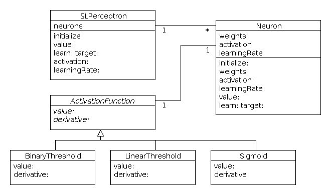
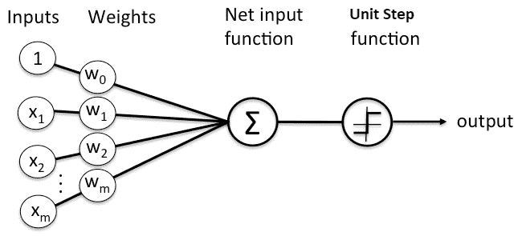
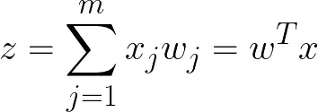
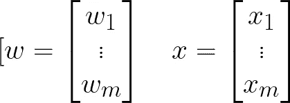
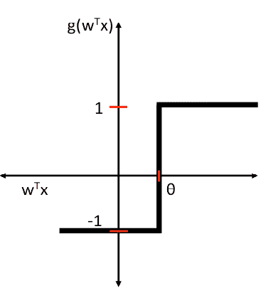
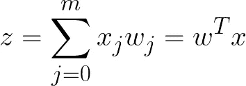
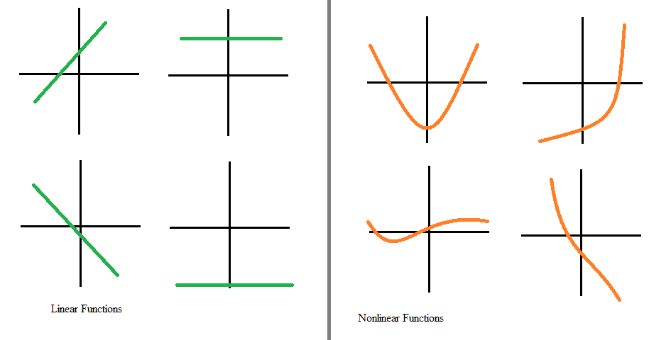
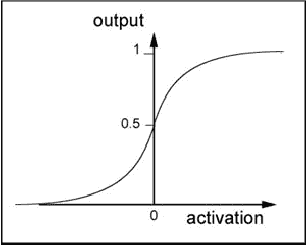
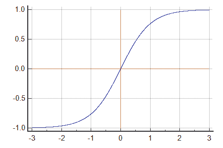
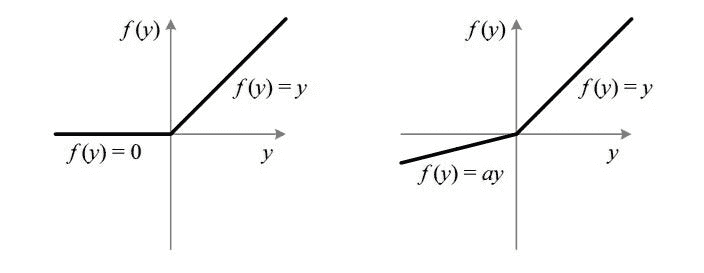

# 单层感知器和激活函数

> 原文：<https://medium.com/codex/single-layer-perceptron-and-activation-function-b6b74b4aae66?source=collection_archive---------5----------------------->

## 让学习开始吧…

## 对感知器和不同类型激活函数的冗长而简短的介绍

照片由[拉蒙·萨利内罗](https://unsplash.com/@donramxn?utm_source=medium&utm_medium=referral)在 [Unsplash](https://unsplash.com?utm_source=medium&utm_medium=referral) 上拍摄

单层感知器(SLP)是基于阈值传递函数的前馈网络。SLP 是最简单类型的人工神经网络，并且只能对具有二元目标的线性可分情况进行分类。激活函数是决定神经网络输出的数学方程。该函数附属于网络中的每个神经元，并根据每个神经元的输入是否与模型的预测相关来确定是否应该激活该函数。

## 它是如何工作的

感知器是线性分类器；也就是说，它是一种通过用直线分隔两个类别来对输入进行分类的算法。输入通常是特征向量`***x***`乘以权重`***w***`并加到偏差`***b***`:

单层感知器不包括隐藏层，隐藏层允许神经网络对特征层次进行建模。因此，它是一个浅层神经网络，这阻止了它执行非线性分类。

## 使用单位阶跃函数进行训练

*   将我们的二元分类设置中的正负类标记为`**1**`和`***-1***`
*   输入值`***x***`和权重`***w***`的线性组合为`***(z=w₁x₁+⋯+wₘxₘ)***`
*   定义激活函数`***g(z)***`，其中如果`***g(z)***`大于定义的阈值`***θ***`，则预测`***1***`，否则预测`***-1***`；在这种情况下，该激活功能`***g***`是简单**单位阶跃功能**的替代形式，有时也被称为**大阶跃功能**

总而言之，我们最终得出:

在哪里，

*   `***w***`是特征(权重)向量，
*   `***x***`是来自训练数据集的`***m***`维样本:

为了简化符号，我们将`***θ***`带到等式的左侧，并定义`***w₀=−θ***`和`***x₀=1***` (也称为**偏差**)

这样一来，

## 学习规则

初始感知器规则相当简单，可以通过以下步骤进行总结:

1.  将权重初始化为`**0**`或小随机数。
2.  对于每个训练样本`***xⁱ***`:计算输出值并更新权重。
3.  输出值是我们之前定义的单位阶跃函数预测的类别标签，权重更新可以更正式地写成`***wⱼ = wⱼ + Δwⱼ.***`
4.  用于在每个增量更新权重的值由学习规则计算:`***Δwⱼ = η(targetⁱ − outputⁱ) xⱼⁱ***`
    其中`***η***`是学习率(在`***0.0***`和`***1.0***`之间的常数)，**目标**是真实类别标签，**输出**是预测类别标签。
5.  权重向量中的所有权重被同时更新

只有当这两个类是线性可分的，感知器的收敛性才能得到保证。如果这两个类不能被线性决策边界分开，我们可以设置训练数据集**时期**上的最大通过次数和/或可容忍的错误分类数量的阈值**。**

# **单位阶跃函数与激活函数**

****激活函数**是神经网络的决策单元。他们计算神经节点的净输出。这里， **Heaviside 阶跃函数**是神经网络中最常见的激活函数之一。该函数产生二进制输出。这就是它也被称为二元阶跃函数的原因。当输入超过阈值限制时，该函数产生 1(或 true ),而当输入未超过阈值时，该函数产生 0(或 false)。这就是为什么，它们对于二元分类研究非常有用。**

****heaviside 阶跃函数**通常只在**单层感知器**中有用，这是一种早期的神经网络，可用于输入数据可**线性分离**的情况下的分类。然而，多层神经网络或多层感知器更令人感兴趣，因为它们是通用函数逼近器，并且它们能够区分不可线性分离的数据。使用**反向传播**训练多层感知器。反向传播的一个要求是一个可微分的激活函数。这是因为反向传播在这个函数上使用**梯度下降**来更新网络权重。**

> **亥维赛阶梯函数在`**x = 0**`是不可微的，而在其他地方`***f(x) = x; −∞ → ∞***`它的导数是`***0***`。这意味着梯度下降将无法在更新权重方面取得进展，反向传播将失败。**

**神经网络被称为通用函数逼近器。神经网络的主要潜在目标是学习复杂的非线性函数。如果我们在多层神经网络中不应用任何非线性，我们只是试图使用线性超平面来分离类别。**

**非线性函数有:**

*   ****微分或微分**:y 轴的变化相对于 x 轴的变化。它也被称为斜坡。**
*   ****单调函数**:要么完全不增，要么完全不减的函数。**
*   **主要根据它们的**范围或曲线**来划分**

****

## **乙状结肠或逻辑激活功能**

****

**我们使用 sigmoid 函数的主要原因是因为它存在于`***0***` 和`**1**`之间。因此，它特别适用于我们必须预测概率作为输出的模型。由于任何事情的概率只存在于`***0***`和`***1***`之间，所以 sigmoid 是正确的选择。它也经常被称为挤压功能。其目的是在输入空间中引入非线性。非线性是我们摇摆的地方，网络学习捕捉复杂的关系。当通过 sigmoid 函数的大负数变成`***0***`，大正数变成`***1***`。**

****

*   ****杀伤梯度**:乙状结肠神经元在边界上饱和，因此这些区域的局部梯度几乎为零。大的正值被压缩到接近 1，大的负值被压缩到接近 0。因此，有效地使局部梯度接近 0。结果，在反向传播期间，该梯度被乘以最终目标函数的该神经元输出的梯度，因此它将有效地“杀死”梯度，并且没有信号将通过神经元流向其权重。此外，我们必须注意初始化 sigmoid 神经元的权重以避免饱和，因为如果初始权重太大，那么大多数神经元将会饱和，因此网络将很难学习。**
*   ****非零中心输出**:输出总是在 0 和 1 之间，这意味着应用 sigmoid 后的输出总是正的，因此，在梯度下降期间，反向传播期间权重的梯度将总是正的或负的，这取决于神经元的输出。结果，梯度更新在不同的方向上走得太远，这使得优化更加困难。**
*   **函数是**可微的**，我们可以找到任意两点处的 sigmoid 曲线的斜率。**
*   **函数是**单调的**，但函数的导数不是。**

## **双曲正切激活函数**

****

**它基本上是一个移位的乙状结肠神经元。它基本上接受一个实数值，并在`***-1***`和`***+1***`之间压缩它。类似于乙状结肠神经元，它在大的正值和负值时饱和。然而，它的输出总是以零为中心，这是有帮助的，因为网络后面层中的神经元将接收以零为中心的输入。因此，在实践中，双曲正切激活函数在隐藏层中优于 sigmoid。**

****

*   **函数是**可微的**。**
*   **函数**单调**而其导数不单调。**
*   **双曲正切函数主要用于两类之间的分类。**
*   ****双曲正切和逻辑 sigmoid 激活函数均用于前馈网络。****

## **整流线性单位**

****

**最近，它变得流行起来，因为发现与 Sigmoid 或 Tanh 激活函数相比，它大大加速了随机梯度下降的收敛。它基本上将输入阈值设置为零，即 ReLU 神经元输入中的所有负值都设置为零。这降低了模型根据数据适当拟合或训练的能力。给予 ReLU 激活函数的任何负输入都会使图形中的值立即变为零，这反过来会通过不恰当地映射负值来影响结果图形。根据输入的符号，梯度为`***0***`或`**1**`。**

****

*   ****激活稀疏度** : ReLU 和 Tanh 激活函数几乎总是在神经网络中被激活，导致几乎所有的激活都在计算网络的最终输出时被处理。理想情况下，我们希望只有一部分神经元激活，并对网络的最终输出做出贡献，因此，我们希望网络中的一部分神经元是被动的。ReLU 给了我们这个好处。因此，由于 ReLU 的特性，有可能 *50%* 的神经元给予`***0***`激活，从而导致更少的神经元触发，结果网络变得更轻，我们可以更快地计算输出。**
*   ****死神经元**:由于 ReLu 中的水平线(对于负`***x***`)，梯度可以走向`***0***`。对于 ReLu 区域中的激活，梯度将为`***0***`，因此在下降过程中不会调整权重。这意味着，那些进入这种状态的神经元将停止对错误/输入的变化做出反应(仅仅因为梯度是`***0***`，没有任何变化)。这就是所谓的将死雷鲁问题。这个问题会导致几个神经元死亡，没有反应，使网络的大部分处于被动状态。因此,“死亡”的神经元将停止响应输出误差的变化，因此，在反向传播期间，参数将永远不会更新。**
*   ****范围** : `***0 → ∞***`**
*   **函数及其**导数**都是**单调**。**

## **泄漏 ReLU**

****

**只是传统 ReLU 函数的扩展。正如我们看到的，对于小于`***0***`的值，梯度是`***0***`，这导致这些区域中的“死亡神经元”。为了解决这个问题，Leaky ReLU 就派上了用场。也就是说，我们不是将小于`***0***`的值定义为`***0***`，而是将负值定义为输入的一个小的线性组合。常用的小值是`***0.01***`。**

****

*   **通过做一点小小的改变，漏 ReLU 的思想可以被进一步扩展。我们可以学习乘数，而不是将`***z***`乘以一个常数，并在我们的过程中将其视为一个附加的超参数。这就是所谓的参数 ReLU。**
*   ****范围** : `***−∞ → ∞***`**
*   **函数及其**导数**本质上是**单调**。**

**参考:**

1.  **[https://sebastianraschka . com/Articles/2015 _ single layer _ neurons . html](https://sebastianraschka.com/Articles/2015_singlelayer_neurons.html)**
2.  **[https://towards data science . com/activation-functions-neural-networks-1 CBD 9 F8 d 91d 6](https://towardsdatascience.com/activation-functions-neural-networks-1cbd9f8d91d6)**
3.  **[https://towards data science . com/activation-functions-b 63185778794](https://towardsdatascience.com/activation-functions-b63185778794)**

**欢迎任何反馈或建设性的批评。**