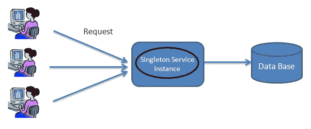

# 单一设计模式

> 原文：<https://medium.com/codex/singleton-design-pattern-2f3c4b0b040b?source=collection_archive---------10----------------------->

Singleton 是一种创造性的设计模式，它确保只有一个同类对象存在，并为其他代码提供了访问它的单点。

来源:[https://treewebsolutions . com/articles/the-singleton-pattern-in-PHP-65](https://treewebsolutions.com/articles/the-singleton-pattern-in-php-65)

顾名思义，singleton 模式用于产生一个类的单个实例。在一些情况下，一个类只应该有一个实例，并且应该实施约束。缓存、线程池和注册表只是一些例子…