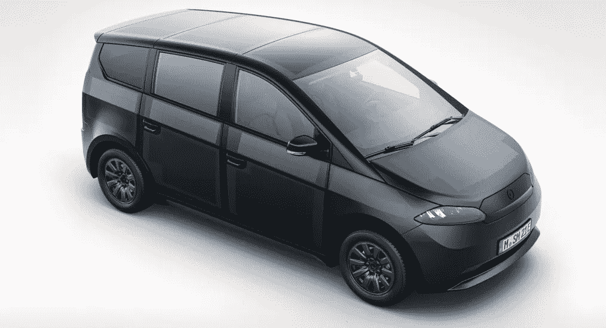
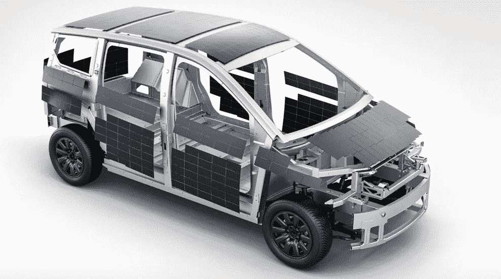

# Sion:又一辆太阳能汽车！

> 原文：<https://medium.com/codex/sion-another-solar-powered-car-2faaa833d968?source=collection_archive---------2----------------------->

## 首批车型将于明年交付！

[Sion 太阳能汽车(索诺汽车媒体)](https://sonomotors.com/en/sion/)

虽然目前全电动汽车风靡一时，但只有少数制造商在探索将太阳能电池板整合到汽车上。索诺汽车公司就是这样一家公司，它已经在车身上安装了 456 个无缝半电池(见上图)。更有趣的是，索诺汽车公司将所有车身面板都用于太阳能。