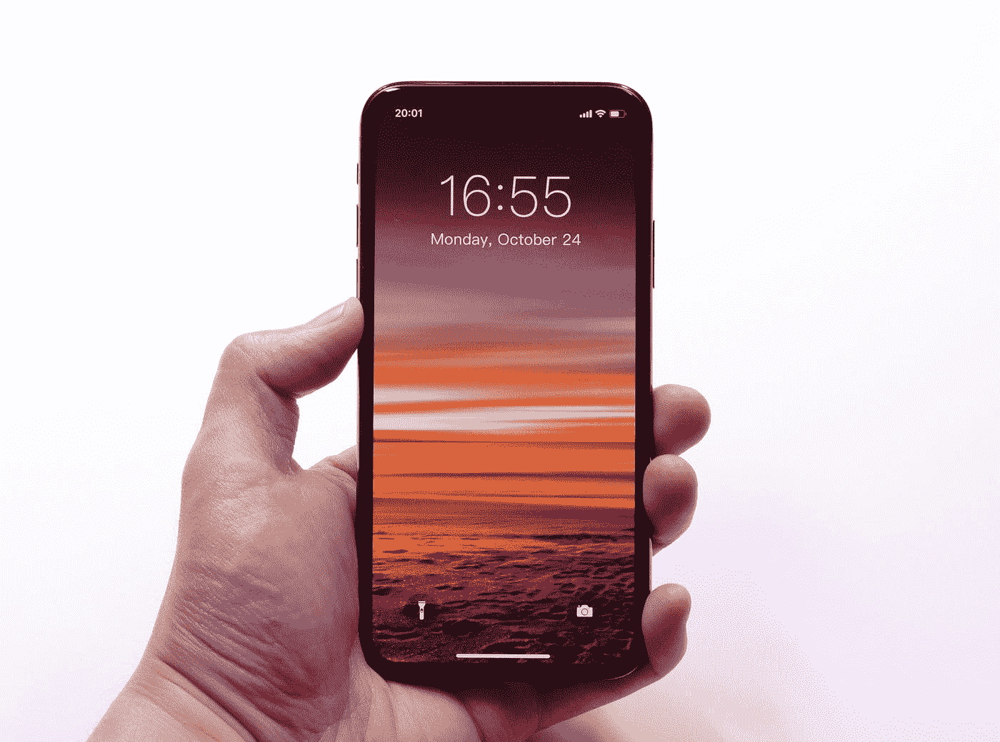

# 六个有趣的谷歌技巧 99%的人从未尝试过

> 原文：<https://medium.com/codex/six-funny-google-tricks-99-of-people-never-tried-b8619f46a61a?source=collection_archive---------1----------------------->

## 它不仅仅是一个搜索引擎

图为[托德·姜](https://unsplash.com/@toddjiang?utm_source=medium&utm_medium=referral)在 [Unsplash](https://unsplash.com?utm_source=medium&utm_medium=referral)

你们中的大多数——读者们——我相信你们已经谷歌了十多年了。这是一个很棒的搜索引擎。

但是，你知道谷歌也是一个方便的工具箱和一个装满复活节彩蛋的宝库吗？

(哦，不是你在复活节赠送的那些鸡蛋。技术人员将“复活节彩蛋”定义为没有记录的隐藏…