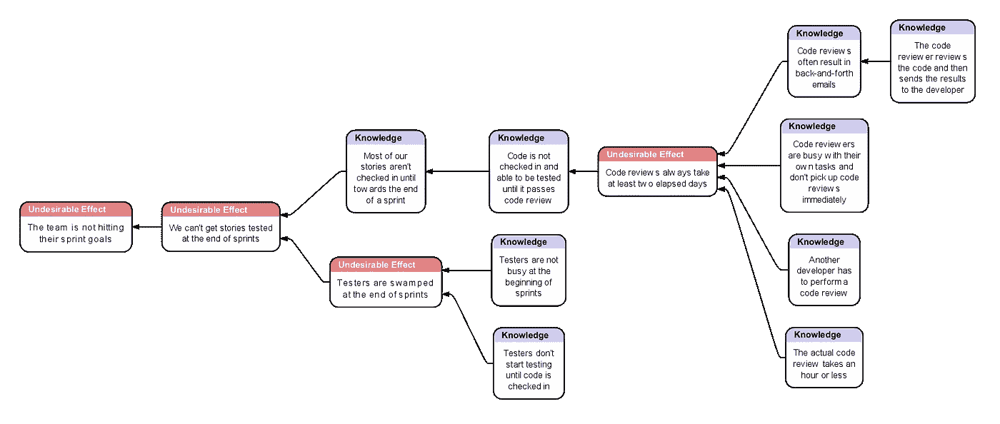

# 通过敏捷测试的六个步骤

> 原文：<https://medium.com/codex/six-steps-to-pass-the-agile-test-93d3f002baa5?source=collection_archive---------15----------------------->

在之前的一篇文章([)中，我讨论了“敏捷测试”，这是我的术语，指的是当我们面临问题和障碍时，应用检查和调整来改进我们的过程和实践的机会](/@obijohnkenobe/are-you-failing-the-agile-test-fd6399de5e13))。在本文中，我将提供一个详细的方法来应用检查并适应你的问题，我称之为“六个步骤”，然后通过一个真实的例子向你展示如何利用这个方法。

# 将检查和调整应用于流程的六步方法

我们必须从正确的心态开始。首先，你必须停止接受问题是必要的和不可避免的。相反，假设所有的问题都是偶然的，完全可以预防的，但前提是你改变你的过程和实践，打破导致这些问题的事件链。

遵循以下六个步骤来找到并解决您的问题:

**1。创建描述不良影响的问题陈述**

**2。使用根本原因分析技术找到问题**

**3。明确定义问题**

**4。定义解决方案和成功标准**

**5。运行实验以验证或否定结果**

**6。整合您的知识**

我们没有通过敏捷测试的原因之一是因为我们忽略了因果关系。我们设计了一个不能解决问题的解决方案，也许是因为我们觉得这个解决方案是我们能做的，是我们能控制的。或者可能是因为我们听说其他人已经采用了这种解决方案并取得了一些成功。很多时候，我们没有花时间去看他们的解决方案是否适合我们和我们的环境。冒着指出显而易见的事实的风险，解决不了问题的解决方案不是解决方案。相反，我们需要后退一步，首先执行一些根本原因分析。

限制理论当前现实树——为什么我们不能达到我们的冲刺目标

# 1.创建描述不良影响的问题陈述

请注意，大多数时候，我们最初确定为问题的东西实际上并不是问题。这是对问题解决方案的重新表述。这里有一个例子:一个努力实现冲刺目标的团队可能会说:“我们没有实现我们的冲刺目标，因为我们的故事太大了。”这个问题陈述的解决方案很简单:让故事变得更小。这是真正的解决方案吗？我见过团队沿着这条路走下去，直到他们有很多非常小的故事、任务，真的，然而他们仍然没有实现他们的冲刺目标。

# 使用 UDEs

提出约束理论的梦想家 Eliyahu Goldratt 博士推广了一种更好的写问题陈述的方式，即不良效应，或称 **UDEs** 。把 UDEs 想象成我们感受到的痛苦，问题的后果，而不是伪装的解决方案。我们可以将上面的问题陈述重新表述为，“我们无法实现我们的冲刺目标，因此无法确定交付日期。”顺便说一句，敏捷社区中的一些人可能会说，这里没有问题，在一个不确定的世界中，不可能围绕交付日期设定合理的期望，所以解决方案是，*不要做*。这在您的组织中会有多有效？如果你的汽车修理工或厨房改造承包商说，“我不知道要花多长时间，要花多少钱，甚至不知道我能交付什么”，你会如何接受？在我参与过的数百个组织中，在我工作过并担任领导职务的组织中，这根本不是一个可接受的答案。[【1】](#_ftn1)

# 2.使用根本原因分析技术找到问题(五个为什么)

作为 UDE，现在我们有一个问题陈述，是时候进行一点根本原因分析了。我将使用一种简单的根本原因分析技术，称为**五个为什么**。这是一种由丰田章男发明的问题分析技术，他在日本被称为“日本发明家之王”，也是后来丰田集团的创始人。五个为什么是基于这样的原则:第一个答案通常不是正确的答案，我们必须深入去发现真正的问题。为了演示我可能如何使用五个为什么，我将参与一个基于真实客户的假设对话，从教练到团队。

第一个要问的问题总是“我们试图解决什么问题？”上面我们已经有了一个假想的 UDE 的例子。第二个要问的问题是，为什么？

**蔻驰:**“为什么团队没有达到他们的冲刺目标？”

**团队:**“因为我们的故事太大了！”

蔻驰:“你怎么知道它们太大了？”

**团队:**“因为我们没有达到我们的冲刺目标。”

**蔻驰:**“那是循环推理。为什么这些故事会阻碍你实现冲刺目标？”

**团队:**“因为我们无法在 sprint 结束时让故事得到测试。我们在 sprint 结束前几天完成了我们故事的编码，测试人员忙得不可开交，无法及时完成测试。”

蔻驰:“为什么你不能在冲刺阶段结束前把故事准备好接受测试？”

团队:“因为我们总是在签入要测试的代码之前等待代码评审，而这些似乎总是要花上几天的时间。”

**蔻驰:**“为什么代码评审需要几天时间？这些应该短一些吧？”

**团队:**“嗯，是的，评审本身大约需要 30 分钟。但是另一个开发人员必须执行审查。他通常会在第二天发现它，发现一些问题，将他的评论发送给最初的开发人员进行修复。偶尔，会有分歧，电子邮件会来回发送，直到问题得到解决，代码可以签入为止。所以，至少需要一天，通常需要两天。”

**蔻驰:**“为什么代码评审直到第二天才开始？”

**团队:**“加油，约翰！开发商不会坐以待毙。他们正在完成自己的任务，有时间的时候会进行评估。”

现在我们有了一些信息，但没有一个信息指出让故事变得更小是一个有效的解决方案。你能想到解决办法吗？我希望你思考一下我们在这次讨论中学到了什么，问题实际上可能是什么，以及你可能会提出什么解决方案。随意停顿片刻，写下你认为问题可能是什么，以及你可能如何解决它。不要担心细节，只要一句话说明你认为问题是什么，另一句话说明你认为可行的解决方案是什么，第三句话描述成功是什么样子……你如何判断你的解决方案是有效的。然后我们会看看你的问题和你的解决方案是否和我的相似。[【2】](#_ftn2)

# 3.明确定义问题

让我描述一下我们关注的问题。应该不超过一个小时的代码审查会花费一到两天的时间，结果故事在 sprint 的后期结束，这减少了完全测试代码的时间。这是团队努力实现冲刺目标的一个原因；注意可能还有其他人。请注意，这个问题陈述提供了一个经过的持续时间和一个理想时间。我什么意思？经过的时间是某件事情实际需要的时间，而理想时间是某件事情在没有阻碍的情况下应该需要的时间。该团队已经承认，代码审查的理想时间应该是一个小时，或者更少。[【3】](#_ftn3)团队还声明了代码评审的持续时间从超过一天到两天不等，有时甚至更多。需要注意的是:**只要理想时间和运行时间之间的比率很大，就可以确定有问题**。这是一个重要概念，所以请随意花几秒钟给自己时间去思考和理解它。

# 4.定义解决方案和成功标准

基于我们的问题定义，对于代码评审的过度运行持续时间问题的任何有效的解决方案必须显著地减少运行持续时间，必须减少比率，理想地减少到运行持续时间是理想的时间。我们如何做到这一点？通过使用原则导出策略作为有效解决方案的基础。

# 利用原则帮助设计解决方案

我经常将精益原则、看板方法和约束理论引入到我的过程咨询中，我将在这里这样做。看板方法的原则之一是管理流程，管理价值流中的工作流程，以便尽可能快地提供最高价值。我们通过实施策略和规则来管理流程，这些策略和规则根据服务类别来控制工作的优先级和顺序，服务类别是一种将工作项目与关于我们如何确定工作项目的优先级和顺序的特定策略指南相关联的属性。这类似于航空公司如何登机乘客，登机工作流中的工作项，使用策略；谁登机以及登机顺序取决于他们的服务等级…精英等级、机票等级、挑战或残疾。

如你所知，sprint backlog 项目已经被产品所有者优先化了。如果我们有三个项目，A、B 和 C，按照它们的优先级顺序按字母顺序排列，那么这个顺序传达了产品负责人对 A 的评价，A 比 B 更重要，B 比 C 更重要。 无论它是一个带有项目和子任务便签的物理板，还是一个虚拟板，sprint 板都向我们展示了我们的工作流程，工作从左侧的初始状态转移到右侧的最终状态。

# “最上最右”原则

我将使用一个我称之为“最顶端-最右边”的原则来描述 sprint 工作流程中工作的顺序和优先级。“最顶端-最右边”引导我们关注最重要的事情，并做好完成它所需的工作。我们可以用它来产生一些有益的实践。例如，如果我们在 A 上有剩余的工作，那么任何有时间和足够技术知识的开发人员都应该在 A 上工作，而不是转移到 B 或 C 上，不管任务的类型如何。即使这是一个测试任务，并且有针对 B 和 C 的编码任务，如果可能的话，开发人员应该在 A 上执行测试任务。复习也是如此；如果一个开发人员可以审查 A 的代码或者开始在 B 上编码，她应该审查 A 的代码。你是否看到这种方法将如何尽可能快地完成 A，也许以 B 为代价，并且尽可能快地完成 B，也许以 C 为代价？如何，即使这些是相同的大小，在冲刺结束时完成 A 的全部总比完成 A、B 和 C 的三分之一好，因为一个项目的 100%总是胜过三个项目的 33%？

# 基于“最上最右”加速代码评审的策略

我们可以采用这个策略，并在代码审查的情况下扩展它。如果我们想要通过减少当前方法的延迟来减少代码审查的持续时间，我们必须确保审查不会拖延。一种方法是让开发人员在一天开始时，以及他们吃完午饭回来后，寻找未完成的代码评审。如果有代码审查，就需要从那时开始。此外，任何拥有需要评审的代码的开发人员都必须做好准备，随时准备在评审人员需要的时候参与代码评审，无论是实际参与还是虚拟参与。为什么是这些时候？因为工作已经被自然地中断了，所以此时对评审者或者开发人员执行评审没有什么影响。此外，通过让审查者和开发人员在一起，可以实时讨论和解决问题，而没有来回发送电子邮件的延迟。想一想…一个简单的策略变化，它将代码评审的持续时间大大减少到在提出请求后不超过 4 个工作小时。不会对我们的员工造成负面影响，不会增加资源，也不会不必要地延误其他工作。

# 定义评估有效性的成功标准

我们有一个政策，但我们仍然没有完成。我们如何确定这个政策是否成功？通过陈述期望的未来状态作为成功的标准:*在大多数情况下，代码评审花费的时间少于 4 个小时，不会超过 8 个小时*。清晰、客观、量化、可衡量。

# 5.进行实验，验证或否定结果

这个简单的改变可能看起来是理论上的，但是我在十多年前基于类似的根本原因分析在我自己的组织中第一次实现了它，并且在没有任何涵盖代码评审及时性的政策的情况下在许多客户那里实现了相同的问题，并且它产生了显著的差异，比团队最初预想的更大。如果您有类似的问题，它在您的环境中会起作用吗？只有一个办法可以知道，对吗？

# 6.融入你的学习

如果成功了呢？太好了！你所做的过程、政策和/或实践的改变现在已经成为今后做事方式的一部分。就这样吧。

如果不行呢？你会知道的，因为你不会达到你的成功标准。振作起来，失败仅仅意味着你没有完全发现问题所在。这又是一次学习的机会！回顾一下流程。一些需要验证的内容:

你是否找到了一个有效的问题定义(步骤 3)？

您的解决方案是否真正解决了您发现的问题(步骤 4 和 5)？

你发现的问题真的是阻止你实现最初目标的原因吗？

# 摘要

我们在这篇文章中提出了很多主题…工作流、价值流、看板方法、使用原则来帮助获得有效的实践、根本原因分析、问题陈述…甚至了解利用率和生产率之间的差异如何能够推动关注和限制 WIP，以便我们开始得更少，完成得更多。这些都是有趣且有价值的话题，可以也将会在未来的文章或网络广播中展开详细讨论。

乔治·奥威尔写道:“要看清一个人眼前的东西是一场持续的斗争。”这就是敏捷测试的斗争，看看我们面前是什么，问为什么而不是接受为什么不，改变不工作的东西而不是忍受它。通过敏捷测试很简单，但并不容易。这需要勇气、正直和领导力。这是成功的关键。记住要通过的步骤:

**1。创建描述不良影响的问题陈述**

**2。使用根本原因分析技术找到问题**

**3。明确定义问题**

**4。定义解决方案和成功标准**

**5。运行实验来验证或否定结果**

**6。整合您的知识**

我们所做的是将具体的行动映射到戴明循环:计划(步骤 1-4)、执行/检查(步骤 5)、行动(步骤 6)。

# 前进，繁荣

如果你是一个领导者，在你面对敏捷测试的时候，鼓励和支持你的团队和你的员工。只要你面对你的问题，问为什么，为了一个理解的原因做一些不同的事情，然后检查结果以学习和改进，你就真的不会做错事情。这是真正的检查和适应的核心，科学的方法，经验主义的行动，所有的进步取决于它。不要满足于你不能达到的目标。不要在敏捷测试中失败。适应，随机应变，克服。你能做到的。

_____

我们将在后面的文章中讨论这个坚持认为可预测性对于软件开发来说既不可能又无用的概念。

[【2】](#_ftnref2)这并不意味着我的解决方案对你来说是对的，或者你的是错的。解决这个问题有许多不同的方法，其中一些同样有效。这就是随机工作的本质。

[[3]](#_ftnref3) 我们不会担心少于一个小时的时间，因为这是一个过多的细节级别，表明我们正在进入杂草中。