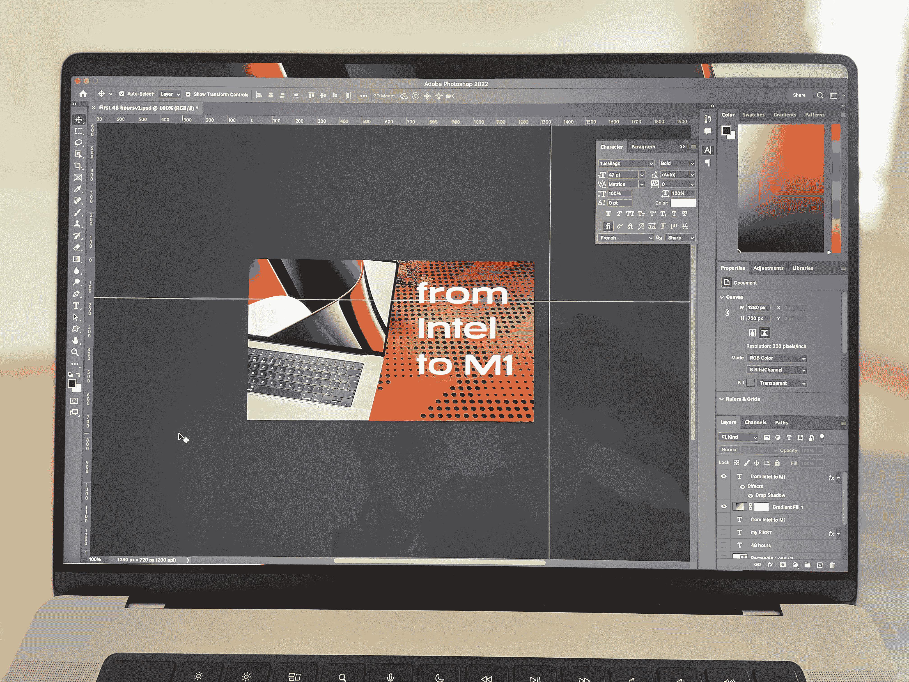

# 大小——并不完全像人们所说的那样！

> 原文：<https://medium.com/codex/size-not-all-its-cracked-up-to-be-a7cd7689a8ca?source=collection_archive---------10----------------------->

## 大屏幕还像以前那么重要吗？

我认为我们可以奇怪地将一些好消息归咎于疫情。当然，我们所经历的事情一定会有好的结果，希望这将是我们的工作实践。过去的两年打破了我一生的习惯。在 2020 年之前，我绝不会考虑在家工作，或者就此而言，一台笔记本电脑。但是时代在变。

## 我会改变，但前提是…

如果你读过我最近的一些博客，那么你会知道我在上周做了一个经过深思熟虑和慎重考虑的改变。我已经离开了 27 英寸的 iMac，第一次在笔记本电脑上工作。那台笔记本电脑是 16 英寸的 MacBook Pro。我以前也有过 MacBooks，但从来没有把它作为我的主要工作工具或日常驱动(这是一个恼人的短语，但就是这样！).这不是一个容易的决定，远非如此。如果我弄错了，那么这将是一个*严重的*昂贵的错误。虽然我花了很多时间在商店里看 MacBook，但没有什么比它在你的桌子上工作更好的了。我把它放在篮子里，我不知道放了多少个星期，但还是有什么东西在折磨着我，让我意识到我将要犯一个错误。另一方面，我渴望改变。我想避免仅仅因为继续使用台式机而感到内疚，因为我一直都是这样。不，我想拥抱这个变革的时代。

## 把你的恐惧放在一边

我是一个珍贵的爱人，认为我的工作流程是如此的动态和特别。我怎么能在这么小的笔记本电脑上工作呢？这篇博客直接针对那些认为自己太专业而不能在小屏幕上工作的人。

 [## 闭环系统

### 和苹果断裂的供应链

medium.com](/codex/the-closed-loop-system-f1b2ee23a151) 

我已经在 MBP 工作了整整 4 天。在此期间，任务包括:

*   录制本周的播客
*   在试听中编辑它
*   写每日博客
*   在 Premiere Pro 中编辑我的第一个视频
*   Photoshop、Illustrator 和设计工作

所有这些任务，也许除了《尤利西斯》中的写作，对眼睛要求很高，并且一直是大屏幕的领域。这一周的日子很长，但这绝不是因为“磨合”新的 Mac 电脑。不，远非如此。这台 Mac 的安装和操作非常简单；我使用新 Mac 电脑的最佳体验。然而，让我惊讶的是，它没有错过一个大屏幕。我想我唯一一次感觉到*小小的*空间局促，是在首映的时间线，但是，我很挑剔。这远不是不可行的，除此之外，我一点也没有错过更大的显示器，并想知道，这是怎么回事。

## 一切都是为了贝兹宝贝

不管您的用例是什么，有几个因素促使这台机器成为如此优秀的工作机器。更小的挡板有很大的不同。我有一台英特尔 MacBook 可以与之比较，这个屏幕感觉比数字告诉我们的 1 英寸大得多。*几乎是*边对边的屏幕，意味着您沉浸在工作中，而面板是您一天中不可或缺的一部分。你真的不会注意到这些薄薄的玻璃框。我刚刚意识到，我还没有谈到缺口。那是因为，我很少注意到它。事实上，在我开始使用创意云应用程序之前，我根本没有注意到这一点。其他全屏应用程序，正是如此。它们占据了整个屏幕，缺口消失了。然而，用土坯，它们只能打开缺口的高度。这是令人沮丧的，因为你的眼睛实际上被吸引到屏幕上没有被使用的部分。希望 Adobe 能尽快解决这个问题。

## 色彩准确度

这个 MBP 最令人愉快的因素，必须是颜色的表现。这些颜色，比如说在 Photoshop 中，只是弹出来，让任务看起来更加艰巨，即使在 iMac 上，这也是一种绝对的快乐*。它们脆脆的，充满活力的，有力的。事实上，我发现我的创造力也因此得到了提高。我一直很喜欢坐下来在 Mac 上工作，但本周这种感觉被带到了一个全新的高度。不仅如此，就在我写这篇博客之前，我还花时间打开了苹果电视。哦，天啊！！它让我的电视无地自容！它是如此，深深地沉浸其中，栩栩如生。不至于伤害你的眼睛，不，这似乎是一种平衡。我想知道多久我才会开始在这里看电视，而不是在家看墙上的 55 英寸电视？真的是*好。**

* [## 我在 M1 麦克领地的第一个 48 小时…

### …从英特尔到苹果芯片的过渡

medium.com](/codex/my-first-48-hours-in-m1-mac-territory-9e88b093a961) 

除了屏幕之外，键盘和电池这两个小因素也让这款手机使用起来充满乐趣。毫无疑问，键盘是我用过的最好的。我只希望我打字打得更好，能更好地利用这一点。还有电池…我这周写了我不确定。擦干净。我今天一直在用电池，已经用了 6 个小时了，它仍然有 25%的电量。在那段时间里，它应付了 Photoshop，Illustrator 和设计。没有粉丝，没有热度，只有纯粹的生产力。* 

## *小问题很重要*

*当你开始考虑所有这些不可区分的、递增的设计元素时，这一切都有助于创造一个华丽的工作环境。迷你 LED 面板的亮度让一天变得更加轻松。我还没有测试 120Hz 的刷新率，但是请给我时间。*

## *尽力尝试；努力去做*

*如果你只是因为 27 英寸的 iMac 已经停产而推迟购买新的 Mac 电脑，那么，你不必担心。相信我的话，有了这台 MacBook，你可以在任何地方发挥创造力。拿起你的背包，把充电器放进去…以防万一，你，我的朋友，随时随地准备好创作。做出改变…让疫情有一个*好的*结局。如果你足够幸运，去拥抱一个新的、便携的、Mac 的工作世界，那就去做吧。有些日子是基于工作室并连接到更大的屏幕上，同样，有些日子是在当地的咖啡店或海滩上发挥创造力！*

* [## Apple TV…值得吗？

### 我大胆尝试，以下是我的想法。

medium.com](/codex/apple-tv-is-it-worth-it-1f3c01f142) 

生活是为了活着。现在，这些新的苹果电脑让这一切成为可能和现实。* 

## *在你走之前*

## **你订阅《灵媒》了吗？**

*我只是高端博客网站 Medium 的众多作者之一。它是如此物有所值，你可以在这里加入[https://medium.com/membership](https://medium.com/membership)*

*[**加入我的幕后邮件列表**](https://www.talkingtechandaudio.com)*

***原载于 2022 年 5 月 12 日 https://www.talkingtechandaudio.com/blog******。*****