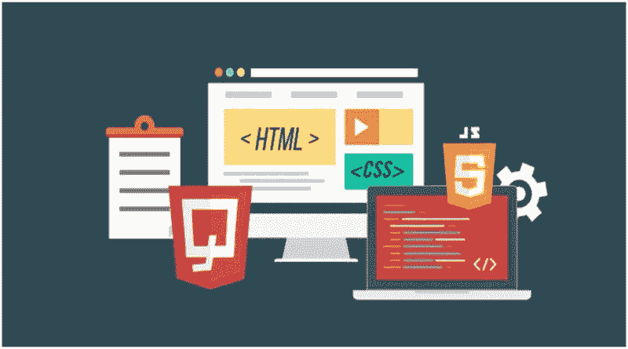
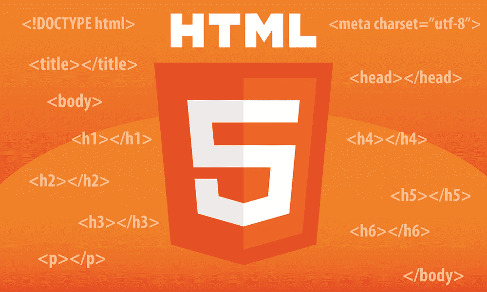
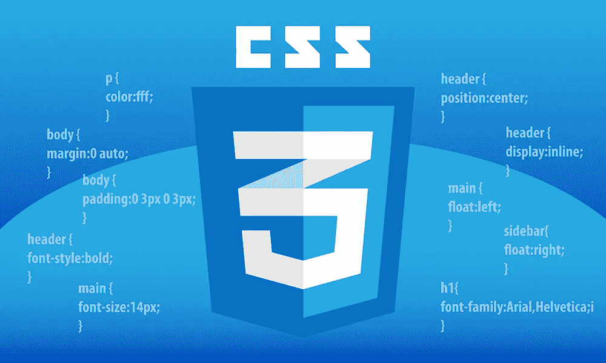
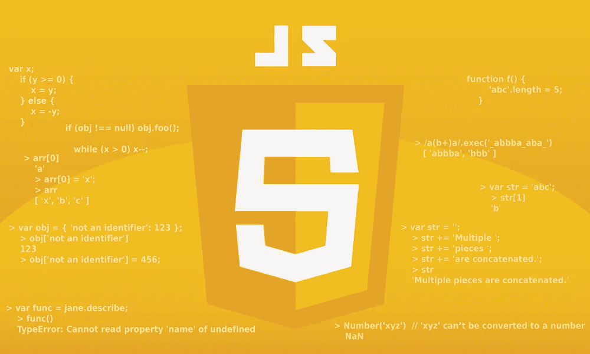
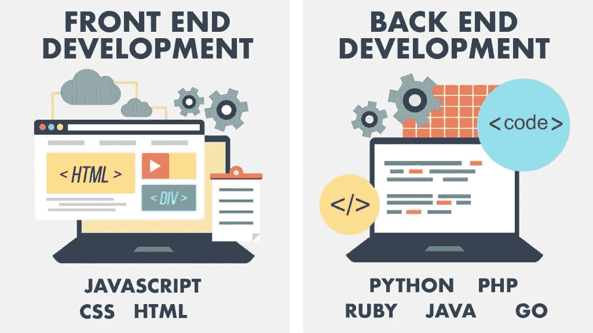
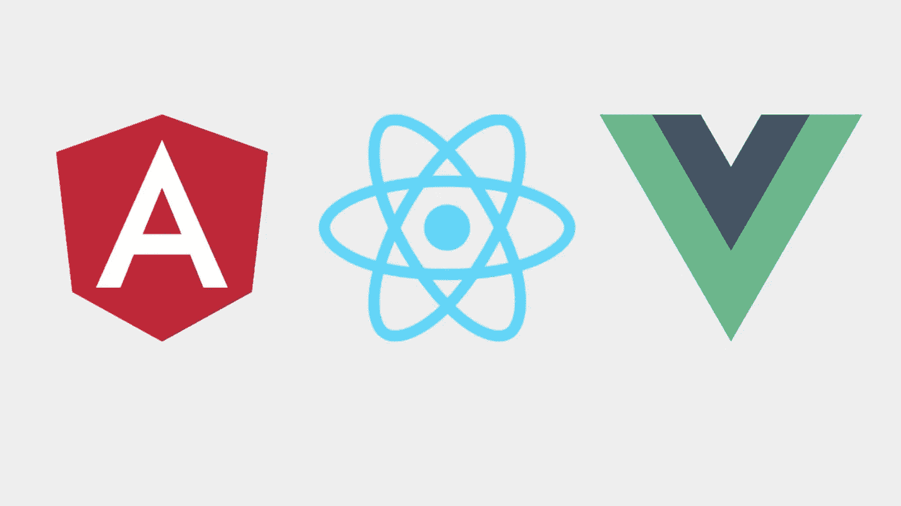
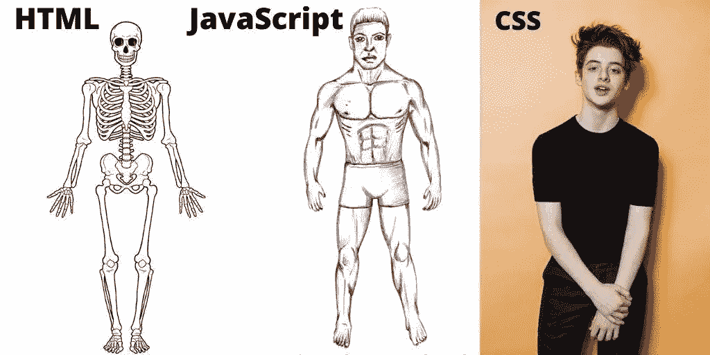

# 6 个月成为前端开发人员的技巧

> 原文：<https://medium.com/codex/skills-to-become-a-front-end-developer-in-6-months-e50a7da47f13?source=collection_archive---------9----------------------->

# 谁是前端开发者？

当你在看一个你正在看的网页时，有没有想过“为什么它看起来是那样的？”，“那些*按钮是怎么工作的？”*，或者曾经渴望过的*“我希望我也能做一个那样的？”*如果你已经做到了这一点，那么这是可能的，因为**网页设计**决定了网站的外观，前端开发是如何在网络上实现设计的。

图片来源:-Ironhack

前端 web 开发，也称为客户端开发，是为网站或 Web 应用程序生成 HTML、CSS 和 JavaScript 的实践，以便用户可以直接看到它们并与之交互。与前端开发相关的挑战是，用于创建网站前端的工具和技术不断变化，因此开发人员需要不断了解该领域的发展情况。

你在网站上看到的一切都是在**【前端开发】**的帮助下建立起来的，而让这一切成为可能的人就是**【前端开发者】。**

**前端 web 开发人员**或**前端 web 开发人员**是通过不同语言实现 web 设计的软件工程师。如果你去任何一个网站，你都可以看到前端开发人员在导航、布局、适应性设计方面的工作，以保持从不同设备上看到的最佳质量界面，这也被称为响应式设计。

要成为一名前端开发人员，你需要对 HTML、CSS 和 JavaScript 有很强的掌握。这三种语言还有一个昵称，这是根据它们的用途和对开发人员的重要性给它们起的，它们是:-

图片来源:-牛津网络工作室

**HTML (Skeleton)** 是 web 编码最基本的构建块。没有 HTML 方面的技能，你无法创建一个网站——你在屏幕上只能看到无格式的纯文本。没有 HTML，你甚至不能给页面添加图片！

在你开始任何 web 开发职业生涯之前，你必须精通编码。好消息是，获得 Html 的扎实工作知识可以在短短几周内完成。

图片来源:-牛津网络工作室

****【设计】**CSS 或者层叠样式表**

**是编码语言赋予了网站外观和布局。和 HTML 一样，CSS 也是网页设计的基础。没有它，网站仍然是白色背景上的纯文本。**

**CSS 允许自由定制，比如能够**

****1。**为浏览器指定默认字体以外的字体**

****2。**指定文本和链接的颜色和大小**

****3。将颜色应用于背景****

****4。包含网页元素在收件箱中，并将这些框浮动到页面上的特定位置****

****

**图片来源:-牛津网络工作室**

****Java Script (Skin** ):这让你可以给你的网站添加更多的功能，你可以只用 HTML、CSS 和 Java Script 或 JS 创建许多基本的网络应用程序。**

**JavaScript 作为一种 web 技术的重要性可以从它目前被所有网站中的 94.5%使用这一事实来确定。作为一种客户端编程语言，JavaScript 通过实现定制的客户端脚本来帮助 web 开发人员使网页具有动态性和交互性。**

**如今，大多数开发人员采用响应式 web 设计来使网站易于访问，并在多种浏览器、设备和浏览器之间保持良好的外观。响应式 web 设计使开发人员能够用一个代码库为计算机和移动设备优化网站。但是开发人员必须将 CSS3、HTML5 和 JavaScript 结合起来，使网页具有响应性。因此，开发人员必须使用 JavaScript 来优化移动设备的网页。**

# **前端和后端开发者的区别。**

****

**图片来源:-风险课程**

**现在我们知道了前端开发人员是做什么的，但是在哪些参数上以及它与后端开发人员有什么不同，这可以使这个主题变得清晰。**

**参考现实世界，后端开发人员就像是设计和创建城市运行系统的工程师(电、水、下水道、分区等)。)，而前端开发人员是布置街道并确保一切都正确连接以便人们可以过自己的生活的人。**

**能处理两端操作的人，被称为“全栈开发者”。**

# **所需技能**

**从 HTML 和 CSS 开始，大概需要 6 周或者一个半月左右。对于练习 VS Code 来说，这是一个非常好的平台，非常用户友好，带有“Emmet 缩写”,就像是一个帮助完成任务的助手。VS 代码最好的一点是它支持所有语言。**

**然后上 Java Script 或者 JS，又要 6 周。在做这件事的时候，不要试图成为 it 专家，只要试着了解功能、应用程序并有一个合理的理解，因为像 VS Code 这样的平台可以为你提供一切，唯一需要的是你应该知道如何操作 Java Script。**

****

**通过像 indeed、LinkedIn 这样的平台积极寻找工作岗位。这样你就不用为前端开发的所有事情做准备了，你现在知道你要准备什么，你想去哪个职位，职位的要求以及对公司的重要性。没有指定的时间限制，我们可以根据喜好来做。**

> ****“寻找垂直的 pro 效率，而不是水平的”。****

****

**图片来源:-开发社区**

**建设一个网站往往包括一堆重复的任务。这就是前端框架和库的用武之地。一个框架或库带有大量代码，你可以在我们的网站上重用。因此，他们帮助我们更快地完成工作。这就是为什么现在很多公司使用这些流行框架中的一个，比如 **React** 、 **Angular** 或 **Vue** 。**

**JS 库和框架这些充当了普通 JavaScript 的包装器，提供了额外的功能，否则需要花费更长的时间来编写代码。**

**查看**打字稿**和 **Redux。****

**在 JS 中，当分配某些值时，它需要它，但是在执行之后，如果任何错误出现，那么就很难捕捉到它，这里出现了 **Typescript** ，它是 JS，但是它允许你给你的应用程序添加强类型。**

****Redux** 是一个状态管理系统。Angular、React 和 Vue 会有它们的变化，但是当应用程序变得更大，并且有许多不同的部分包含它们的数据时，redux 在这里所做的*是充当所有不同 U.I .组件的集中存储器，以便从*中读取。我们可以说它是真理的来源。**

**Git 是一种版本控制技术，它允许你在一个特定的时间点保存你的应用程序，并在必要时恢复，还可以在线分享你的代码，并与其他开发者合作。**

****SAAS** 是 CSS 的扩展。它仍然是 CSS，但它有一些额外的工具，可以节省很多时间。**

**除此之外，我们还可以选择**终端、NPM 软件包、Webpack、敏捷方法**(基础)。这些是许多开发团队使用的工具，如果在简历中提到，招聘经理肯定会注意到。**

# **摘要**

**最后，不要什么都搞混了，坚持使用一种语言，但是要知道其他语言的基本操作。因此，无论何时需要，都可以在很短的时间内快速适应。对于前端 web 开发人员来说，它总是**

****

**图片来源:-OnSizzle**

****HTML** 【内容或标记语言】**

****CSS** 【造型】**

****Java 脚本**【逻辑或编程语言】**

**希望上面这张图能把概念说清楚。**