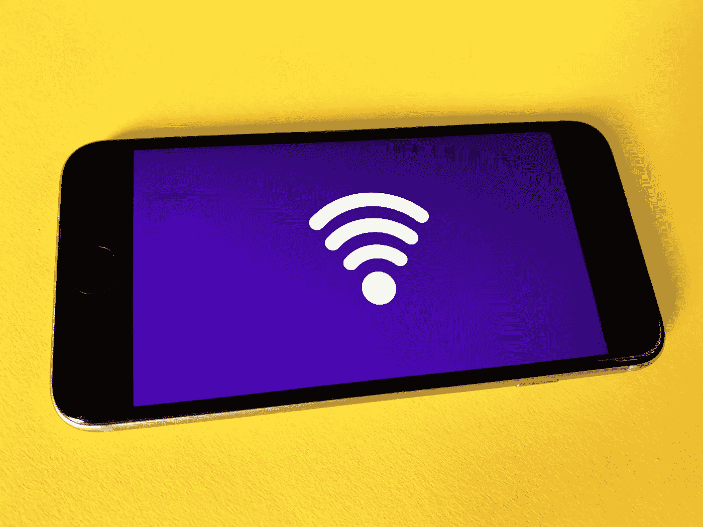

# 网速慢？提高 Wi-Fi 速度的技巧

> 原文：<https://medium.com/codex/slow-internet-tip-to-improve-your-wi-fi-speed-4d7f7d54c934?source=collection_archive---------8----------------------->

照片由[弗兰克](https://unsplash.com/@franckinjapan)在 [Unsplash](https://unsplash.com/) 上拍摄

人们通常认为网速慢一定是他们的网络服务提供商造成的。但是你的 Wi-Fi 路由器设置也会有影响。许多人忽略的一个设置是他们的 Wi-Fi 频道。由于 **Wi-Fi 信道干扰**，使用次优 Wi-Fi 信道会导致 Wi-Fi 互联网缓慢或不稳定。

# 什么是 Wi-Fi 频道？