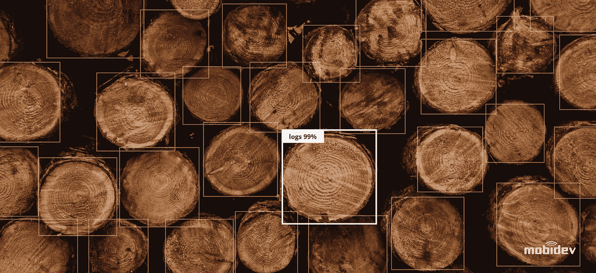
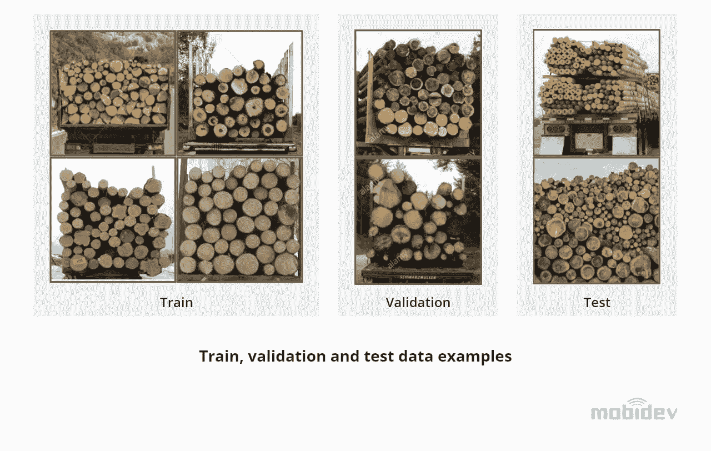
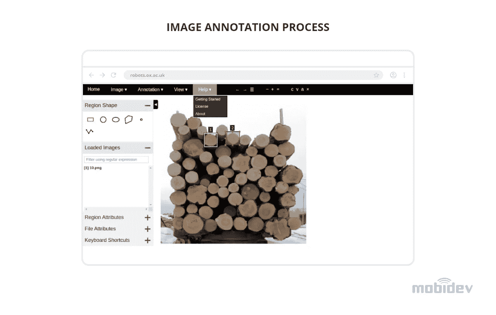
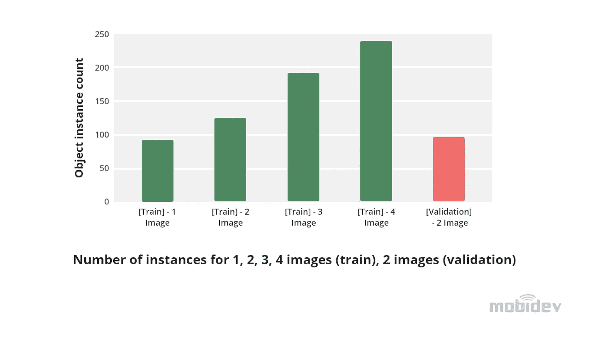
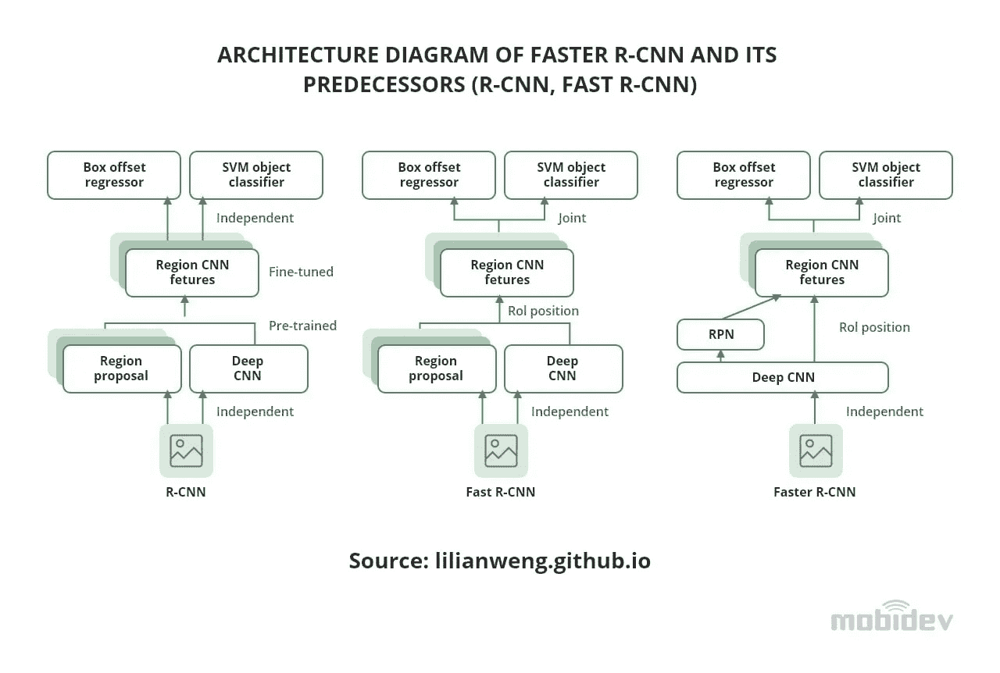
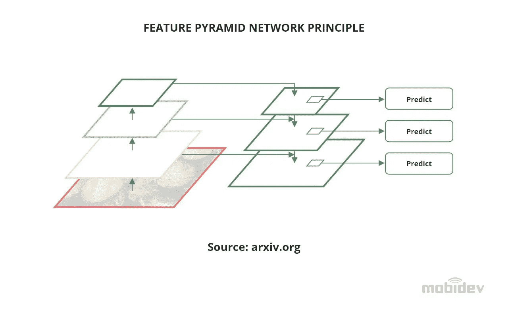
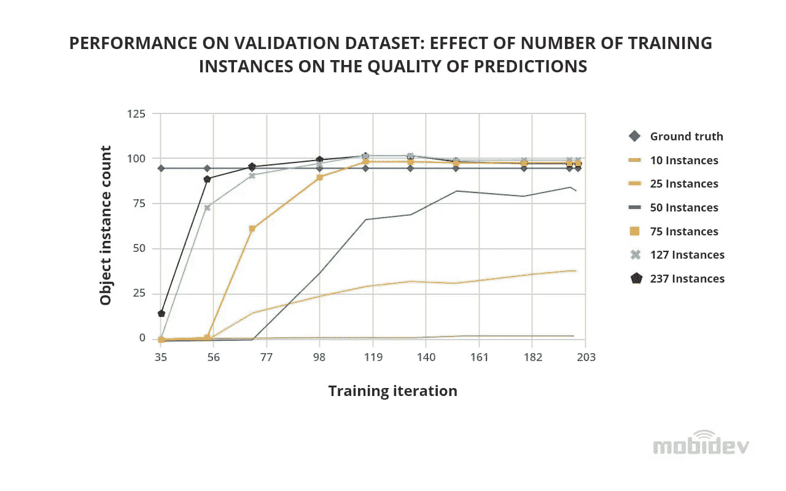
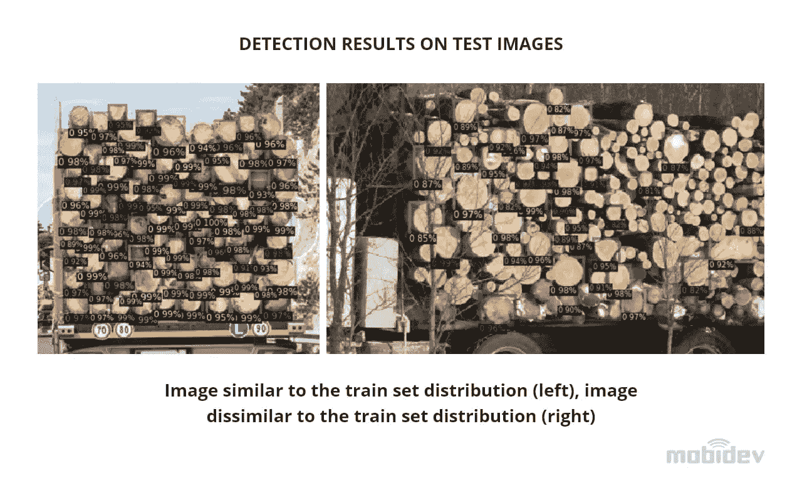
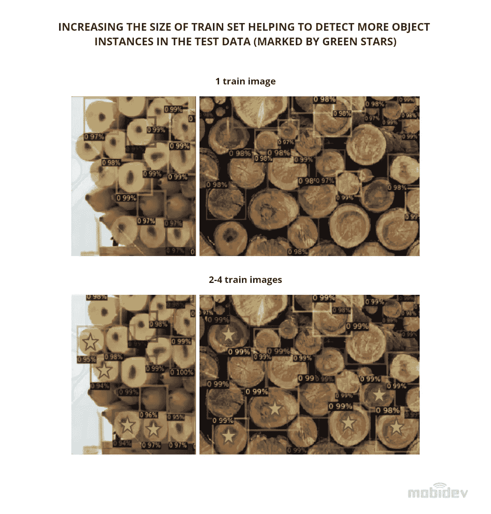

# 基于小数据集的目标检测:多少数据是足够的？

> 原文：<https://medium.com/codex/small-datasets-based-object-detection-how-much-data-is-enough-7cade289d340?source=collection_archive---------1----------------------->

开始任何机器学习项目通常都是从这个问题开始的:“多少数据才够？”。这种反应取决于许多因素，如生产数据的多样性、开源数据集的可用性、系统的预期性能等等。在这篇文章中，我想揭穿一个关于机器只能从大量数据中学习的流行神话，并分享一个用小数据集应用 ML 的用例。

随着深度学习在计算机视觉中的快速采用，需要在机器的帮助下解决的多样化任务越来越多。为了理解机器学习在现实世界中的应用，让我们关注一下*的目标检测任务。*

# 什么是物体检测？

对象检测是计算机视觉的一个分支，处理在照片或视频中识别和定位对象。目标检测的目标是在机器学习的帮助下，在数字图像或视频中找到具有某些特征的目标。通常，对象检测是项目识别的初步步骤:首先，我们必须识别对象，然后应用识别模型来识别某些元素。

# 对象检测业务用例

物体检测是视觉检测、仓库自动化、库存管理、安全等人工智能解决方案的核心任务。以下是一些跨行业成功实施的对象检测用例。

**制造业**。质量保证、库存管理、分拣和装配线—物体检测在许多制造过程的自动化中发挥着重要作用。机器学习算法允许快速检测任何缺陷，自动计数和定位对象。这使他们能够通过最大限度地减少人为错误和花费的时间来提高库存准确性。

**汽车**。机器学习用于自动驾驶汽车、行人检测和优化城市交通流量。物体检测用于感知驾驶员周围的车辆和障碍物。在交通运输中，目标识别用于检测和计数车辆。它还用于交通分析，并有助于检测停在高速公路或十字路口的汽车。

**零售**。对象检测通过分析和比较货架图像与理想状态，帮助检测 SKU(库存单位)。集成到硬件中的计算机视觉技术有助于减少零售店中的等待时间，跟踪客户与产品的交互方式，并自动交付。

**医疗保健**。对象检测用于研究医学图像，如 ct 扫描、MRI 和 X 射线。它被用于癌症筛查，帮助识别高危患者，检测异常，甚至提供手术帮助。应用对象检测和识别来辅助远程医疗的医疗检查是改变向患者提供医疗保健的方式的新趋势。

**安全与监控**。目标检测的应用包括能够进行人物检测和人脸识别的视频监控系统。使用机器学习算法，这种系统被设计用于生物识别和远程监控。这项技术甚至被用于自杀预防。

**物流和仓库自动化**。对象检测模型能够对缺陷检测、库存管理、质量控制和供应链管理的自动化进行可视化检查。人工智能驱动的物流解决方案使用对象检测模型，而不是条形码检测，从而取代人工扫描。

# 如何开发对象检测系统:PoC 方法

开发一个对象检测系统用于类似于我们上面提到的任务与任何其他 ML 项目没有什么不同。它通常从建立一个假设开始，在几轮实验中用数据进行检验。

这种假设是软件开发中 PoC 方法的一部分。它与机器学习一致，因为在这种情况下，交付不是最终产品。进行研究可以让我们得出结果，从而可以说可以使用任何一种选择的方法，或者需要进行额外的实验来选择不同的方向。

如果问题是“多少数据对于机器学习来说是足够的”，假设可能听起来像“150 个数据样本足以让模型达到最佳的性能水平”。

经验丰富的 ML 从业者，如[吴恩达](https://en.wikipedia.org/wiki/Andrew_Ng)(谷歌大脑的联合创始人，前百度首席科学家)[建议](https://blog.roboflow.com/andrew-ng-scale-transform-conference/)快速构建具有机器学习功能的系统的第一个迭代，然后部署它，并从那里迭代。

这种方法允许我们创建一个功能性的、可伸缩的原型系统，它可以用来自生产团队的数据和反馈来升级。与您试图从一开始就构建最终系统的情况相比，这种解决方案要高效得多。像这样的原型不一定需要大量的数据。

要回答“多少数据才够”这个问题，绝对没错，没有机器学习专家能预测需要多少数据。找出答案的唯一方法是设定一个假设，并在真实案例中进行测试。这正是我们在下面的对象检测示例中所做的。

# 案例研究:使用小数据集的对象检测，用于物流中的自动物品计数

我们的目标是创建一个能够检测物流对象的系统。从生产地到仓库或从仓库到工厂的货物运输通常需要中间控制和实际数量与发票和数据库的协调。当手动完成时，该任务将需要数小时的人工工作，并且涉及高风险。

说到假设，我们的目的是检查一个小的带注释的数据集是否足以解决为物流目的自动计数各种物品的问题。

许多人选择的解决问题的典型方法是使用经典的计算机视觉技术。例如，可以结合 Sobel 滤波器边缘检测和 Hough 圆变换方法来检测和计数圆形物体。该方法简单且相对可靠，然而它更适合于受控环境，例如具有轮廓分明的圆形或椭圆形物体的生产线。

在我们选择的用例中，经典方法的可靠性要低得多，因为对象的形状、图像质量以及照明条件可能会有很大差异。此外，经典方法不能从数据中学习。这使得通过收集更多的数据来迭代系统变得困难。在这种情况下，最好的选择是微调基于神经网络的对象检测器。

**数据收集和标记**

为了用小数据集执行对象检测的实验，我们收集并手动注释了公共来源中可用的几幅图像。我们决定把重点放在原木的检测上，并将带注释的图像分成*验证*分割。

此外，我们还收集了一组没有标签的图像，这些图像中的原木在某些方面与训练和验证图像(原木的方向、尺寸和形状、颜色)不同，以查看模型的检测能力在训练集中的限制。

由于我们正在处理对象检测，图像注释被表示为边界框。为了创建它们，我们使用了基于开源浏览器的工具 [VGG 图像注释器](https://www.robots.ox.ac.uk/~vgg/software/via/via-1.0.6.html)，它有足够的功能来创建小规模数据集。不幸的是，该工具以自己的格式生成注释，然后我们将其转换为 [COCO](https://cocodataset.org/#home) 对象检测标准。

在对象检测中，数据量不仅取决于数据集中的图像数量，还取决于每个图像中的单个对象实例的数量。在我们的例子中，图像中的对象非常密集——每个图像中的实例数量达到 50–90 个。

**探测器 2 物体探测**

我们决定使用的模型是脸书在计算机视觉库 [Detectron2](https://github.com/facebookresearch/detectron2) 中实现的[快速 R-CNN](https://arxiv.org/abs/1506.01497) 。

让我们仔细看看 R-CNN 如何更快地进行对象检测。首先，输入图像通过 backbone(一种针对图像分类问题预先训练的深度 CNN 模型)并被转换为称为特征图的压缩表示。然后，区域提议网络(RPN)处理特征地图，识别特征地图中可能包含感兴趣对象的区域。

接下来，使用 RoI 合并操作从特征图中提取区域，并通过边界框偏移头(预测每个区域的精确边界框坐标)和对象分类头(预测区域中对象的类别)进行处理。

更快的 R-CNN(基于区域的卷积神经网络)是 R-CNN 架构的第三代。

更快的 R-CNN 是一个两阶段的对象检测模型。它包括 RPN 子网络，用于对目标提案进行采样。然而，这不是用于对象检测的小数据集的唯一解决方案。

有一个单阶段探测器模型试图找到相关的对象，而没有这个 repion proposal 筛选阶段。与两级模型相比，一级检测器的架构更简单，速度更快，但精度较低。这些例子包括 [Yolov4](https://github.com/AlexeyAB/darknet) 和 [Yolov5](https://github.com/ultralytics/yolov5) 架构，这些系列中一些配置较轻的型号可以达到 50–140 FPS(尽管会影响检测质量)，而更快的 R-CNN 最大运行速度为 15–25 FPS。

关于更快的 R-CNN 解释的原始论文于 2016 年发表，并从那里获得了一些对架构的小改进，这些改进反映在我们使用的 Detectron2 库中。

例如，为我们的实验选择的模型配置 [**R50-FPN**](https://github.com/facebookresearch/detectron2/blob/master/MODEL_ZOO.md) 使用具有特征金字塔网络的主干 ResNet-50——这一概念是在 CVPR 2017 [论文](https://arxiv.org/abs/1612.03144)中引入的，此后成为 CNN 主干用于特征提取的主要内容。简单来说，在特征金字塔网络中，我们使用的不仅仅是从 CNN 中提取的最深层特征图，还有中低层特征图。这允许小物体检测，否则在向下压缩到最深等级期间会丢失该小物体检测。

**结果**

在我们的实验中，我们使用了以下逻辑:

1.  拿一个在 [COCO 2017](https://cocodataset.org/#home) 数据集上预训练的更快的 R-CNN，有 80 个对象类。
2.  分别用 4 和 1 个单位替换边界框回归中的 320 个单位和分类头中的 80 个单位，以便为 1 个新类别训练模型(边界框回归头对于每个类别具有 4 个单位，以便回归边界框的 X、Y、W、H 尺寸，其中 X、Y 是 bbox 中心的中心坐标，W、H 是其宽度和高度)。

经过一些初步运行后，我们选择了以下训练参数:

*   型号配置:R50-FPN
*   学习率:0.000125
*   批量:2
*   RoI 头的批量:128
*   最大迭代次数:200

有了参数集，我们开始研究训练中最有趣的方面:需要多少训练实例才能在验证集上获得令人满意的结果。因为即使一个图像包含多达 90 个实例，我们也不得不随机删除部分注释来测试更少的实例。我们发现，对于包含 98 个实例的验证集，在 10 个训练实例时，我们只能获得 1-2 个实例，在 25 个实例时，我们已经获得了大约 40 个实例，在 75 个或更多实例时，我们能够预测所有实例。

将训练实例的数量从 75 个增加到 100 个和 200 个导致了相同的最终训练结果。然而，由于训练样本的更高多样性，该模型收敛得更快。

在下图中可以看到用来自验证集的图像上的 237 个实例训练的模型的预测；有几个假阳性(用红色箭头标记)，但它们的可信度低，因此可以通过将可信度阈值设置为大约 80%来过滤掉。

在下一步中，我们探索了训练模型在没有标签的测试图像上的性能。正如预期的那样，类似于训练集分布的图像具有自信和高质量的预测。而那些原木形状、颜色不寻常或者方向不同的图像，模型就很难处理了。

然而，即使在来自测试集的具有挑战性的图像上，我们也观察到了增加训练实例数量的积极效果。在下图中，我们展示了随着训练图像数量的增加(1 个训练图像-91 个实例，2–4 个图像-127–237 个实例)，模型如何学习挑选额外的实例(用绿色星号标记)。

总之，结果表明，该模型能够挑选验证数据集中约 95%的实例。在对 75–200 个对象实例进行微调后，提供的验证数据类似于训练数据。这证明了选择适当的训练样本使得在有限的数据场景中进行高质量的对象检测成为可能。

# 物体探测的未来

物体检测是近年来出现的最常用的计算机视觉技术之一。其原因是多功能性。一些现有的模型已经在消费电子产品中成功实现，或者集成在驾驶辅助软件中。其他则是用于自动化物流、转变医疗保健和制造业的机器人解决方案的基础。

对象检测的任务对于数字化转型至关重要，因为它是人工智能驱动的软件和机器人的基础，从长远来看，这意味着我们可以逐渐将人们从单调乏味的工作中解放出来，并减轻多种风险。

由 [Maksym Tatariants](https://mobidev.biz/our-team/maksym-tatariants) ，AI 解决方案架构师 [MobiDev](https://mobidev.biz/services/machine-learning-consulting) 撰写。

*全文原载于*[*https://mobidev . biz*](https://mobidev.biz/blog/object-detection-small-datasets-use-cases-machine-learning)*，基于 mobi dev 技术研究。*