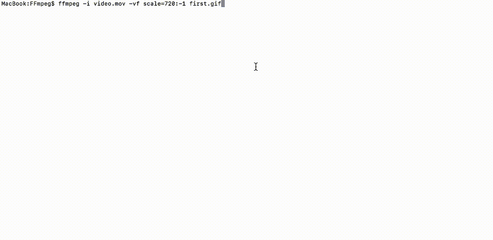
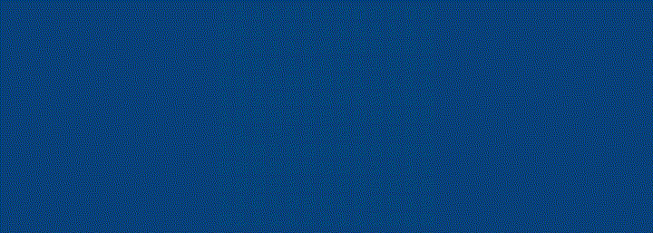
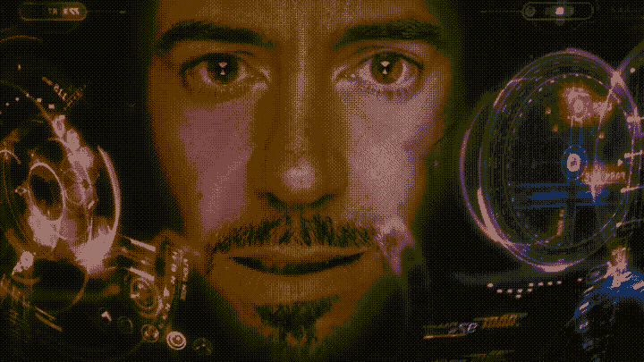
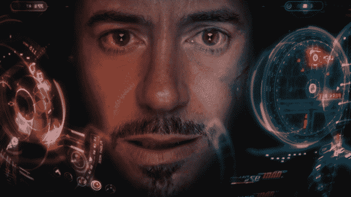
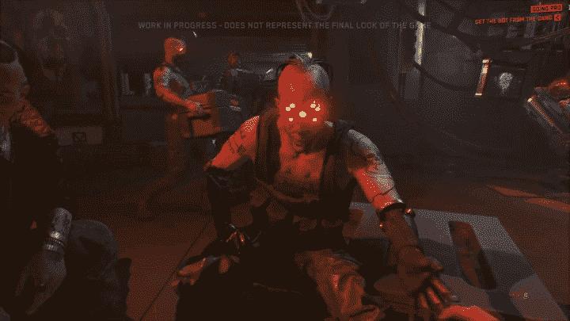

# 如何用 FFmpeg 创建 gif

> 原文：<https://medium.com/codex/small-sized-and-beautiful-gifs-with-ffmpeg-25c5082ed733?source=collection_archive---------1----------------------->

## 免费在任何平台上制作高质量的动画

GIF 创建于 1987 年，至今仍是一种广泛使用的格式，用于在网络上保存短小、轻便的动画。尽管有许多优点，这种文件格式有许多限制。gif 被限制为 256 色调色板，并且当动画的复杂性增加时会失去质量。因此，转换设置必须发挥平衡图像质量和文件大小。

我曾经在 Adobe Photoshop 中创建 gif。然而，由于 Photoshop 有 500 帧的限制，长而平滑的动画必须使用变通方法来创建。这很耗时，而且 Photoshop 也不是我的主要设计工具，所以我不得不寻找其他选择。Giffox 只录制选定的屏幕片段，但不允许从本地文件夹上传视频。还有，在免费版里，它放水印，不做 10 秒以上的 gif。更不用说它只在 Mac 上可用，而 FFmpeg 是跨平台的，没有这样的限制。 [Ezgif](https://ezgif.com) 的上传限制为 2000 个文件，每个文件的最大大小为 6MB 或总共 100MB。在在线转换器中，它是最好的之一，但它根据视频持续时间限制了 FPS。FFmpeg 具有良好的性能，可以处理大文件。

## 准备

在终端中安装运行以下脚本的[自制软件](https://brew.sh)。

```
/usr/bin/ruby -e "$(curl -fsSL https://raw.githubusercontent.com/Homebrew/install/master/install)"
```

安装 [FFmpeg](https://www.ffmpeg.org/download.html) 在终端中运行以下脚本。

```
brew install ffmpeg
```

## 将视频转换为 GIF

在“终端”中，导航到包含您要转换的视频的文件夹，然后运行命令创建 GIF。

```
ffmpeg -i recording.mov result.gif
```

这是最简单的命令，现在让我们添加可视过滤器来定制输出。

```
ffmpeg -i recording.mov -vf fps=5,scale=1200:-1,smartblur=ls=-0.5,crop=iw:ih-2:0:0 result.gif
```

*   **-i** 是一个输入键，后面跟随着你要转换的文件名。
*   **-vf** 是设置视觉滤镜的按键。
*   **fps** 是描述输出帧率的字符串(默认为“25”)。
*   **比例**设置宽度和高度，“-1”保留纵横比。
*   **smartblur** 模糊或锐化视频，“ls”表示“亮度强度”——[smart blur](https://ffmpeg.org/ffmpeg-filters.html#smartblur-1)选项之一。从-1 到 0 的值锐化图像。
*   **裁剪**修剪像素，“iw:ih-2:0:0”告诉从底部修剪 2 px。

> **可以通过降低帧速率、缩小图像和减少调色板来减小文件大小。**

由于某种原因，QuickTime 总是在屏幕底部显示一条黑线。很好的一点是，录音可以在 FFmpeg 中进行修剪，而不必打开额外的视频编辑软件。同样，帧速率被降低到 5 fps，至于这个 GIF 动画的流畅度就不那么重要了。由于 GIF 大多是文本清晰度可以提高一点点。转换后的 GIF 如下图所示。



分辨率:1200x586。时长:15 秒。FPS: 5。大小:382 KB。

## 将一系列图像转换为 GIF

可以从一系列图像中创建动画，这有时非常有用。例如，旧版本的 Adobe Media Encoder 不能导出为 GIF，因此可以从 PNG 序列创建动画。下面的命令从“框架”文件夹中从 000 到 999 枚举的图像创建 GIF。

```
ffmpeg -i frames/%03d.png -vf fps=20,scale=720:-1 logo.gif
```



使用默认调色板的 GIF 是粒状的，需要 24 MB。

## 定义自定义调色板

转换后的 GIF 只有三种颜色:白色和两种蓝色，因此，默认的 256 色调色板可以减少到 16 色。自定义调色板是用*调色板根*过滤器创建的。

```
ffmpeg -i frames/200.png -vf palettegen=16 palette.png
```

创建调色板后，它可以用于 GIF 转换。

```
ffmpeg -i frames/%03d.png -i palette.png -filter_complex "fps=20,scale=720:-1:flags=lanczos[x];[x][1:v]paletteuse" logo.gif
```

*   **-当有多个输入和/或输出时，使用 filter_complex** 。
*   **flags=lanczos** 设置重新缩放算法。*与*双三次*相比，Lanczos* 缩放器产生的模糊输入更少。
*   **【x】【1:v】**是[链接标签](https://ffmpeg.org/ffmpeg-filters.html#Filtergraph-syntax-1) —给予输出过滤器的名称。
*   **调色板使用**是一个过滤器，告诉使用自定义调色板。


带有自定义调色板的 GIF 具有更高的质量，需要 279 KB。

## 使用调色板将视频转换为 GIF

如前所述，GIF 格式存储了一个全局调色板，可以用自定义颜色重新定义以获得更好的质量。首先，让我们用默认的调色板创建 GIF，它将用于比较。顺便说一下，从输入文件只需要 2 秒钟，所以具体的部分将被转换为 GIF。

```
ffmpeg -ss 1:24 -i avengers.mp4 -vf fps=15,scale=720:-1 -t 2 avengers.gif
```

*   **-ss** 在输入文件中寻找特定的时间戳。在这种情况下，提取将从 1 分 24 秒开始。
*   **-t** 限制从输入文件读取数据的持续时间。在这种情况下，持续 2 秒钟。

为了创建调色板，需要提取一个帧。

```
ffmpeg -ss 1:25 -i avengers.mp4 -vframes 1 -vf scale=720:-1 snippet.jpg
```

*   **-vframes** 设置要输出的视频帧数。

然后使用创建的片段生成 256 色调色板。

```
ffmpeg -i snippet.jpg -vf palettegen palette.png
```

最后，调色板用于创建 GIF。

```
ffmpeg -ss 1:24 -i avengers.mp4 -i palette.png -filter_complex "fps=15,scale=720:-1:flags=lanczos[x];[x][1:v]paletteuse" -t 2 avengers2.gif
```

## 每帧生成调色板

每帧生成一个调色板并获得更好的质量是可能的。

```
ffmpeg -ss 1:24 -t 2 -i avengers.mp4 -filter_complex "[0:v] fps=15,scale=w=720:h=-1,split [a][b];[a] palettegen=stats_mode=single [p];[b][p] paletteuse=new=1" avengers3.gif
```

下面比较了两张 gif，第一张是用默认调色板创建的，占用 2.5 MB。第二个是用每帧调色板创建的，占用 5.4 MB。



使用默认调色板的 GIF 具有最佳的质量/大小比。



每帧带调色板的 GIF 质量最好，但尺寸却翻倍了。

## 额外提示

使用 [Gifscisle](http://www.lcdf.org/gifsicle/) 您可以进一步优化 GIF 并无损缩小其大小。要安装 Gifsicle，请在终端中运行以下脚本。

```
brew install gifsicle
```

使用以下命令优化 gif。

```
gifsicle -O3 animation.gif -o animation_optimized.gif
```

*   **-O3** 是一个优化级别，尝试多种方法来实现更好的压缩。 [Gifsicle 手册页](http://www.lcdf.org/gifsicle/man.html)有更多信息。
*   **-o** 是一个输出键，后面跟一个文件名。

下面是一个用 FFmpeg 创建的例子，使用自定义调色板，并在 Gifsicle 中进一步优化。大小从 15 MB 减少到 14.4 MB。



分辨率:720x405。时长:7 秒。FPS: 18。大小:14.4 MB。

*起初，所有这些可能看起来令人困惑，但安装和配置不超过 5 分钟。设置完成后，只需使用脚本并根据需要进行修改——非常简单。我希望这个指南对你有用。你转换 gif 的首选方法是什么？*

# **喜欢这篇文章？**

请支持我的努力，我会经常写信的。

BTC:15 xxw 1 jndrbzzzkvnyicffwtefxyte 7 CPS

ETH:0x 5 f 88 ca 7 a 7 DFC 671 D1 e 618 D1 f 76d 05 a 0 BF 85 c 0d 44