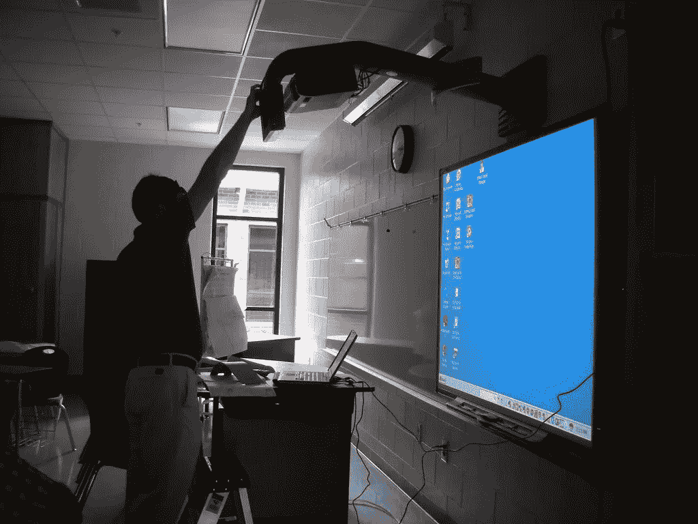

# 智能教室，未来教育的发展方向

> 原文：<https://medium.com/codex/smart-classrooms-the-way-education-will-go-in-the-future-a5c735a876ee?source=collection_archive---------10----------------------->

## 几个因素正在推动教育技术和智能教室行业向前发展。

图片:[https://www.flickr.com/photos/judybaxter/2636049929](https://www.flickr.com/photos/judybaxter/2636049929)

从全球来看，教育机构正在投资新技术，正如我们所知，这些新技术将改变教育。将尖端技术与传统教学相结合的智能教室就是这些技术支出之一。