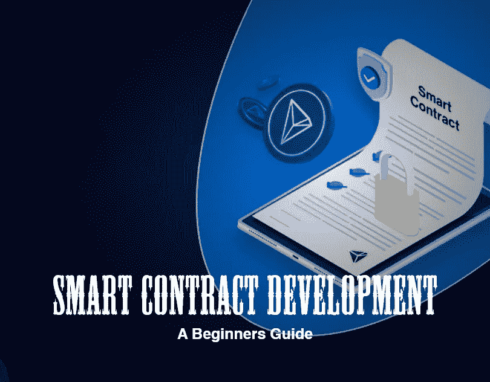

# 智能合同开发——初学者指南

> 原文：<https://medium.com/codex/smart-contract-development-a-beginners-guide-40a418be3894?source=collection_archive---------13----------------------->

在区块链技术中，智能合同如今变得至关重要。它有助于正在进行的交易的组织和安全。此外，它还提高了其他组件的可访问性，例如在这些平台上运行的程序。

这就是为什么世界各地的商人开始使用有效的智能合同开发他们的区块链相关产品的主要原因。为了减少网络中的工作并增加透明度，智能合同被集成到区块链中。现在，它被广泛应用于各个领域，企业通过其自动化看到了财富。

[**智能合约开发**](https://www.zabtechnologies.net/smart-contract-development-company/?utm_source=CodexGBIg&utm_medium=SmartConDC&utm_campaign=MPD)

# 什么是智能合同？

智能合同是双方或多方之间使用区块链平台建立的协议或虚拟合同。它被设计成有一个特定的目标，并持续运行，直到预定的环境得到满足。它执行编码在上面的指令继续前进，直到条件满足。此外，由于智能合约由代码片段组成，因此它们需要区块链来存储和处理数据。当协定的地址相互通信时，它管理并执行操作。

当谈到智能合同开发时，它是将虚拟合同与现有区块链集成的过程。区块链开发是智能合约的基础，因此它反映了区块链的能力，如透明度、去中心化和一切。智能合约是以太坊开发的一个概念。但是现在，创业公司可以在他们想要的任何区块链上拥有智能合同，如 TRON，BNB 链，polygon，Solana 等等。

但是在开发智能合同并将其集成到您的区块链相关业务中之前，您需要了解智能合同的工作流程。

# 智能合约是如何工作的？

智能合同是一种特殊类型的程序，它在一个专门的虚拟机上运行，该虚拟机集成到区块链或其他分布式分类帐中，并包含业务逻辑。现在让我们看看以下步骤的工作过程。

1.  业务团队和技术专家一起工作，为智能合约的预期行为设置参数，以响应特定的情况或事件。
2.  简单的事件包括公用事业仪表读数阈值、支付许可或发货收据等。
3.  此外，对更复杂的操作进行编码也很有用，比如确定衍生金融工具的价值或自动分配保险赔付。
4.  使用一个创建智能合同的平台，工程师们编写并测试代码。编写完成后，程序被发送到不同的团队进行安全性测试。
5.  你可以雇佣一个内部专家或者一个专门研究智能合同安全性的公司。
6.  合同被接受后，它将在已经存在的区块链或其他分布式分类帐基础设施上实现。
7.  智能合约投入使用后，它被配置为等待来自“oracle”的事件更新，Oracle 实际上是一个加密的流数据源。
8.  智能合约在从一个或多个必要的事件串联的先知接收之后运行。

智能合同实现的区块链相关软件包含一组在任何特定情况下要完成或发生的规则。一旦所有条件都满足，它将自动执行交易过程。如果出现任何不匹配，合同将被撤销，交易将被终止。代码保护所有成员的财产，确保没有损失。这是智能合同被用于各种行业的主要原因。

让我们看看一些…

# 各种行业中的智能合同用例

智能合同有许多使用案例，将适用于任何行业。许多行业已经在利用智能合同开发。现在，让我们看看一些常见的例子，如金融、房地产、医疗保健和保险。

## 金融

金融业凭借这种智能合约技术赢得了大奖。通过高效的智能合同开发，贷款结算和银行流程的时间可以减少一半。因此，客户会对快速的流程和客户体验感到满意。此外，快速处理降低了运营成本。

## 卫生保健

医疗保健行业拥有具有最高价值和保密性的患者记录。因此它需要一个系统来有效地保护它。智能合约和区块链技术可以有效地存储和加密它们。只有获得授权的会员才能进入。此外，处方可以通过智能合同实现自动化，以减少时间并获得良好的患者体验。

## 保险

保险业经常受到欺诈的攻击，大量的金钱将被浪费在更长的保险索赔过程上。通过智能合同，这些行业可以通过自动化节省大量成本，这也有利于客户。当保险公司通过自动化合同节省了大量资金时，他可能会像多米诺骨牌效应一样向客户提供更低的保费。

## 房地产

房地产可以是智能合约的最佳应用。因为这个行业遇到的情况是卖家在收到钱之前不想过户。此外，在卖方将所有权转让给他之前，买方不想给钱。这种情况可以通过智能合约来有效管理。

它减少了中介，加快了交易速度。此外，只有在双方的需求都得到满足的情况下，合同才会生效。因此，这是一种安全、透明、快速的合同敲定方式。

现在让我们继续…

# 智能合同的特征

在开发智能合同之前，功能是您需要考虑的最重要的事情。因为这些是他们所拥有的使他们独一无二的特征。以下是您在开发智能合同时可以集成的功能列表。

## 分布式和透明的

智能合同的副本被分发给网络的所有成员。每个人都可以拥有一份合同。它不能在一方的命令下改变，而需要各方的同意。

## 确定性的

智能合约将只执行为其设计的动作。它执行代码的条件，结果永远不会改变。智能合约开发人员将使用严格需要执行且永远不能更改的条件来开发它。

## 自动化的

自动化是智能合约开发的主要特征。智能合同可以自动执行任何类型的任务。此外，如果没有收到任何类型的激活，它将保持理想状态。

## 不变

一旦智能合同在网络中发布和部署。它不能被修改。但是只能被移除。

## 可定制的

可定制是智能合约开发的一个重要特性。智能合同可以根据合同的需要进行定制。它们也可以用来开发各种 DApps。

## 私有化和不信任

不可信的特性使智能合约开发更加高效。智能合同不需要第三方来验证流程。因为区块链有更完整的环境和更忠实的流程。

# 制定智能合同的好处

作为一家初创公司，你可以通过集成智能合同来增强区块链相关业务的能力。因为它们对创业公司有各种好处。有了这一点，希望在人群中独树一帜的初露头角的企业家可以有效地提升他们的业务。

## **高度安全**

建立在区块链上的智能合约是高度安全的。它们很难被破解，加密的区块链交易使文件完全安全。因此，它被认为是市场上最安全的技术之一。

## 负担得起的成本

智能合约的运营成本更低，因为它消除了对中介的需求。这一事实节省了大量资金，因为它消除了对一系列代理人、公证人、顾问和其他第三方的需要。此外，咨询费和佣金可以大幅减少。

## 提高透明度

盗窃或丢失资产的可能性非常小。因为这些文件被加密并存储在难以破解的安全账本上。由于智能合约消除了与信任相关的风险，因此出错和操纵的可能性更小。透明性在智能契约中很重要，它消除了对契约中涉及的合作成员的怀疑。

## 增强速度

速度是智能合约的主要优势。只要智能协定中的条件得到执行，它就会自动执行。它消除了投入文书工作的额外时间和精力。此外，花在纠正错误和人工劳动上的时间也减少了。

这些是智能合约开发可以带来的好处。总的来说，以区块链相关业务为目的开发智能合同对初创公司有利。

# 最后的想法

正如我们之前讨论的，智能合约在很多方面都可以帮助你。但是对于那些编码新手来说，开发它是乏味的。因为智能合约完全依赖于编码和编程语言。因此，在没有编码知识的情况下开发智能契约会导致巨大的损失。于是[**智能合约开发**](https://www.zabtechnologies.net/smart-contract-development-company/?utm_source=CodexGB&utm_medium=SmartConDC&utm_campaign=MPD) 的流程对于初出茅庐的商人来说有些困难。

如果你想轻松地开发一个智能合约，它需要专业智能合约开发人员的帮助。发展自己可能需要努力和大量的时间来完成产品。

一家著名的开发公司将为您提供一份有效的智能合同，帮助您开展与区块链相关的业务。他们帮助您开发一个无缺陷、灵活、安全可靠的智能合约。他们经验丰富的智能合约开发人员会以一种轻松的方式为您提供完全实用的智能合约。