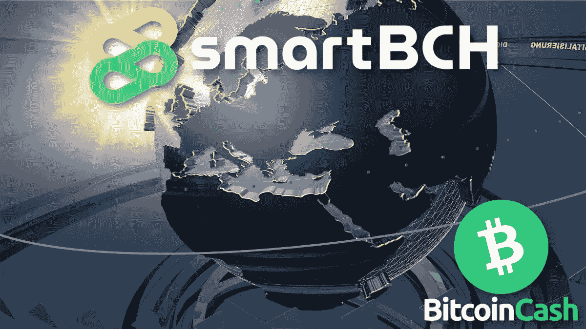
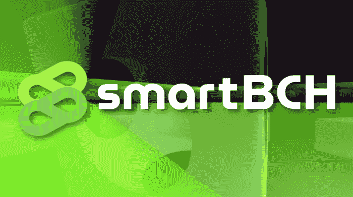
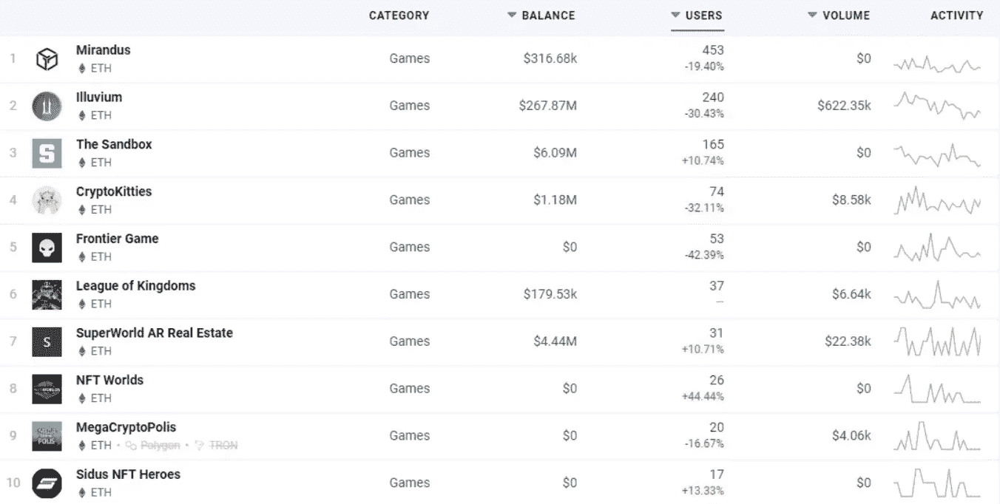
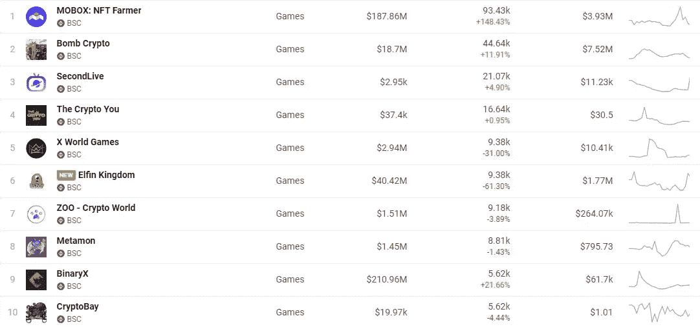
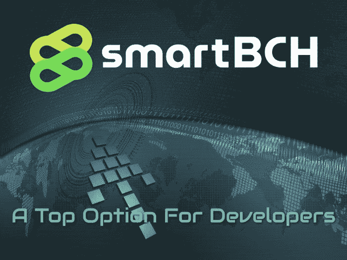

# SmartBCH:开发人员的首选

> 原文：<https://medium.com/codex/smartbch-a-top-option-for-developers-cd76e782e54a?source=collection_archive---------13----------------------->

[*pix abay*](https://pixabay.com/tr/illustrations/say%c4%b1salla%c5%9ft%c4%b1rma-%c3%b6l%c3%a7ek-logo-g%c3%b6sterin-1755783/)

[SmartBCH](https://smartbch.org/) 是当今开发者、智能合约专家和投资者的最佳平台。

虽然 smartBCH 在智能合约领域开启了无限可能，但以太坊仍处于实施 ETH 2.0 和分片的漫长过程中，这是一种网络升级，可能需要长达 10 年的时间才能达到 smartBCH 目前提供的吞吐量。

对于投资者来说，smartBCH 提供产量农业，在整个 DeFi 市场中具有最高的 APR。交易者可能会发现一些低估值的有前景的项目，并进行长期投资。

然而，对于开发人员来说，smartBCH 提供了一个壮观的平台，他们可以将自己的想法部署到智能合同 Dapps 中，并找到比任何其他平台都更好的成功机会。

有了 smartBCH，在以太坊上构建的一切都变得更加容易。

*   **区块链游戏**会找到一个很棒的环境来创作游戏
*   **NFT 艺术家**可以创作并提供他们的作品
*   **任何** **创新的新项目**都可以提供代币销售并在 dex 上市
*   **预测市场**和**博彩业巨头**
*   smartBCH 提供了一个庞大的用户群(一个现成的目标群体和目前有限的竞争)。在选择构建哪个平台时具有重要的战略意义。

当确定你的项目目标时，做一个市场调查并找出开发者创造的产品是否有目标群体是很重要的。

一些智能合约网上的目标群体只是两位数的用户。任何此类开发成功的机会都极低。SmartBCH 已经有数千名活跃的参与者，这是一个渴望发展的用户群。

# 为什么要构建 smartBCH？

[*Pixabay*](https://pixabay.com/tr/illustrations/soyut-geometrik-d%c3%bcnya-harita-1278080/)

开发商往往不了解市场，他们不是在一个强大而有效的区块链上提供产品，而是选择那些被营销和炒作的产品，只是因为他们认为他们也有用户群。

可悲的是，事实并非如此。鲸鱼可能会尝试抽取雪崩 DeFi 并呈现巨大的容量(目前为 11B ),但这并不反映该网络实际用户群的当前状态，该用户群仅为 100-200 人。

开发人员分配时间和精力来创建一个总是计划大规模采用的应用程序。否则只是短期的泵，长期的失败。自从以太坊开始以来，由于以太坊的费用和网络拥塞不允许大规模采用，已经有成千上万的尝试被浪费了。基本上，以太坊甚至不允许适度的采用，因为费用使得扩展变得不可能。

一旦费用开始上涨，大多数建立在用户基础上的项目就不可能继续进行。提款变得不可行，合同交互要求不合理的费用。以太坊内各种类别的长期生存能力立即被取消。

提高成功率的开发人员是那些逆潮流而动，在别人看不到的地方找到机会的人。

## **在以太坊下遭殃的利基产业**

*   **区块链游戏**
*   **预测市场&赌博应用**
*   **市场**
*   **NFTs**
*   **DeFi(针对小投资者)**
*   **提供货币化的应用(即发布 0x)**

当费用上涨时，一个项目的长期可行性立即被取消。以太坊的费用一直是一个威胁，然而开发者一直在这个区块链上发布他们的产品，因为直到最近还没有可行的替代方案。Tron 没有进步，就用户群而言，这个平台从未真正启动。大多数以太坊克隆至今也是失败的，没有带来什么新的或者有趣的东西。

BSC 吸引了一定的人群，主要是因为它创建的 DeFi 基础设施，然而，BSC 是一个由币安大量资助的项目，并且集中在币安验证者的控制之下。BSC 吸引了一些开发人员，但它没有强大的用户基础来长期维持它。

除了少数几个“DeFi”平台，BSC 上的几乎所有东西都只是一个投机泡沫，将是短暂的。一旦吸引空投猎人的最初奖励结束，这个平台的区块链游戏玩家就会迅速消失。

从长远来看，平衡计分卡的模式似乎没有潜力取得更好的成果。即使是 BSC 的 DeFi 部门似乎也已经耗尽了它的潜力，可能很快就会开始走向竞争。

# 以太坊的拥堵阻碍了 Dapps、区块链游戏、赌博应用和预测市场的创新

一个很好的例子是今天以太坊区块链游戏的用户数量:

*对于任何区块链游戏来说，不得不处理如此低的流量都是令人遗憾的。在以太坊的所有区块链游戏中，这主要是一个两位数的用户群。这个列表包含了 529 个仍然活跃的以太坊游戏，它们都大规模地失败了。大多数没有每日用户，也许只有一些开发者的朋友决定每天浪费数百美元的以太坊费用，只是为了让这些游戏保持活跃。*

*币安智能链区块链游戏统计似乎提出了一个极端的用户数量，然而，这些数字包含了区块链游戏的现状不切实际的流量。*

**

*[*来源*](https://dappradar.com/rankings/protocol/binance-smart-chain/category/games)*

*在游戏中发现“炸弹密码”或“你的密码”这样的数字是不合理的。对于密码领域的任何人来说，这些都是完全未知的游戏，因此 BSC 提供的数据可能远远不真实。*

*WAX 在区块链游戏中做得更好，然而，WAX 的费用不像 smartBCH 那样低，并且需要不断地补充 CPU 和 RAM 的功能来收费。尽管如此，WAX 还是有一定的(真实的)令人钦佩的用户基础。*

*Hive 只有 Splinterlands，一款类似 Axie Infinity 炒作的游戏，拥有数千名活跃用户。*

*基本上，正是这两个游戏(Axie 和 Splinterlands)吸引了最多的用户群，这是因为货币化因素和媒体的关注(以及市场炒作)。*

*作为游戏，它们缺乏吸引真正游戏玩家的基本功能，仅仅是货币化因素无法永远维持它们。*

*他们都无法生存的主要原因将是游戏性和环境更好的真实游戏的竞争。*

*这是对区块链游戏方式的普遍感觉，它甚至不被全球数亿游戏玩家视为游戏。此外，还有提供娱乐价值的因素。*

*纸牌游戏不会持续太久，这种模式似乎已经达到了极限。然而，我不想让 Axie 或 Splinterland 玩家气馁。*

***AxieBCH 公会**是一个 smartBCH 项目，具有**令人钦佩的**。*

*以太坊开发者曾一度专注于区块链游戏，但**矿工费用摧毁了这个市场的任何进展**。当然，游戏需要足够的资金，一个开发人员只能开发一个普通的移动 Android/IOS 应用程序，而其他任何事情都需要大量资金支持的团队。可悲的是，**很少这样的团队出现**，不仅仅是**资金不足，**而且以太坊，直到最近还是他们唯一的选择，悲惨地未能满足这样项目的需求。*

*和往常一样，分权制是主要的例子。它不完全是区块链游戏，但属于这一类，因为它提供了一个虚拟世界，开发者经常在其中创建一些游戏。不过，想法是一样的。数字财产和物品应该出售，但在以太坊内，99.99%的可能游戏行为被排除在外，因为仅与合同互动的费用就往往达到 200 美元或更高。*

*没有玩家会去碰分散之地，或者任何其他以太坊的游戏。没有人与这些合同互动，任何基于以太坊的区块链游戏都将遭受同样的命运。以太坊图表中的数字解释了区块链游戏的真正问题，以及为什么 smartBCH 提供了部署类似开发的最佳平台。*

**

# *最后*

**

*[来源](https://pixabay.com/tr/illustrations/soyut-geometrik-d%c3%bcnya-harita-1278080/)*

*SmartBCH 是解决竞争链所面临的各种问题的有力解决方案。在 2022 年，它将推进去中心化，并与以太坊和所有 EVM 兼容的侧链相衔接。*

*可以肯定的是，smartBCH 的未来是光明的，它将成长为一个有竞争力的区块链，一旦在这个市场成熟，将吸引大量投资。*

*前景令人兴奋，许多人已经注意到了这一点。我们都在等待“惊喜”的时刻，那时每个人都会讨论 smartBCH。*

*区块链游戏只是拥挤的网络无法满足大规模采用的一个例子。以太坊上的任何游戏都不会成功，因为它要求 200 美元的费用，仅仅是为了进行一次数字资产的转移。*

*SmartBCH 为区块链游戏和其他游戏解决了这个问题。对于各种 Dapps，赌博应用，发布网站等都是一样的。虽然也可以使用比特币现金，但 smartBCH 仍然包含了以太坊的所有智能合约功能。*

*也有强大的用户基础。也许任何能吸引他们的开发都有几万甚至几十万的潜在用户。*

*费用很低，用户群也在那里。如果你是一个开发人员，专注于创造一个数百万人想要使用的产品，smartBCH 可能是你现在最好的选择。*

*如果我是区块链的游戏开发者，我会马上在 smartBCH 上创建一个游戏。smartBCH 上的“Splinderlands”模式的游戏将在两三个月内吸引十万用户。*

**

**在以下网站写作:●*[*read cash*](https://read.cash/@Pantera)*●*[*noise cash*](https://noise.cash/u/Pantera99)*●*[*Medium*](/@panterabch)*●*[*Hive*](https://hive.blog/@pantera1)*●*[*Steemit*](https://steemit.com/@pantera1)*●*[*声乐*](https://vocal.media/authors/pantera)*

> ***免责声明**:本内容中发布的所有材料均用于娱乐和教育目的，并符合**合理使用准则**。无意侵犯版权。如果您是或代表本文所用材料的版权所有者，并且对所述材料的使用有疑问，请发送[电子邮件](https://read.cash/@Pantera/cryptouknowns-battlegrounds-the-crypto-battle-royal-part-i-0ca762da#bad-link)。*
> 
> *不是财务建议。*

****如果你喜欢这篇文章，别忘了订阅并点赞！****

**最初发布于*[*https://read . cash*](https://read.cash/@Pantera/smartbch-a-top-option-for-developers-e9a24483)*。**

**