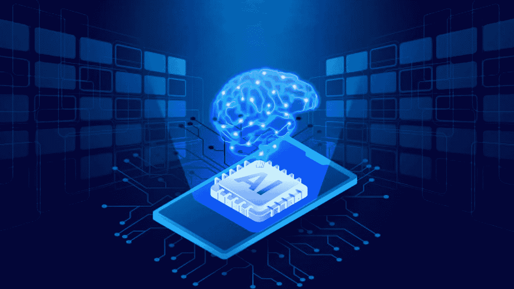
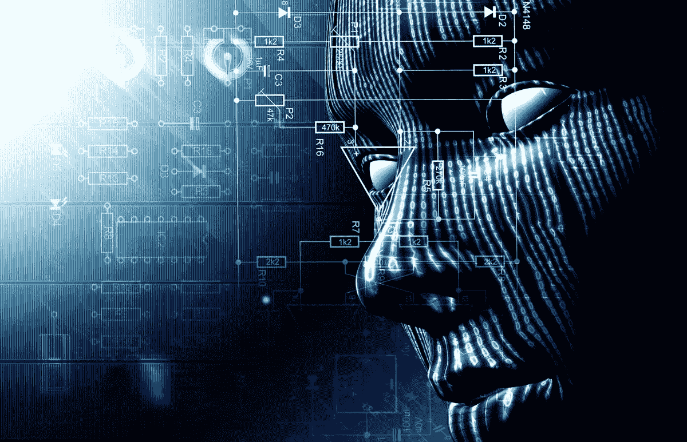

# 智能手机

> 原文：<https://medium.com/codex/smartphones-d0f96b9b1fed?source=collection_archive---------28----------------------->

资料来源:AIThority.com

> 2021 年，人工智能在各行各业的使用将创造 2.9 万亿美元的商业价值和 62 亿小时的工作效率。2019 年，人工智能创业公司在 Q2 获得了创纪录的 74 亿美元资金。截至 2019 年 3 月，美国共有 279，145 项人工智能专利申请。

“人工智能是最流行的词，智能手机行业正在将它融入他们的设备中！”

任何一个行业，人工智能(AI，下同)都在前排占了一席！

几乎每个行业都因人工智能领域的进步而变得疯狂！

原因可能很多，但最重要的是，

## 谁不喜欢知道未来呢？

比方说，你想在街上找个停车位，但是你到家了，不知道到达目的地后能不能找到。不要担心谷歌地图(还有人工智能)是救星！

谷歌地图有一个被称为**“街道停车指示器”**的功能，它使用众包数据和人工智能算法，利用过去的数据提前预测停车难度！

这是从 2017 年开始提供的:O

Siri，Alexa，谷歌助手用的是 NLP(自然语言处理)

人脸识别、图像识别、谷歌镜头使用(物体/人脸检测)

AI 相机，AI 电池，AI 芯片，AI 手势，AI 助手，…..

我担心有一天会有“唉唉”

类似这样的！

**那么，下一步是什么？**

人工智能不仅主宰着智能手机行业，它更是走向每一个有数据的行业！

有志者事竟成。-?太老派了！

> 哪里有数据，哪里就有 AI！？-?是新潮流！

随着这种巨大的数据流，IoT(物联网)等模式正在快速发展！

来源:计算机世界

因此，一个由人工智能驱动的完整生态系统正在产生！

除了智能手机，许多小工具和设备也将成为这个生态系统的一部分！(就像几年前的智能手表一样)

逐渐地，许多由物联网和人工智能驱动的设备将以低廉的价格提供。

但是随着由人工智能驱动的设备，将会有一大群设备在互联网上运行，并在内部相互连接。

这个蜂巢可能会对安全和隐私造成威胁，这也需要通过人工智能来解决！

> “任何可以产生比人类更聪明的智能的东西——以人工智能、脑机接口或基于神经科学的人类智能增强的形式——都毫无疑问地成为最能改变世界的东西。其他的甚至都不在一个联盟里。”—埃利泽·尤德科夫斯基