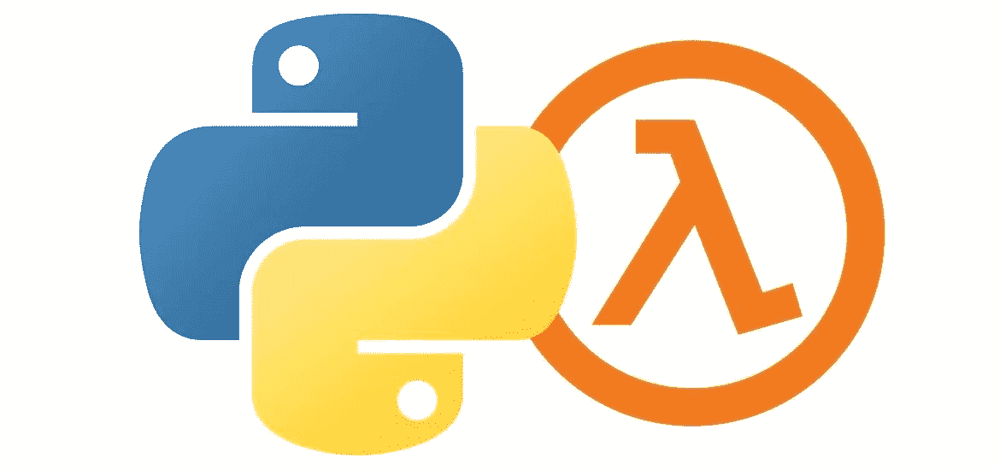

# 使用 AWS 在 python 中发送短信和电子邮件

> 原文：<https://medium.com/codex/sms-and-email-sending-in-python-using-aws-a81df27fc210?source=collection_archive---------1----------------------->



有时，您希望在 python 应用程序触发某个动作或事件时发送短信和电子邮件。在正常情况下，我们可以使用带有 python `[smtplib](https://docs.python.org/3/library/smtplib.html)` 模块的 Gmail 帐户发送电子邮件，但它有每天发送电子邮件的限制。有许多服务可以让你有计划地发送短信和电子邮件。其中比较流行的是 [Twilio](https://www.twilio.com/) ，他们有一个很棒的 API 和一个很容易使用的 python 客户端。

另一种选择是使用亚马逊的[简单通知服务](https://aws.amazon.com/sns/) (SNS)和[简单邮件服务](http://aws.amazon.com/ses/) (SES)分别发送短信和邮件。你也可以使用社交网站发送电子邮件，但社交网站的工作方式类似于你订阅的邮件群，以便接收与用户相关的内容。

## 先决条件

首要要求是一个 AWS 帐户和一个经过验证的电子邮件地址来发送电子邮件。还要从 amazon 帐户下载 AWS 访问密钥和秘密密钥，以便对交易进行身份验证。

第二部分是亚马逊的 python SDK[boto 3](https://aws.amazon.com/sdk-for-python/)，它有助于将您的 Python 应用程序、库或脚本与 AWS 服务集成，包括亚马逊 S3、亚马逊 EC2、亚马逊 DynamoDB 等等。

```
pip install boto3
```

**发送短信**

```
import boto3
# Create an SNS client
client = boto3.client(
    "sns",
    aws_access_key_id="YOUR ACCES KEY",
    aws_secret_access_key="YOUR SECRET KEY",
    region_name="us-east-1"
)
# Send your sms message.
client.publish(
    PhoneNumber="+12223334444",
    Message="Hello World!"
)
```

**发送电子邮件**

```
email_ses_client = boto3.client(
            "ses",
            aws_access_key_id="YOUR ACCES KEY",
            aws_secret_access_key="YOUR SECRET KEY",
           region_name="us-east-1"
           )
# The email body for recipients with non-HTML email clients.
email_body_text = "email body text here"# The HTML body of the email.
email_body_html = "email html contents" # The character encoding for the email.
email_charset = "UTF-8"
email_msg = MIMEMultipart('mixed')
# Add subject, from and to lines.
email_msg['Subject'] = "subject"
email_msg['From'] = "AWS verified sender email id"
email_msg['To'] = ', '.join(email to list)
email_msg['Cc'] = ', '.join(email Cc list)
email_msg['Bcc'] = ', '.join(email bcc list)email_msg_body = MIMEMultipart('alternative')
textpart = MIMEText(email_body_text.encode(email_charset), 'plain', email_charset)
htmlpart = MIMEText(email_body_html.encode(email_charset), 'html', email_charset)
# Add the text and HTML parts to the child container.
email_msg_body.attach(textpart)
email_msg_body.attach(htmlpart)# Attach the multipart/alternative child container to the multipart/mixed
# parent container.
email_msg.attach(email_msg_body)if not os.path.exists(Attachment file):
     print("Attachment file does not exists")
 else:
     # Define the attachment part and encode it using
     MIMEApplication.email_attachment = IMEApplication(open(Attachment file path, 'rb').read())   
     file_name = Path(Attachment file path).name
                email_attachment.add_header('Content-Disposition',          'attachment', filename=file_name)
     # Add the attachment to the parent container.
     email_msg.attach(email_attachment)try:
    # Provide the contents of the email.
    response = email_ses_client.send_raw_email(
                    Source=email_msg['From'],
                    Destinations= email to list + emaom cc list + email bcc list,
                    RawMessage={
                        'Data': email_msg.as_string(),
                    }
                )
            # Display an error if something goes wrong.
            except ClientError as e:
                print(e.response['Error']['Message'])
            except EndpointConnectionError as exp:
                print(exp)
            except ConnectionError as exp:
                print(exp)
            except:
                print("Unknown Exception(AWS SES) while sending Email")
            else:
                print(response['MessageId'])
```

您需要将 AWS SES 帐户移出沙盒，以便发送电子邮件而无需验证。所有新的 AWS SES 帐户首先在一个测试环境(沙箱)下，所以你只能发送电子邮件**到**验证的电子邮件地址和域，并且在 24 小时内最多可以发送 200 条消息。