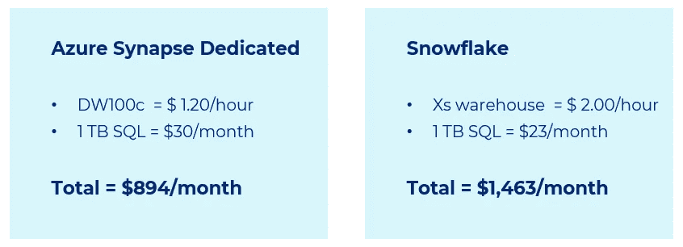

# 雪花 Vs Azure Synapse 分析:云数据仓库之战

> 原文：<https://medium.com/codex/snowflake-vs-azure-synapse-analytics-battle-of-cloud-data-warehouses-576f407189f9?source=collection_archive---------0----------------------->

图像来源—galaktika-soft.com

如今，许多企业都在努力应对数据的巨大增长，我们需要了解为什么传统系统无法应对这种情况。在接下来的五年里，全球数据创建预计将增长到 180 多亿字节。

数据驱动的决策正在改变我们的工作和生活，无论是政府还是教育机构、金融或医疗保健组织，数据都被视为游戏规则的改变者。所以数据是新的石油。我们需要找到它，提取它，提炼它，分配它，并将其货币化。

数据仓库解决方案是这些数据驱动生态系统的另一个重要方面。因此，我们需要构建强大的数据解决方案，能够无限制地进行实际扩展，处理各种数据，如结构化/半结构化/非结构化数据、批量数据或实时流数据，并存储任何数量的数据。很明显，我们传统的数据仓库系统无法处理它。

这就是为什么“雪花”、“Azure Synapse Analytics”和类似的云数据仓库产品如此受欢迎的主要原因之一。在给定的场景中，通常很难决定哪一个更合适。

考虑到这一点，让我们试着从一个公正的角度来分析这两种产品。

# 什么是雪花数据云？

> *雪花于 2012 年开发，是一个完全托管的 SaaS(软件即服务)，为数据仓库、数据湖、数据工程、数据科学、数据应用程序开发以及实时/共享数据的安全共享和消费提供单一平台。雪花具有开箱即用的特性，如存储和计算分离、动态可扩展计算、数据共享、数据克隆和第三方工具支持，以应对不断增长的企业的苛刻需求。来源-snaplogic.com*

# 什么是 Azure Synapse Analytics？

> *Azure Synapse Analytics 是一项无限的分析服务，它将数据集成、企业数据仓库和大数据分析结合在一起。它让您可以自由地使用无服务器或专用选项来大规模查询数据。Azure Synapse 将这些世界与统一的体验结合在一起，以摄取、探索、准备、转换、管理和提供数据，满足即时的 BI 和机器学习需求。来源-azure.microsoft.com*

# 雪花架构

> *雪花的架构是传统共享磁盘和无共享数据库架构的混合体。与共享磁盘架构类似，Snowflake 使用一个中央数据存储库来存储持久数据，可从平台中的所有计算节点进行访问。但与无共享架构类似，雪花使用 MPP(大规模并行处理)计算集群处理查询，集群中的每个节点都在本地存储整个数据集的一部分。这种方法提供了共享磁盘体系结构的数据管理简单性，但具有无共享体系结构的性能和横向扩展优势。来源——snowflake.com*

雪花架构的主要亮点…

*   计算与雪花数据库/存储完全隔离
*   多个计算可以同时访问同一个数据库
*   同一个计算/虚拟仓库可以同时访问多个数据库
*   手动放大/缩小
*   自动放大/缩小，停止恢复

下图描述了雪花计算架构…

图像来源—snowflake.com

# Azure Synapse 架构

> *Synapse SQL 利用横向扩展架构将数据的计算处理分布在多个节点上。计算独立于存储，这使您能够独立于系统中的数据扩展计算。来源——azure.microsoft.com*

Azure Synapse 架构的主要亮点…

*   一个专用的 SQL 池对应一个 SQL 数据库
*   只有在专用 SQL 池运行时，才能访问数据库
*   大规模并行处理
*   工作负载组和分类器用于隔离和区分操作的优先级
*   手动/API 刻度、停止、恢复

下图描述了 Azure Synapse 计算架构…

图像来源—azure.microsoft.com

# 平台架构对比

下图描述了雪花和 Azure Synapse 的平台生态系统比较…

# 雪花的特性

*   零拷贝数据克隆和数据共享
*   与合作伙伴安全轻松地共享数据
*   时间旅行查询(90 天前的历史记录)和较少的管理
*   面向计算/虚拟仓库和数据库组件的强大 Web 界面
*   像 DataGrip 这样的工具可以用来创建一个开发环境
*   雪花在实际的云资源之间有一个抽象层
*   在多个云上运行相同的雪花软件——Azure、AWS 和 GCP
*   在 Snowflake.com 进行管理，租户登录绑定到特定的云。
*   容量根据运行时间和选定的性能水平收费。

下图描述了雪花特有的特性…

图像来源—snowflake.com

# Azure Synapse 的特定功能

*   Azure 资源的集合，如 Azure 数据湖、Azure SQL Server、Azure 数据工厂
*   在 Azure 中制作和维护
*   集成 Web 界面视图
*   阿帕奇火花池
*   在 web 开发环境中使用笔记本准备数据并构建 ML 模型

下图描述了 Azure Synapse 的特定功能…

图像来源—azure.microsoft.com

# 恒定使用量定价对比

最低计算容量和 30 天 24x7 运行 1 TB 数据库的固定使用价格(忽略 ETL、文件存储和数据传输)

下图描述了这种情况…

# 可变使用定价比较

最低计算能力和 1 TB 数据库运行 4 周的可变使用定价(忽略 ETL、文件存储和数据传输)

下图描述了这种情况…

# 雪花限制

*   根据使用情况，雪花可能比竞争对手稍贵。
*   雪花错过了更紧密集成的云生态系统的好处。
*   雪花将通过雪花客户端提交的查询文本的大小限制为每个语句 1 MB。
*   无内部雪花产品

# Azure Synapse 限制

*   异构工作负载—无法将单个计算机器分配给每个组
*   并发会话管理—工作负载隔离
*   没有固定的数据加载时间&数据加载时间有点长
*   暂停和恢复操作需要 3-8 分钟，具体取决于 dwu
*   暂停操作将终止现有连接
*   需要锯机连接，有连接问题
*   使用 Azure 数据共享的数据共享功能
*   数据备份—恢复整个数据库并复制数据
*   Synapse 成本核算—以每小时为基础

# 数据加载时间比较

下图描述了雪花和 Azure Synapse 的数据加载时间比较…

# 对比亮点

下图描述了雪花和 Azure Synapse 的功能级别比较…

# 结论

选择正确的数据仓库解决方案是企业数据策略制定的关键部分。当考虑使用哪个数据仓库时，评估您的用例并理解其数据和集成的重要性是至关重要的。

雪花性能良好，集成了广泛的工具，易于管理，并具有不同的计算能力选项。另一方面，Synapse 性能良好，易于与 Azure 生态系统集成，并为数据处理和数据库类型提供了更多样化的体验。另一个关键因素是分析平台使用模式，Azure synapse 闪耀着恒定使用模式的光芒，而雪花则更适合可变使用模式。雪花还为不同的用户角色提供了选择具有不同计算能力的虚拟仓库的灵活性。

对于只有 Azure 的环境，选择 Synapse 是显而易见的。所有服务原生集成，良好的性能，以及用于数据管道、spark 处理和 Azure ML/AI 的集成 IDE。另一方面，Snowflake 凭借云无关特性、灵活计算、时间旅行、可变使用模式、零拷贝数据克隆、零管理和高性能成为强劲的竞争对手。

一定要让我知道你对雪花和 Azure Synapse 比较的看法…

感谢阅读！！！