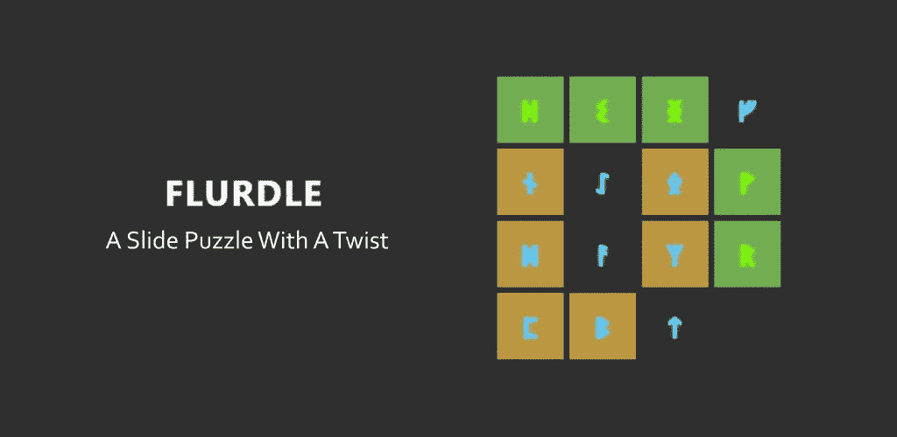

# 所以，我做了一个沃尔多克隆体

> 原文：<https://medium.com/codex/so-i-made-a-wordle-clone-8a86d661c50f?source=collection_archive---------3----------------------->

好的，所以当我说“Wordle 克隆”的时候，你可能会想到一个看起来像 Wordle 的游戏。你有 6 次猜单词的机会，没有提示，字母会变成绿色或黄色，这取决于你是否猜对了单词。

这不是这个。好吧，瓷砖仍然变成绿色和黄色，没有任何提示，但这是相似之处的尽头。我在考虑做一个真正的沃尔多克隆体。但是真正的克隆市场是…