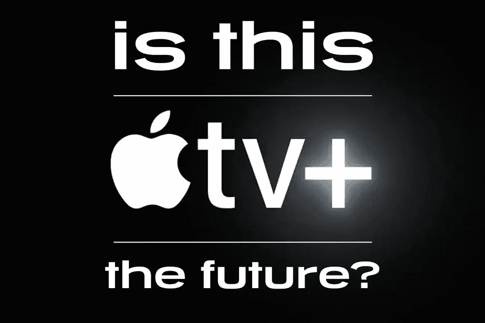
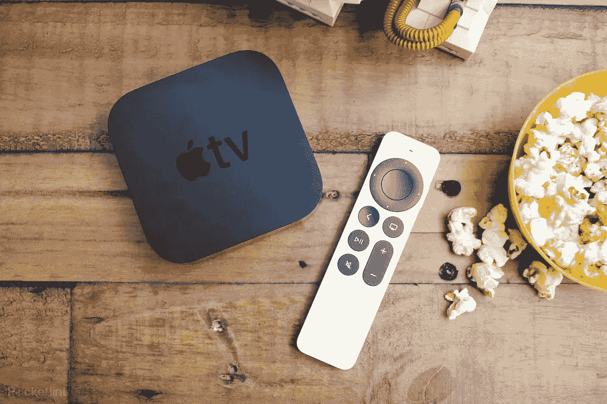
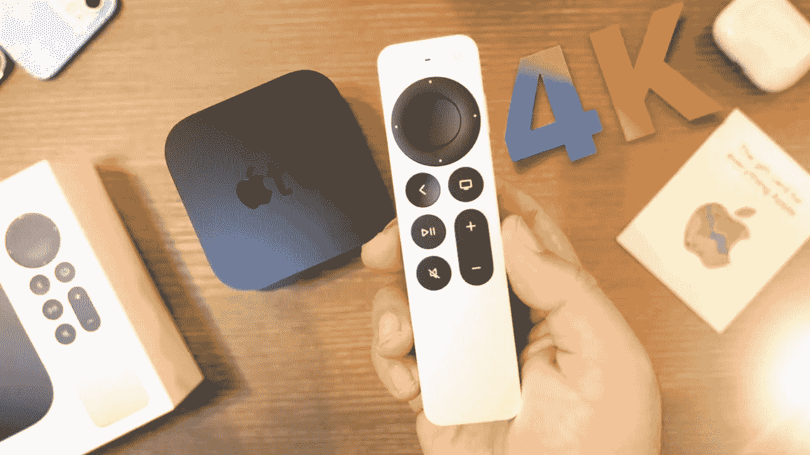
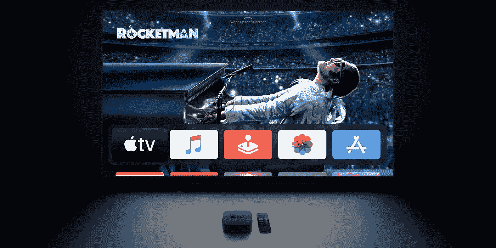
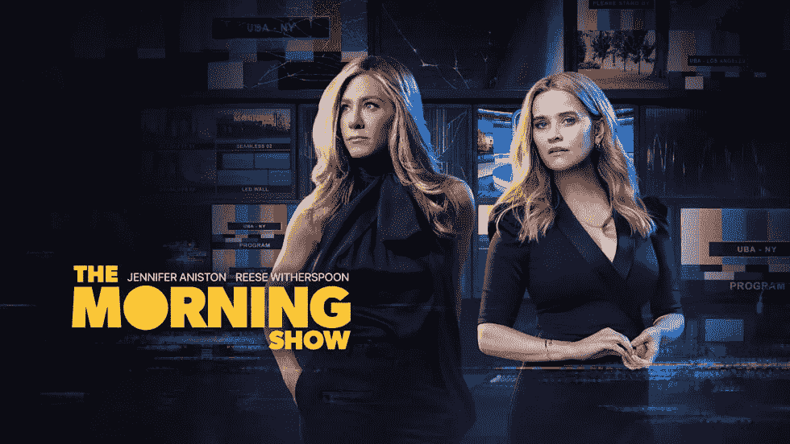

# 所以，我想我终于明白了！

> 原文：<https://medium.com/codex/so-i-think-ive-finally-got-it-616359b03673?source=collection_archive---------13----------------------->

## 这就是苹果电视，也是为什么我会加入进来

我会有变化吗？

如果你订阅了我的[时事通讯](https://www.talkingtechandaudio.com)、观看了我的任何[视频](https://www.youtube.com/c/DavidLewistalkingtechandaudio)，或者甚至在我的“媒体”页面上阅读了一些早期的博客，那么你会知道我非常喜欢苹果电视+和它们的原创。美丽的镜头，梦幻般的场景&剧本和精彩的演员阵容。总的来说，这是一次伟大的经历。找到了它，并越来越多地使用它，它让我看到了我目前的观看订阅，以及事情会如何变化。

减十六播客

## 自满

苹果电视的易用性很有吸引力

提前道歉，因为这个博客很可能会以英国为中心，但希望其中会有你感兴趣的内容。像我这个年龄的许多人一样，我会小心翼翼地避开*…我的观看习惯源于 90 年代的卫星革命。我很早就采用了卫星广播公司 BSKYB(是的，我真的有那么老了！).那时候，这是一场革命，从那时起，我就一直被盲目地拖着。天空是最模糊和复杂的服务。我昨天打电话给他们，想知道我什么时候没有合同，这样我就可以取消和他们的合同。幸运的是，我不在他们的掌握之中，但是出于兴趣，在那个电话里，他们几乎把我每月的费用 ***减半*** 。这是一个*“非常特别的提议，先生”*，*“只有一天”。*如果我今天打电话回来，有可能得到更好的报价吗？和他们在一起 22 年后，他们告诉我，我的提议不像我是一个新成员那样迫切…..这似乎有点奇怪！此外，如果我同意，我将与另一份 18 个月的合同捆绑在一起，随后每年加薪。所以，我还没有签约，至少在我考虑我的选择的时候。*

## 是时候改变一下了吗

苹果电视——全部在 HDR 和 4K

显然，我的观看习惯不会和你的一样，但是我已经花了时间来看我所观看的，以及我有什么选择。我有点喜欢网球。嗯，亚马逊一年中的大部分时间都在照顾我，而我可以通过我的 Prime 订阅免费获得它。斯诺克——是的，我又回到了那个领域，Discovery+应用程序可以帮我解决这个问题。一级方程式赛车和板球是我喜欢用来消磨观看时间的另外两项运动，这也是它变得反常的地方。在英国，我们有一项叫做 NowTV 的服务。没有合同，按月支付，随时取消。他们提供天空电视台给我的准确的报道，为什么？*因为它属于天空！昨晚检查，我可以利用各种免费时段和特别优惠。而且，即使他们停止，所有这些订阅的总和是 ***仍然*** 比我昨天得到的天空、*和*无长期合同的价格便宜。*

因此，假设从 11 月到 3 月没有 f1，我只需暂停订阅该套餐，就可以节省一大笔费用。我唯一放弃的似乎是录制节目的能力，但现在有这么多各种各样的服务，我怀疑这将是一个巨大的损失。

 [## 维修权利成为现实，iOS 16 新闻&更多关于 iPhone 14

### 苹果视图回合-2022 年 4 月 25 日至 4 月 29 日

medium.com](/codex/right-to-repair-gets-real-ios-16-news-more-on-iphone-14-6fee2039d7bc) 

## 用苹果高清观看

我们坠毁了——一部优秀的苹果电视原创作品

我家里有三台智能电视。他们都很体面，但不是疯狂的高端。所有手机都内置了应用程序，包括苹果电视。所以，我懒洋洋地认为，没有必要得到一个苹果 4K 盒。看来我只说对了一部分，原因如下。内置的应用程序不一定能给你通过苹果盒子观看的所有好处。首先是 60fps 播放和超清晰的 4K 分辨率。这种 HDR 的能力会给人更鲜明的色彩，使现场表演更有力度。置身于传说中的苹果生态系统中，我还会有许多其他的好处。集成到 HomePod 迷你，空间音频和杜比全景声，能够在任何时候配对两套 AirPods 是第一个想到的。苹果的原创，如早间秀，慢马，我们崩溃了，通过苹果盒子看会更好看。这个盒子有两个存储选项，32 GB 或 64 GB，如果你存储很多电影的话，但这对我来说并不重要。BBC 的 iPlayer 等所有追赶服务都是内置应用的一部分，现在电视和 YouTube 也是如此。

 [## iPad 真的坏了吗？

### 还是我们只是用错误的方式看待它？

medium.com](/codex/is-the-ipad-really-broken-18968b593073) 

## 是时候改变了？

苹果电视上的一系列内置应用

这很奇怪，但我仍然发现自己坐在围栏上，不太跳，我不知道为什么。我认为，习惯是最大的促成因素。和 Sky 在一起这么久，我已经习惯了界面和在哪里找东西。但毫无疑问，这不是按兵不动的理由，不是吗？Sky 每个月从我账户里拿走的钱实在是太多了。我看到的应用和服务也提供了更大的观看灵活性。我相信我可以在任何时候用一个帐户登录六个设备。想象一下，在我即将上市的配有 120 赫兹微型 LED 面板的 MacBook Pro 16 上，在真实的 HDR 观看一级方程式赛车！然后我以为天空让我上了多房间，但在寒冷的白天，我意识到一旦我在各种电视上登录说，现在电视，我就有效地拥有了它！

 [## 这会是迄今为止最好的 MacBook Air 吗？

### 为什么 M2 MacBook Air 可以改变一切

medium.com](/codex/will-this-be-the-best-macbook-air-yet-eaf621d8dfaf) 

## 结束的

苹果电视的另一个原创——早间秀

那怎么办呢？嗯，我认为循序渐进的方法是最好的。例如，这个周末有一场大奖赛。我想我可能会订购一个 AppleTV 机顶盒和一个月的 NowTV 体育套餐。然后我会积极努力不去伸手去拿遥控器。如果我发现我一点也没有错过，那么我就知道我在正确的轨道上。我必须给 Sky 一个 30 天的通知期，所以在那个月，我会在一个月的基础上试用各种应用程序，看看效果如何。

我认为我很懒惰，对变化很警惕，这种情况需要停止。仅仅因为我对我所拥有的感到满意，因为我支付的钱，这并不意味着它是正确的。

你呢？你换了吗？你是如何通过一个 AppleTV 盒子找到观看体验的？你试过其他服务吗？我希望得到一些反馈…而且可能有点过分了！

**出发前**

你订阅《媒介》了吗？

我只是高端博客网站 Medium 的众多作者之一。这是如此好的价值，你可以在这里加入 https://medium.com/membership

加入我的幕后邮件[列表](https://www.talkingtechandaudio.com)

最初发表于 2022 年 5 月 2 日 https://www.talkingtechandaudio.com/blog。