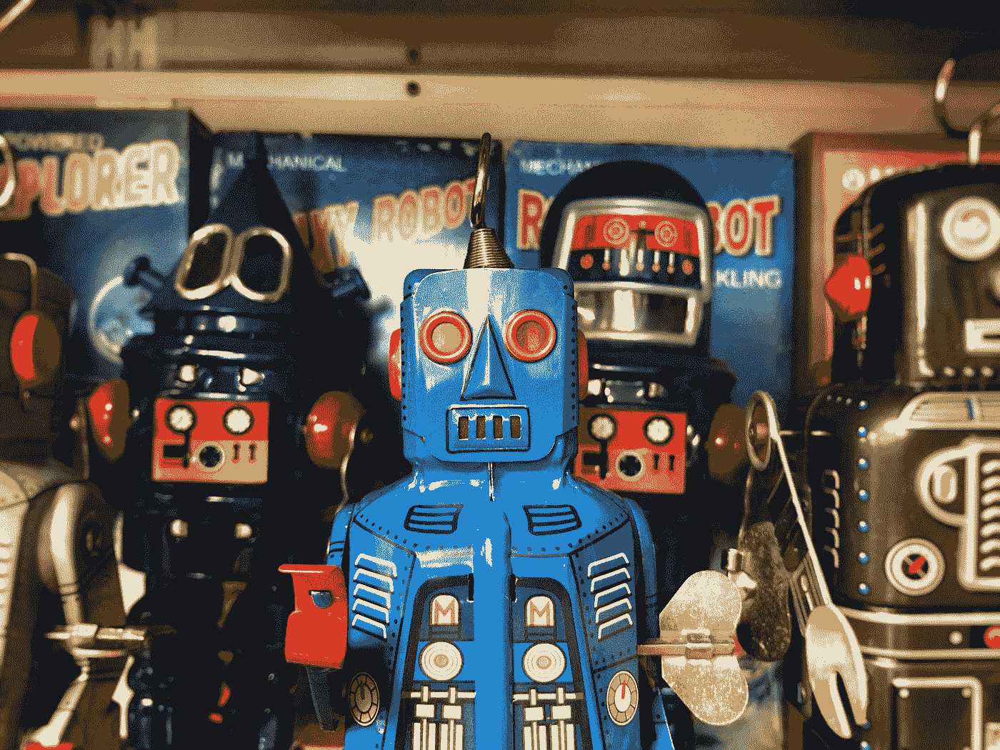

# 那么，如果一个作家真的是一个机器人呢？

> 原文：<https://medium.com/codex/so-what-if-a-writer-really-is-a-bot-26fdc7faeeb2?source=collection_archive---------11----------------------->

## 这是件坏事吗？技术专家对写作中近感觉的看法。

克雷格·赛伯特在 [Unsplash](https://unsplash.com?utm_source=medium&utm_medium=referral) 上的照片

我觉得这很有话题性。有人声称谷歌的人工智能不知何故变得有知觉。这是真是假，还有待观察，但它确实让我思考。一个多月前，[古斯塔夫·德里斯](https://medium.com/u/b9bbb10e03c3?source=post_page-----26fdc7faeeb2--------------------------------)做出了[潜在的有趣发现](/medpage/why-i-blocked-diana-meresc-9c70ae5464f5)——一个…