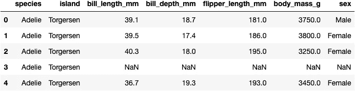
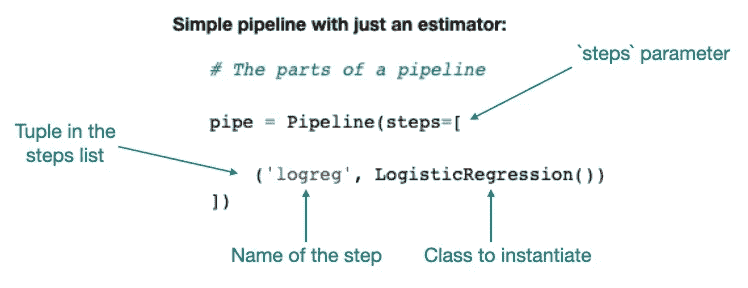
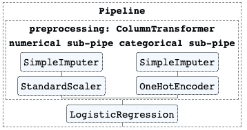

# 所以，你想建一条管道？

> 原文：<https://medium.com/codex/so-you-want-to-build-a-pipeline-b16c69bc7902?source=collection_archive---------4----------------------->


这宝贝能装这么多数据！|[大峡谷 NPS](https://www.flickr.com/photos/50693818@N08) 的【跨峡谷管道(历史)2400】由 2.0 在 [CC 下许可](https://creativecommons.org/licenses/by/2.0/?ref=ccsearch&atype=html)

**看，我只打算说一次:**写代码的首要原则之一就是不要重复自己(干)。这是一条适用于所有语言的通用规则，在处理数据时尤其重要。DRY 是我们为循环而不是复制粘贴而写的原因；这就是为什么我们声明函数而不是复制粘贴；这也是我们使用管道来预处理数据、拟合模型以及交叉验证模型的原因。

代码中的重复不仅仅是混乱和令人困惑——当你重写变量值时，它会导致严重的错误。还记得那次你忘了你已经预处理了`X_train`并且你最终填充了整个数据帧 will `np.nan`，然后花了一个小时试图弄清楚为什么你的模型有土豆的精度吗？开始使用管道，让这种体验成为一个故事，你告诉你的孩子，让他们无聊入睡。


# 管道中的企鹅

在这个小操作指南中，我们将看到一些管道在运行，并学习一些策略来使管道更加方便。我们将使用通过 Seaborn 导入的 [Allison Horst 的企鹅数据集](https://github.com/allisonhorst/palmerpenguins)，建立一个可以预测企鹅种类的模型。列出的每只企鹅的特征有:本岛、喙和鳍的尺寸、体重和性别。数据集中的三种企鹅:阿德利企鹅、巴布亚企鹅和下巴颏企鹅。它们都很可爱，尤其是阿德利。

*注意:我通常会在笔记本的顶部看到一个巨大的代码块，用于导入依赖项，但是我认为这样做更有帮助，因为这样可以更容易地看到所有内容的来源。*

```
import pandas as pd
import numpy as np
import matplotlib.pyplot as plt
import seaborn as sns

# To print some nice tables (https://pypi.org/project/tabulate/)
from tabulate import tabulate

# Load in the penguins
penguins = sns.load_dataset("penguins")
display(penguins.head())
print(penguins.shape)
```



```
(344, 7)
```


让我们假设我们已经做了一些探索性的数据分析(EDA ),以查看每个特性的分布，它们之间的潜在关系，等等。，我们准备做一些建模。像往常一样，我们将使用 [Scikit-learn 的](https://scikit-learn.org/stable/modules/generated/sklearn.model_selection.train_test_split.html) `[test_train_split](https://scikit-learn.org/stable/modules/generated/sklearn.model_selection.train_test_split.html)`从目标类中分离出我们的特性。由于我们试图预测企鹅的种类，这将是我们的目标，`y`。

```
from sklearn.model_selection import train_test_split

# Separate features from target
X = penguins.drop('species', axis=1)
y = penguins['species']

X_train, X_test, y_train, y_test = train_test_split(X, y, test_size=0.20, random_state=42)

# Print out the sizes
shape_table = [['Original', X.shape, y.shape], ['Training', X_train.shape, y_train.shape], 
         ['Testing', X_test.shape, y_test.shape]]
print(tabulate(shape_table, headers=['Dataset', 'X shape', 'y shape']))Dataset    X shape    y shape
---------  ---------  ---------
Original   (344, 6)   (344,)
Training   (275, 6)   (275,)
Testing    (69, 6)    (69,)
```

在我们走得太远之前，我们最好看一下缺失值的计数。

```
penguins.isna().sum()species               0
island                0
bill_length_mm        2
bill_depth_mm         2
flipper_length_mm     2
body_mass_g           2
sex                  11
dtype: int64
```

嗯……不太多，但是在我们尝试适合一个模型之前，我们仍然必须对它们做一些事情。由于我们一开始没有那么多数据，并且因为本教程依赖于这些数据，所以让我们填充它们而不是删除它们。

因此，我们需要采取的下一步措施是:

1.  用以下内容填充缺失值:

*   数字特征含义
*   分类特征的模式

2.缩放数字数据

3.对分类数据进行一次性编码

4.拟合模型(我们将只使用简单的逻辑回归)

5.评估模型

我们将使用管道来完成。


# 但是我现在的做事方式有什么问题吗？

在管道出现之前，我的工作流程可能是这样的:

```
from sklearn.linear_model import LogisticRegression
from sklearn.preprocessing import StandardScaler, OneHotEncoder
from sklearn.impute import SimpleImputer
from sklearn.model_selection import cross_val_score

# I want to fill in missing values, 
# but some of my columns are categorical and some are numerical
num_imputer = SimpleImputer(strategy='median')
cat_imputer = SimpleImputer(strategy='most_frequent')

# Apply each imputer to the correct columns by selecting datatypes
X_train_num_imputed = num_imputer.fit_transform(X_train.select_dtypes(include=['int64', 'float64']))
X_train_cat_imputed = cat_imputer.fit_transform(X_train.select_dtypes(include='object'))

# Might as well scale the numerical stuff...
ss = StandardScaler()
X_train_num_imputed_scaled = ss.fit_transform(X_train_num_imputed)

# ...and one-hot-encode the categorical stuff
ohe = OneHotEncoder(handle_unknown='ignore', sparse=False)
X_train_cat_imputed_ohe = ohe.fit_transform(X_train_cat_imputed)

# Now I gotta put 'em back together
X_train_preprocessed = np.concatenate([X_train_num_imputed_scaled, X_train_cat_imputed_ohe], axis=1)

# And finally fit and evaluate the model
logreg = LogisticRegression(random_state=42)
logreg.fit(X_train_preprocessed, y_train)
initial_score = logreg.score(X_train_preprocessed, y_train)
initial_crossval_score = cross_val_score(logreg, X_train_preprocessed, y_train).mean()

# Print out scores
scores_table = [['Original', initial_score, initial_crossval_score]]
scores_headers = ['Dataset', 'Training score', 'Cross-val score']
print(tabulate(scores_table, headers=scores_headers))Dataset      Training score    Cross-val score
---------  ----------------  -----------------
Original           0.996364           0.992727
```

***真乱！***

如果你跳过了那段代码，我不能责怪你。就是重复，组织不好。我对数据集进行了六次拆分和重命名，然后又将它们重新组合在一起。我第一次尝试运行它时，我不得不调试多个错误，其中大部分是因为我为每个新版本的`X_train`写了不同的名字而导致的简单的打字错误。如果以后我想更改或添加任何东西，我将不得不搜索我的代码并重命名一堆东西。最糟糕的是，为了对我的模型做最后的评估，我不得不对`X_test`重复整个*过程。*


一定有更好的办法！

# 管道:更好的方式

使用管道将使代码更简单、更清晰、更少重复。当使用机器学习模型时，管道可以更容易地预处理数据，并使模型适合训练和测试集。管道还可以防止数据泄漏，尤其是在通过交叉验证评估模型时。

正如函数存储你可以反复运行的进程一样， [sklearn 的 Pipeline 类](https://scikit-learn.org/stable/modules/generated/sklearn.pipeline.Pipeline.html)存储其他类的实例以在你的数据集上运行。一些类是转换器，而另一些类是估计器。变形金刚大战霸天虎——等等，不对。

*   **转换程序**处理或修改你的数据:`[StandardScaler](https://scikit-learn.org/stable/modules/generated/sklearn.preprocessing.StandardScaler.html)`和`[OneHotEncoder](https://scikit-learn.org/stable/modules/generated/sklearn.preprocessing.OneHotEncoder.html)`都可以在转换程序中使用。
*   **估计器**将模型拟合到您的数据:`[LogisticRegression](https://scikit-learn.org/stable/modules/generated/sklearn.linear_model.LogisticRegression.html)`和`[KNeighborsClassifier](https://scikit-learn.org/stable/modules/generated/sklearn.neighbors.KNeighborsClassifier.html)`都是 sklearn 估计器。

pipelines 如此神奇的部分原因是它们对 sklearn 一致的 API 的直观使用。任何你可以用转换器或估算器来做的事情，你都可以用管道来做。这意味着您可以在管道上使用像`.fit()`、`.transform()`或`.predict()`这样的方法，就像您可以在每个单独的部分上使用一样。您还可以在交叉验证中使用管道来评估模型的性能。

# 你如何建立一个管道？

当您实例化 sklearn 的 Pipeline 类时，您需要定义的主要参数是`steps`，它接受您希望包含在管道中的转换器和估计器的列表。每一步都以一个[元组](https://www.w3schools.com/python/python_tuples.asp)的形式编写。元组中的第一项是变换器/估计器的名称，第二项是变换器/估计器本身。

一个典型的流水线可能包含多个变压器和一个最终估计器，但是你不一定需要在每个流水线中有多个元件。事实上，最简单的管道只包含一样东西:



实际上，管道通常至少有两个步骤。最终，我们将建立一个由其他管道组成的管道！

要构建管道，您需要知道处理数据和拟合模型的步骤。这很难完全提前知道，所以有时从一些混乱的代码开始，然后重构它会更容易。另一个策略是在组装之前先建造较小的管道。

## 按编号排列管道

让我们从数据集中的数字列的管道开始。我们将使用每列的平均值来估算空值，然后在用`LogisticRegression()`估算器拟合之前缩放数据。

```
from sklearn.pipeline import Pipeline

# Pipeline for numerical data only
num_pipe = Pipeline(steps=[
    ('num_imputer', SimpleImputer(strategy='mean')),
    ('ss', StandardScaler()),
    ('logreg', LogisticRegression(random_state=42))
])

# Select only the numerical columns and drop all nulls
X_train_numerical = X_train.select_dtypes(include='float64')

# Fit and score the pipeline
num_pipe.fit(X_train_numerical, y_train)
num_score = num_pipe.score(X_train_numerical, y_train)
num_crossval_score = cross_val_score(num_pipe, X_train_numerical, y_train).mean()

# Compare scores
scores_table.append(['Numerical', num_score, num_crossval_score]) 
print(tabulate(scores_table, headers=scores_headers))Dataset      Training score    Cross-val score
---------  ----------------  -----------------
Original           0.996364           0.992727
Numerical          0.989091           0.985455
```

我们的分数下降是有道理的-请记住，原始分数包括原始数据集中的所有要素，而数字分数仅包括数字要素。

比较使用和不使用管线来完成数据处理和模型拟合的语法:

没有管道:

```
imputer = SimpleImputer()
ss = StandardScaler()
logreg = LogisticRegression()

X_train_imp = imputer.fit_transform(X_train)
X_train_scl = ss.fit_transform(X_train_imp)
logreg.fit(X_train_scl)
```

使用管道:

```
pipe = Pipeline(steps=[
    ('num_imputer', SimpleImputer()),
    ('ss', StandardScaler()),
    ('logreg', LogisticRegression())
])

pipe.fit(X_train)
```

看看使用管道如何减少代码总量，并完全消除为每个步骤创建新的、重命名版本的`X_train`的需要。更简单，更少出错的风险，而且非常干！

## 绝对的是

我们可以在分类栏中添加吗？你打赌！为此，我们将引入另一个名为`[ColumnTransformer](https://scikit-learn.org/stable/modules/generated/sklearn.compose.ColumnTransformer.html)`的类。ColumnTransformer 在这种情况下非常有用，因为它允许我们对不同的列执行不同的操作，一次完成。

为了使用 ColumnTransformer，我们将稍微重构一下代码，并创建两个子管道:一个用于数值数据，一个用于分类数据。

```
# Sub-pipeline for the numerical columns
num_transformer = Pipeline(steps=[
                           ('num_imputer', SimpleImputer(strategy='mean')),
                           ('ss', StandardScaler())])

# Sub-pipeline for the categorical columns
cat_transformer = Pipeline(steps=[
                           ('cat_imputer', SimpleImputer(strategy='most_frequent')),
                           ('ohe', OneHotEncoder(handle_unknown='ignore'))])
```

请注意，这些管道都没有以我们的 LogisticRegression 估计器结束！我们将把它留到最后的流水线上。相反，我们将使用 ColumnTransformer 将这两个子管道连接在一起，column transformer 接受您希望包含在管道中的转换器的列表。每个转换器都以三元组的形式编写，包含以下各项:

1.  变压器的名称(a `string`
2.  转换器或子管道的类或实例
3.  要应用转换器的列

我们可以通过给出一个列表来指定列，比如`['bill_length_mm', 'bill_depth_mm']`，但是使用`[make_columns_selector](https://scikit-learn.org/stable/modules/generated/sklearn.compose.make_column_selector.html)`更容易，因为我们是通过数据类型而不是名称来选择列的。

```
from sklearn.compose import ColumnTransformer, make_column_selector

preprocessing = ColumnTransformer(
    transformers=[
        ('numerical sub-pipe', num_transformer, make_column_selector(dtype_include=['float64'])),
        ('categorical sub-pipe', cat_transformer, make_column_selector(dtype_include=['object']))
    ])
```

# 把所有的放在一起

现在，我们可以制作一个完整的管道，预处理我们所有的特性，并以我们的估计器结束。注意，现在在`'preprocessing'`步骤中，我们传入包含两个子管道的 ColumnTransformer，然后让 LogisticRegression 在我们整个完全处理过的数据集上施展魔法。

```
# A complete pipeline 
complete_pipe = Pipeline(steps=[
    ('preprocessing', preprocessing),
    ('logreg', LogisticRegression(random_state=42))
])
```

现在，完整的管道由一个 ColumnTransformer 和一个 LogisticRegression 分类器组成。在 ColumnTransformer 中有两个子管道，分别对应于数据集中的一种数据类型。每个子管道由一个简单的估算器和另一个步骤组成:一个用于数字数据的标准缩放器和一个用于分类数据的 OneHotEncoder。

如果还有很多碎片要拼的话，不用担心。只看一个画面可能更容易些:

```
# This will allow us to see a nice diagram of our pipelinefrom sklearn import set_config
set_config(display='diagram')

complete_pipe
```



注意:如果您自己在 Jupyter 笔记本上运行这段代码，看看当您单击图中的每个组件时会发生什么！

现在，当我们想要对管道进行调整和评分时，我们不必选择管道外部的列或数据类型——这一切都发生在管道内部！我们现在可以直接传入 X_train，而不必手动转换或干预它。

```
# Fit and score the pipeline
complete_pipe.fit(X_train, y_train)
complete_score = complete_pipe.score(X_train, y_train)
complete_crossval_score = cross_val_score(complete_pipe, X_train, y_train).mean()

# Compare scores
scores_table.append(['Complete', complete_score, complete_crossval_score]) 
print(tabulate(scores_table, headers=scores_headers))Dataset      Training score    Cross-val score
---------  ----------------  -----------------
Original           0.996364           0.992727
Numerical          0.989091           0.985455
Complete           0.996364           0.996364
```

正如预期的那样，我们的完整训练分数与原始分数相同，因为我们再次使用了我们所有的功能。但是请注意，cross-val 分数是不同的！(提示:与原模型构建过程中数据意外泄露有关！但是我们将把它留到另一篇文章中……)


# 不重复我自己…

…但是让我们再来看一下这两种方法，看看完整的管道，并欣赏管道的力量，使我们的代码更简单、更干净，就像关于管道的文章一样枯燥。

## 无管道:

```
*If you skipped over this code block before, this time try to identify each part that we included in our complete pipeline.*num_imputer = SimpleImputer(strategy='median')
cat_imputer = SimpleImputer(strategy='most_frequent')

X_train_num_imputed = num_imputer.fit_transform(X_train.select_dtypes(include=['int64', 'float64']))
X_train_cat_imputed = cat_imputer.fit_transform(X_train.select_dtypes(include='object'))

ss = StandardScaler()
X_train_num_imputed_scaled = ss.fit_transform(X_train_num_imputed)

ohe = OneHotEncoder(handle_unknown='ignore', sparse=False)
X_train_cat_imputed_ohe = ohe.fit_transform(X_train_cat_imputed)

X_train_preprocessed = np.concatenate([X_train_num_imputed_scaled, X_train_cat_imputed_ohe], axis=1)

logreg = LogisticRegression(random_state=42)
logreg.fit(X_train_preprocessed, y_train)
initial_score = logreg.score(X_train_preprocessed, y_train)
initial_crossval_score = cross_val_score(logreg, X_train_preprocessed, y_train).mean()

scores_table = [['Original', initial_score, initial_crossval_score]]
scores_headers = ['Dataset', 'Training score', 'Cross-val score']
print(tabulate(scores_table, headers=scores_headers))Dataset      Training score    Cross-val score
---------  ----------------  -----------------
Original           0.996364           0.992727
```

没有管道，我们必须:

*   手动执行每个步骤
*   跟踪`X_train`的各种版本和拆分
*   最后把它们重新组合在一起。

这很复杂，重复，而且很有可能因为打字错误或步骤顺序错误而出错。更不用说还有数据泄露(提示:和 StandardScaler 有关！).最糟糕的是，为了在我们的维持集上评估我们的模型，我们必须用 X_test 的全新版本和拆分集重复整个过程，还要记住将每个`.fit_transform()`改为`.transform()`，并完全删除`logreg.fit()`。这是无休止的调试和无效结果的秘诀。不用了，谢谢！

## 对于管道:

```
*Here's our pipeline, all in one go.*num_transformer = Pipeline(steps=[
                           ('num_imputer', SimpleImputer(strategy='mean')),
                           ('ss', StandardScaler())])

cat_transformer = Pipeline(steps=[
                           ('cat_imputer', SimpleImputer(strategy='most_frequent')),
                           ('ohe', OneHotEncoder(handle_unknown='ignore'))])

preprocessing = ColumnTransformer(
    transformers=[
        ('numerical sub-pipe', num_transformer, make_column_selector(dtype_include=['float64'])),
        ('categorical sub-pipe', cat_transformer, make_column_selector(dtype_include=['object']))
    ])

complete_pipe = Pipeline(steps=[
    ('preprocessing', preprocessing),
    ('logreg', LogisticRegression(random_state=42))
])

complete_pipe.fit(X_train, y_train)
complete_score = complete_pipe.score(X_train, y_train)
complete_crossval_score = cross_val_score(complete_pipe, X_train, y_train).mean()

scores_table.append(['Complete', complete_score, complete_crossval_score]) 
print(tabulate(scores_table, headers=scores_headers))Dataset      Training score    Cross-val score
---------  ----------------  -----------------
Original           0.996364           0.992727
Complete           0.996364           0.996364
```

有了管道，我们的代码更干净，每一步都清楚地拼写出来。对整个管道的任何部分进行更改或添加都很容易，不需要一连串的重命名。此外，为了在我们的维持集上评估我们的模型，我们要做的就是:

```
final_score = complete_pipe.score(X_test, y_test)
print('Final score on holdout set: ', final_score)Final score on holdout set:  0.9855072463768116
```


## 但是等等，还有呢！

如果你想升级你的管道，看看下面这些方法:

*   使用 [FunctionTransformer](https://scikit-learn.org/stable/modules/generated/sklearn.preprocessing.FunctionTransformer.html) 添加您自己的自定义函数！
*   [FeatureUnion](https://scikit-learn.org/stable/modules/generated/sklearn.pipeline.FeatureUnion.html) 用于并联组合变压器！
*   在管道上执行[网格搜索](https://scikit-learn.org/stable/modules/generated/sklearn.model_selection.GridSearchCV.html)！

我希望这有助于您过渡到使用管道！学习管道让我对机器学习的理解更加清晰，也让我的代码得到了很多改进。我仍然是数据科学的新手，所以请在评论中留下建议或(特别是)更正！

快乐造型！

*在:*[*https://github.com/jmarkowi/build_a_pipeline*](https://github.com/jmarkowi/build_a_pipeline)查看我的代码并亲自尝试

[](https://github.com/jmarkowi/build_a_pipeline) [## GitHub-jmarkowi/build _ a _ pipeline:关于如何用…

### 下面是一个关于如何用 sklearn 的 API 构建机器学习管道的简短教程。我使用 Pipeline()类，因为…

github.com](https://github.com/jmarkowi/build_a_pipeline)