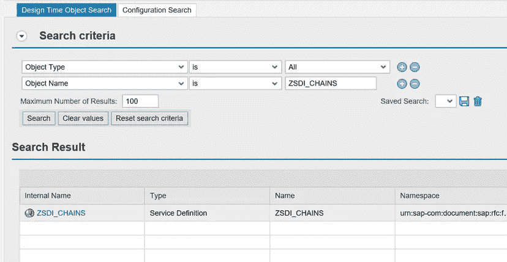
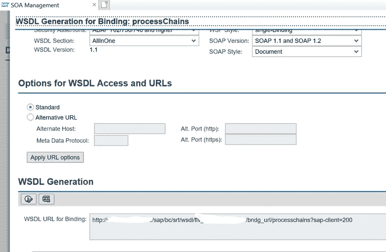

# 来自 ABAP FM 的 SOAP 网络服务

> 原文：<https://medium.com/codex/soap-webservice-from-abap-fm-d53bc43b5b8d?source=collection_archive---------0----------------------->

SAP ABAP 是由德国软件公司 SAP SE 创建的高级编程语言。ABAP 广泛用于基于 SAP NetWeaver 应用服务器的各种系统的编程，包括 SAP Business Warehouse (BW)。SAP BW 是面向企业数据仓库(DWH)的软件，是欧洲最受欢迎的解决方案之一。

SAP Business Warehouse 徽标

SAP BW 支持的很大一部分日常工作时间通常用于规划、启动和分析流程链。过程链用于组织数据操作过程，如提取、转换和加载(ETL)。持续监控流程链的执行非常重要，因为许多业务决策都依赖于来自数据仓库的报告。

在本文中，我将描述基于运行在 SAP BW 实例内部的 ABAP 功能模块(FM)的 SOAP web 服务的创建和部署过程。下一次，我将展示如何从您的 SOAP web 服务消费信息，并在前端显示它。您可以使用这种方法从任何地方监控流程链的执行。通过主动监控 BW 系统中 ETL 过程的故障，可以帮助防止错误的管理决策和不正确的数据分析。

首先，您应该创建 FM，它将作为 SOAP web 服务的后端。可以从 Eclipse(带有 ADT 插件)或使用 T 代码 SE80 通过 SAP 登录来创建 FM。我们将使用新表中的重要流程链。让我们用名称 **ZBW_CHAIN** 创建它，并用进程链 **ZCHAIN_TEST** 向它插入一个新行。(出于我自己将来的需要，我添加了第二列 REF_CHAIN，这是我们在本文中不需要的。)

ZBW_CHAIN 表中的重要流程链

我们希望监控最后一个流程链运行的状态、日期和时间。该信息可以从 SAP BW 系统表**rsclogchain**中收集。您可以使用 SQL INNER JOIN 从该表中选择日志数据，该表仅由存储在 **ZBW_CHAIN** 中的重要流程链过滤。FM 将从网络中接收两个允许的命令之一( **/start** 或 **/status** )，并返回一条包含每个命令执行信息的消息。这是 FM 的 ABAP 代码示例(请不要忘记在首选项中将您的新 FM 类型更改为启用 RFC):

您可以使用 T 代码 **SE37** 在您的 BW 系统中测试新的 FM。如果它工作没有任何错误，那么可能你做了上述所有正确的。

其次，您应该通过标准的 SAP NetWeaver 功能创建一个 web 服务。在 **SE37** 中，进入菜单 Utilities，从功能模块中选择 More Utilities->Create Web Service->:

用于创建 web 服务的菜单项

为新的 web 服务选择任意名称，即 **ZSDI_CHAINS** ，并输入最近创建的功能模块的名称( **ZSDI_GETSTATUS_RFC** ):

为功能模块创建 web 服务

现在是为您的全新 web 服务选择端点的时候了。如果没有端点，就无法从网络访问 web 服务。使用 T-Code **SOAMANAGER** ，选择 Web 服务配置:

t 代码 SOAMANAGER 视图

在打开的窗口中按名称查找您的 web 服务，并在搜索结果列表中单击其名称:

按名称搜索服务

在“配置”选项卡上，按“创建服务”按钮，并按照说明进行操作。您将被要求输入新端点的授权类型，我选择了通过用户和密码进行基本授权(您必须在 SAP BW 系统中拥有一个对 RFC 调用具有有效权限的帐户，才能使用此选项):

创建新端点

在创建了一个新的端点(在我的例子中它被命名为 **processChains** )之后，您应该会看到类似这样的内容:

web 服务的端点列表

现在，您的 SOAP 服务已经联机，可以接受来自网络的请求。为了测试它，你可以使用像 SoapUI 这样的软件。要在 SoapUI 中添加一个新的 SOAP-service 项目，您需要获得一个 WSDL 文件。先前图像中的圆圈图标将带您到服务描述，在那里可以找到 WSDL 文件的链接。从“WSDL 绑定的 URL”复制它。如果它是空的，使用位于那里的按钮生成一个新的:

web 服务的 WSDL 生成

现在使用 SoapUI 中的 SOAP 按钮创建一个新项目。将 WSDL 文件的链接粘贴到初始的 WSDL 字段，然后按确定:

WSDL 文件提供了 SOAP-service 拥有的所有方法的信息，并帮助识别它们的所有输入和输出参数。您可以在左边看到您之前在 SAP 系统中创建的 **processChain** 方法。在请求 1 (1)上单击两次，并在该窗口底部的授权选项卡(2)上添加具有基本授权类型(3)的用户/密码:

现在尝试通过按绿色按钮(或按键盘上的 Alt+Enter)来调用 web 服务。你会看到 ABAP 调频的回答。尝试请求中的 **< I_COMMAND >** 和 **< /I_COMMAND >** 标签之间允许的命令之一( **/start** 或 **/status** )。

基于 ABAP FM 的 Web 服务现已上线，并从 SAP BW 系统内部提供有关流程链执行的信息！

SoapUI 中的 SOAP 请求和响应