# SOC139 — Meterpreter 或帝国活动事件 ID-68

> 原文：<https://medium.com/codex/soc139-meterpreter-or-empire-activity-eventid-68-165790463d03?source=collection_archive---------18----------------------->

这是我在 letsdefend.io 平台上对 alert SOC139 的调查。如果你想了解更多关于平台如何工作的信息，请访问 letsdefend.io，如果你不熟悉教程的内容，你可以在那里找到教程。

我用自己的名字记下了这个提醒，并开始检查它所显示的细节:

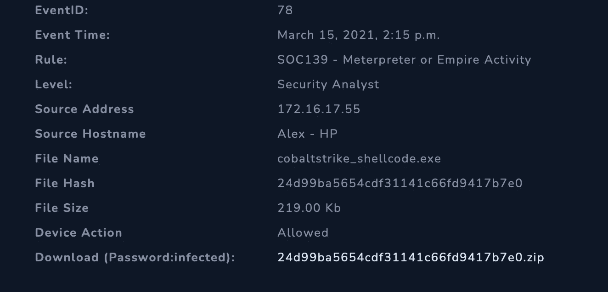

检查警报时，我看到了 metasploit 的一部分 meterpreter，它作为攻击负载提供反向外壳。

我们还看到相关文件与钴罢工有关。快速谷歌搜索显示“木马。CobaltStrike 是一款付费渗透测试产品，允许攻击者在受害机器上部署名为‘Beacon’的代理。”

我开始行动手册，并被要求定义威胁指标:

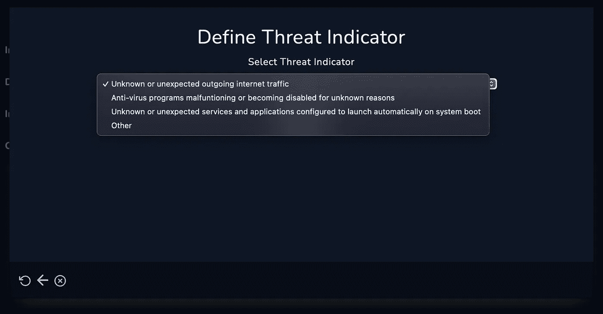

我从日志部分开始调查。当我检查日志时，我可以看到警报发生时与外部 IP 地址的连接。原始日志选项没有显示任何相关信息

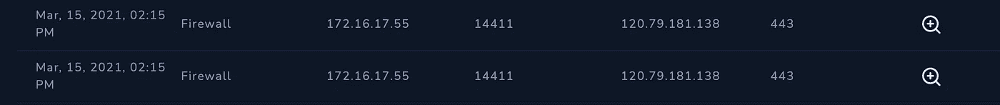

我还访问了端点安全，并在网络连接中看到了这一信息:

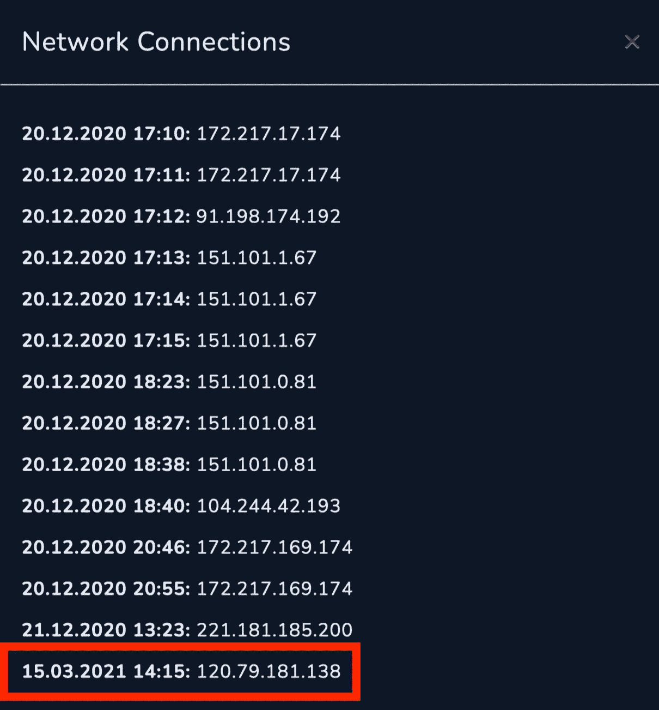

我在行动手册中选择了未知或意外的流量。

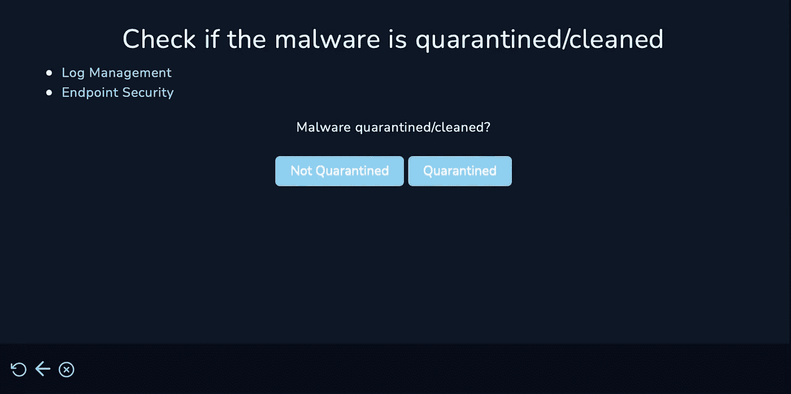

然后，行动手册询问是否隔离了恶意软件，我选择了“否”,因为我在检查终端安全性时没有看到它被隔离。然后我被要求分析恶意软件:

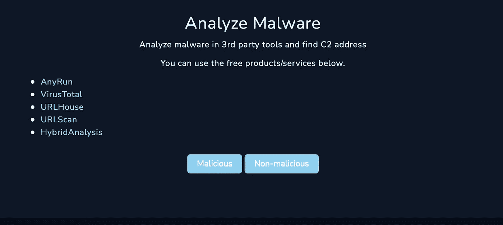

我继续在 anyrun 上运行公开的报告来查找文件哈希，大多数报告都将其标记为 cobalt.strike shell

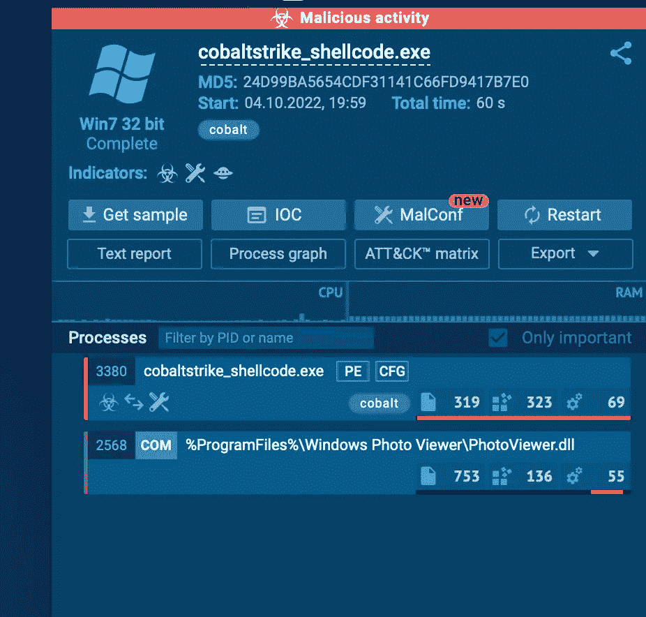

此外，我添加了之前在混合分析中找到的外部 IP 地址 120.79.181.138:

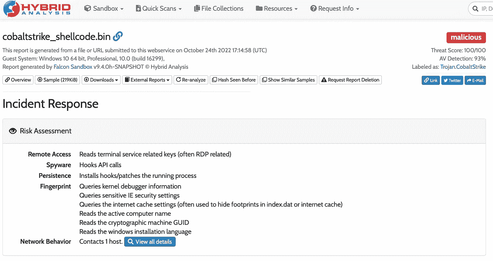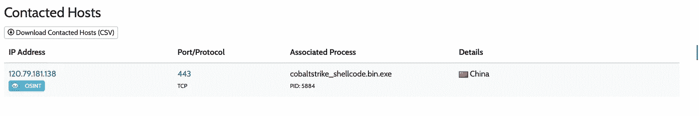

混合分析提供了这个 IP 地址的完整报告。包括被联系的行为和 C2 地址。我可以看到这个 IP 与日志和网络连接中的 IP 相匹配。我在战术手册上选择了这是恶意的，并继续使用战术手册。

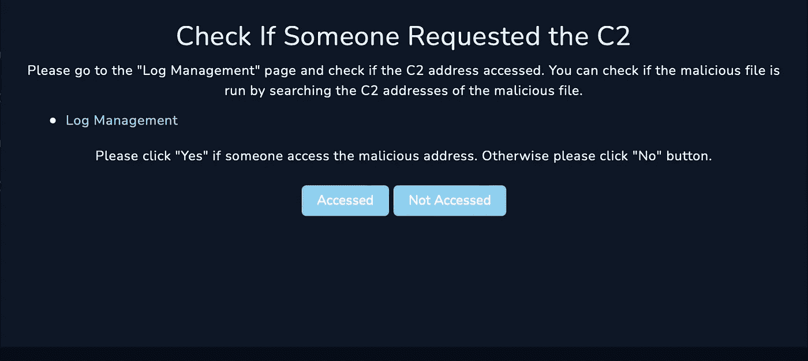

因为我在上面确认了本地机器正在与外部 C2 地址通信，所以我在行动手册中将它标记为已访问。

然后，我继续按照剧本的指示控制机器。

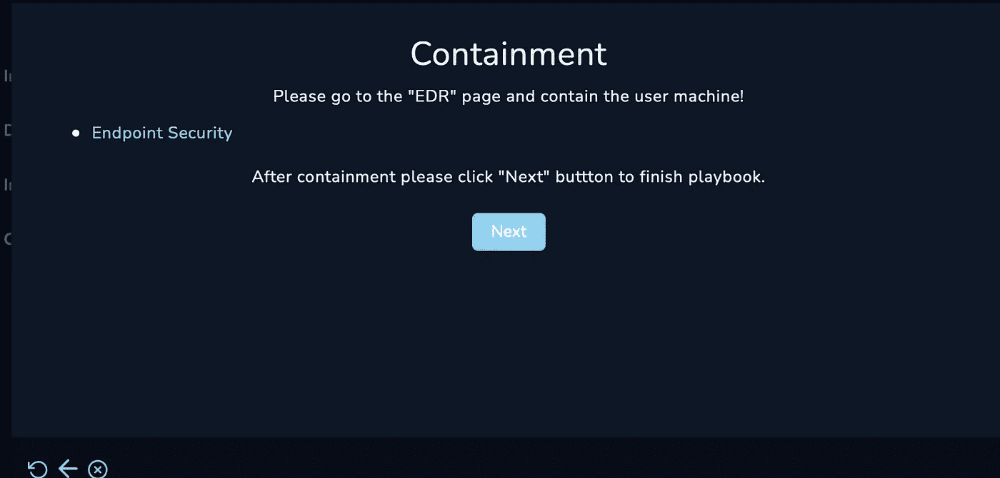

我将恶意文件和恶意 C2 IP 地址的散列添加到 IOCs 中

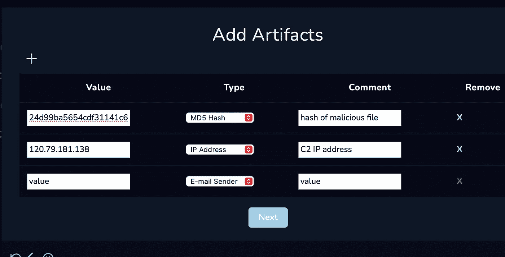

我关闭了警报作为一个真正的积极，并得到了调查的满分

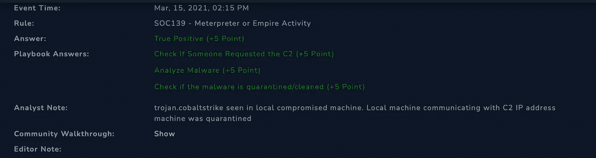