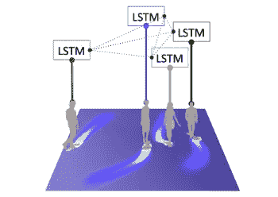
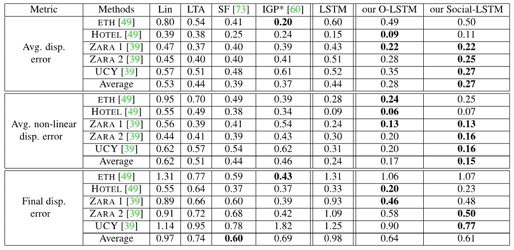
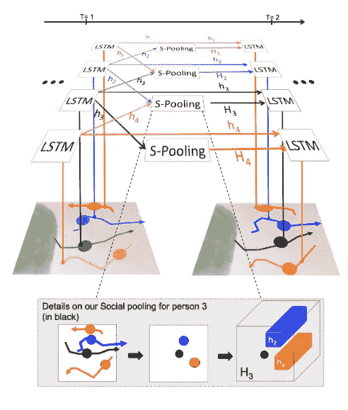
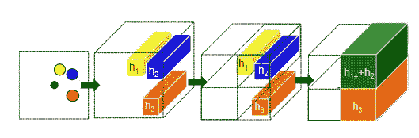
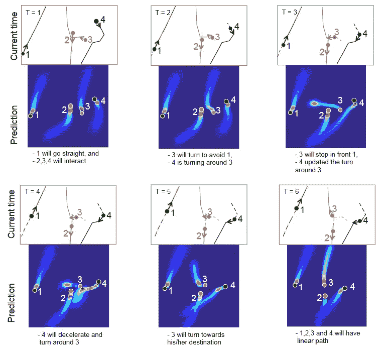
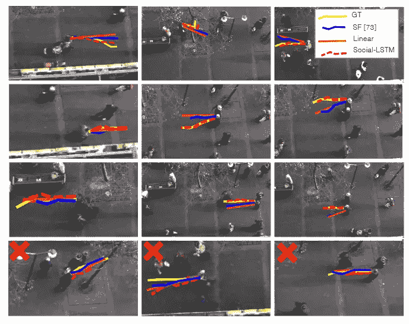

# 社会 LSTM:一个深度学习模型，预测你的路径轨迹的未来！

> 原文：<https://medium.com/codex/social-lstm-a-deep-learning-model-that-predicts-the-future-of-your-path-trajectory-d0da56236348?source=collection_archive---------3----------------------->

**注**:本博客试图解释描述深度学习模型 Social-LSTM 的研究论文。论文可以在[这里](https://cvgl.stanford.edu/papers/CVPR16_Social_LSTM.pdf)找到。

# 为什么是社交 LSTM

社会 LSTM 是一个预测行人未来轨迹的模型(我们可以为其他类型的物体轨迹定制)*给定*他们过去轨迹的数据。

与其他最先进的轨迹预测模型相比，社交 LSTM 的性能。更多细节在“结果”部分

早期的大部分作品都受到以下两个假设的限制。

I)他们使用手工制作的函数来模拟特定设置的“交互”，而不是以数据驱动的方式来推断它们。这导致有利于捕捉简单相互作用(例如排斥/吸引)的模型，并且可能无法概括更复杂的拥挤设置。

ii)它们专注于对彼此靠近的人之间的交互进行建模(以避免直接碰撞)。然而，他们没有预料到在更遥远的未来可能发生的相互作用。

这就是社交 LSTM 填补空白的地方。

# 怎么

这个模型通过一个新颖的体系结构来解决这个问题，该体系结构连接对应于附近序列的 LSTMs。特别是，它引入了一个“社交”池层，允许空间邻近序列的 LSTMs 彼此共享它们的隐藏状态。这种架构可以自动学习在时间上一致的轨迹之间发生的典型交互。该模型利用现有的人类轨迹数据集，无需任何额外的注释来学习人类在社交空间中观察到的常识性规则和约定

# 什么

模型假设每个场景(来自俯视静态相机的帧序列)首先被预处理以获得所有人在不同时刻的空间坐标。在任何时刻，场景中的 iₜₕ人都由他/她的 xy-coordinates(xᶦₜ,yᶦₜ).代表我们观察从时间 1 到 Tₒ₆ₛ(input 序列的所有人的位置，并预测他们在 Tₒ₆ₛ + 1 到 Tₚᵣₑₔ(future 预测序列的时刻的位置。

**图 2** :社交 LSTM 模型概述。场景中的每个轨迹都有一个单独的 LSTM 网络。然后，LSTMs 通过社交池(S-pooling)层相互连接。与传统的 LSTM 不同，该池层允许空间上邻近的 lstm 彼此共享信息。'hₓ'代表人“x”的 LSTM 的隐藏状态。最下面一行显示了场景中一个人的 S-pooling。某一半径内所有 LSTMs 的隐藏状态被汇集在一起，并在下一时间步用作输入。

LSTM 权重在所有序列中共享。

## 隐藏状态的社会汇集

个体通过隐含地推理周围人的运动来调整他们的路径。这些邻居反过来会受到周围其他人的影响，并随着时间的推移改变他们的行为。该模型期望 LSTM 的隐藏状态捕捉这些随时间变化的运动特性。为了跨多人联合推理，该模型引入了“社交”池层，如图 2 所示。在每个时间步，LSTM 单元从邻居的 LSTM 单元接收汇集的隐藏状态信息。

**图 3** :图中用黑点表示该人的社会统筹。模型在一定的空间距离内汇集邻居的隐藏状态(显示为黄色、蓝色和橙色，由“h”值表示)。如最后两步所示，池部分保留了相邻要素的空间信息。

在时间‘t’的隐藏状态用于预测轨迹位置的分布(在下一个时间步‘t+1’的 x',y')ᶦₜ₊₁)。

# 结果

在测试期间，作者使用经过训练的社会 LSTM(及其修改)模型来预测未来的 position(x'ᶦₜ,y'ᶦₜ)ofiₜₕ人。从时间 Tₒ₆ₛ₊₁到 Tₚᵣₑₔ，他们用预测的 position(x'ᶦₜ,y'ᶦₜ)from——先前的社会 LSTM 细胞代替真实的 coordinates(xᶦₜ,yᶦₜ).

## 比较的型号

*   线性模型(**林**):作者使用现成的卡尔曼滤波器，在线性加速度的假设下外推轨迹。
*   碰撞避免( **LTA** ):作者报告了简化版[社会力模型](http://tamaraberg.com/papers/socialprediction_cvpr11.pdf)的结果，该模型仅使用碰撞避免能量，通常称为线性轨迹避免。
*   社会力量( [**SF**](http://tamaraberg.com/papers/socialprediction_cvpr11.pdf) ):作者使用了社会力量模型的实现，其中对群体亲和力和预测目的地等几个因素进行了建模。
*   迭代高斯过程( [**IGP**](https://www.cds.caltech.edu/~murray/preprints/tmmk13-icra_s.pdf) ):作者使用了 IGP 的实现。与其他基线不同，IGP 还使用关于个人最终目的地的附加信息。
*   作者的香草 LSTM ( **LSTM** )。这是社会 LSTM 模型的简化设置，作者移除了“社会”池层，并将所有轨迹视为彼此独立。
*   作者的 LSTM 和居住地图( **O-LSTM** )。作者展示了简化版 social-lstm 模型的性能。提醒一下，该模型仅在每个时间实例汇集邻居的坐标

## 使用的测试指标:

1.  平均位移误差——轨迹的总体估计点和真实点的均方误差(MSE)。
2.  最终位移误差-预测最终目的地和预测期结束时真实最终目的地之间的距离 Tₚᵣₑₔ.
3.  平均非线性位移误差——是轨迹非线性区域的 MSE。由于轨迹预测中的大多数误差发生在人-人相互作用产生的非线性转弯过程中，作者明确评估了这些区域周围的误差。他们在二阶导数的范数上设置了一个启发式阈值来识别非线性区域。

# 真实场景的额外结果

作者可视化了 4 个人在场景中跨越 6 个时间步长移动的预测路径的概率分布。副标题描述了 social-lstm 模型预测的内容。在每个时间步长:第 1、3 行中的实线代表地面实况的未来轨迹，虚线指的是直到该时间步长的观察位置，点表示该时间步长的位置。请注意，在具有非线性运动的挑战性设置中，该模型通常能够正确预测未来的路径。注意“T”代表时间，id (1 到 4)代表个人 id。

社会 LSTM 方法预测轨迹图解。在前 3 行，我们可以看到模型成功预测轨迹的例子，误差很小(在位置和速度方面)。我们还可以看到其他方法如[社会力量](http://tamaraberg.com/papers/socialprediction_cvpr11.pdf)和线性方法。最后一行代表失败案例，例如，人员减速或选择线性路径。