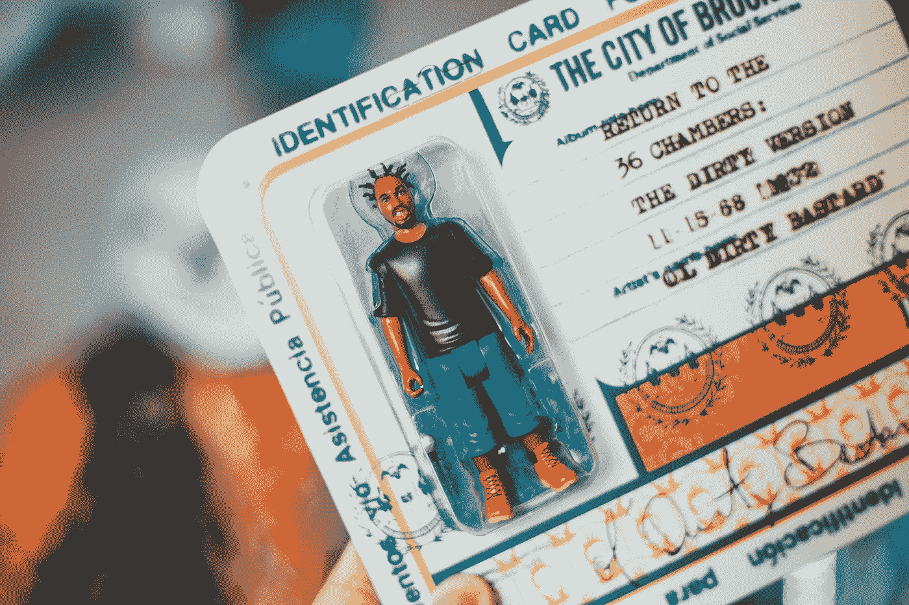

# 社交媒体驾照——我们为什么需要它们

> 原文：<https://medium.com/codex/social-media-driver-licenses-why-we-need-them-d1102cd8b97b?source=collection_archive---------6----------------------->

## 该用真名了。

埃里克·麦克林在 [Unsplash](https://unsplash.com?utm_source=medium&utm_medium=referral) 上的照片

"*你最近看过 YouTube 上的评论吗？《男同》在每日新闻*中被删除。说唱歌手麦克摩尔在 2012 年的歌曲《同样的爱》中放弃了这句话。自那以后，社交媒体在言论方面没有太大变化。