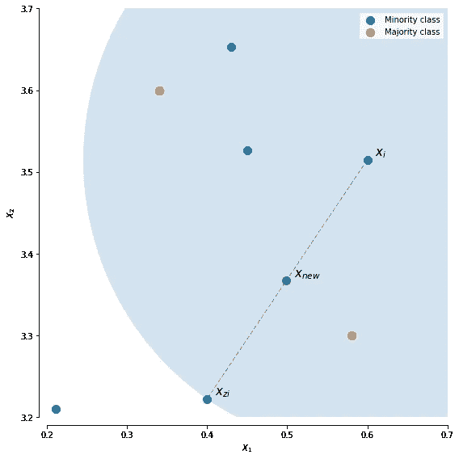
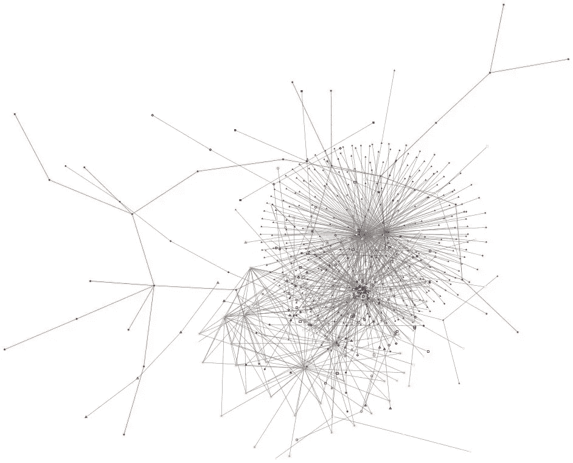

# 用于欺诈检测的社交网络

> 原文：<https://medium.com/codex/social-networks-for-fraud-detection-fc02837f9693?source=collection_archive---------1----------------------->

几天前，我在完成算法和数据结构期中考试后开车回家，突然接到银行的电话，说他们发现我的信用卡上有一些可疑交易。嗯，我很幸运，他们的系统显示了一些错误的标志，但那次事件无疑促使我理解了我的银行可能会经历的给我打电话的过程。

欺诈会给企业带来意想不到的损失，导致收入损失和运营成本增加，在更糟糕的情况下，它会导致企业难以承受的财务冲击。检测和打击欺诈的动机非常强烈，因此，组织在**欺诈检测系统(FDS)** 方面投入巨资。

将社交网络纳入 **FDS** 的动机来自于个人和组织实施欺诈的事实。试图在有数百万行的数据集中找到单个欺诈实例就像大海捞针一样困难。另一个额外的困难是这种数据集的不平衡性质。由于欺诈事件只占数据分布的极小一部分，对公司来说，训练分类器在技术上可能很困难，成本也很高。然而，欺诈性个人和组织通常与其他个人和组织有社会联系。因此，社交网络可以提供欺诈实体的**社交足迹**。

# 了解欺诈

在社会上，我们认为欺诈是为了获得一些个人利益的犯罪欺骗。现在说起来，数据库欺诈是被其他几个交易掩盖的一个例子。因此，处理数据库欺诈通常被视为模式中的异常，或者从分析师的角度来看，它是散点图上的异常值。

与数百万用户使用的系统打交道时，与常规交易相比，欺诈活动非常罕见。粗略地说，欺诈活动不到总数据分布的 1%。因此，如果你在行业内谈论，一般来说，人们谈论的第一步是平衡数据集。为了平衡数据集，我们可以对常规案例进行**欠采样**，对欺诈案例进行**过采样**。一种称为 **SMOTE** 的常见数据过采样技术可用于对数据进行过采样。我们来试着理解一下**击**是什么。

**合成少数过采样技术**

创建分布中少数类的合成数据点的一般方法是找到所有类的 **k 个最近邻**。然后，由少数类形成的群集可用于创建更多这样的实例。一般方法是通过对少数民族类的聚类中的数据取平均值来创建数据点。 **SMOTE** 可以使用更好的聚类技术和平均技术(如加权平均)进行修改，这主要取决于数据的性质。

**对数据集应用 k-最近邻，并用聚类中的合成数据点填充少数类。绿点是 SMOTE 新生成的数据点。**

现在我们已经平衡了我们的分配。在数据中寻找的另一个重要因素是时间权重。市场和技术在快速变化，欺骗系统的方法也是如此。人们很自然地认为，5 年前使用的欺诈技术可能没有今天应用的技术有效。为了解决这个问题，我们通常会更加重视最近的活动。

**时间加权**

将历史数据与最近数据合并的常用方法是给予最新数据更多的权重。为此，最常用的技术之一是通过**几何级数**进行加权。这个想法是给每一年一个几何权重。年份越近，权重值越高。使用这种技术需要正确理解所考虑的数据是什么样的。

另一种可以用来考虑时间重要性的技术是**移动平均值**。移动平均对区间中的点给予相等的权重。最高权重被分配给最近间隔中的点。久而久之，权重迅速下降，然后零权重分配给非常老的历史数据。

时间加权不仅有助于模型处理历史趋势，而且使模型不易受不断变化的环境的影响。由于历史数据不能用于检测今天犯下的所有欺诈，同样的原则也适用于明年犯下的欺诈。因此，时间建模有助于数据科学家估计模型最佳的时间范围，以及模型对系统动态变化的适应性。

至此，我们可以将欺诈视为数据库中的数据条目。这些数据值偏离了它们的正常行为，被埋没在数百万个其他正常值之下。现在，让我们从节点和边缘的角度来看一下欺诈。

# 社交网络中的欺诈

使用社交网络的动机来自于这样一个事实，即交易数据经常包含显式和隐式链接。网络中的显式链路来自两个节点之间的直接链路。人们可以认为一个明确的链接是连接在脸书。隐式链接通常是由于用户在互联网上的交互而产生的经过仔细思考的模式。想想看，如果你和其他 100 个人使用同一个网站，或者在谷歌上搜索相似的音乐，这将是你和其他 100 个人之间的隐含联系。

**设置网络图**

建立网络取决于你如何处理这个问题。但是让我们定义一些基本规则。图中的节点通常代表要分析的实体。在欺诈检测的情况下，这可能意味着任何利益相关方，如欺诈实体(公司或用户)和受害者。并且节点之间的边通常表示两个实体之间的关系。一个很好的例子就是公司之间的资源共享。因此，公司可以表示为节点，而资源可以表示为边。根据不同的用例，边的表示可以不同。边可以是显示链路的二进制值，也可以是显示共享资源数量的绝对值。为了使事情更有洞察力，链接可以指示两个资源之间的资源共享。

**一种建模实体间关系的网络图。**

# 网络分析的局限性

在现实生活中，事务图包含数十亿个节点，新数据的流入呈指数级增长。由于有数十亿个数据点，网络分析容易出现性能问题是很自然的。性能问题使 SNA 成为一项计算要求非常高的任务，因此在运行时将事务与 SNA 相关联会显著影响处理事务的时间。SNA 系统遇到的另一个主要问题是不断改造数据，以处理因新数据点大量涌入而产生的数据歧义，并提高交易系统的数据质量和可用性。

# 快结束的时候…

欺诈检测是一个广阔的领域，有许多令人兴奋的研究正在进行。社交网络分析只是大海捞针。在信用卡欺诈检测领域有一个已经完成的艺术作品的状态。预测分析和大数据技术包括应用神经网络、模糊逻辑、用于监督检测的专家系统和技术，如隐马尔可夫模型(HMM)和用于非监督或异常检测的支持向量机(SVM)。对自然语言处理的研究打开了这个领域有趣工作的整个世界。然而，上述讨论表明，社交网络在这一领域提供了一个非常有趣的用例，因为它们能够预测欺诈，并为监管者提供开箱即用的解释。